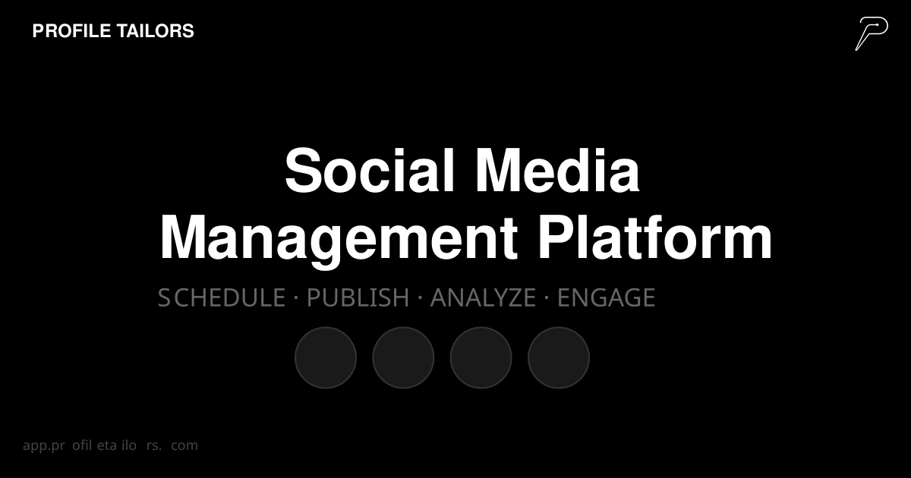

# Profile Tailors

<div align="center">



**Schedule smarter. Post everywhere.**

Monorepo for the Profile Tailors social media management platform (marketing, dashboard, backend, shared modules, and infrastructure).

</div>

[](LICENSE)
[](https://github.com/dallay/profiletailors.com/actions)
[](https://astro.build)
[](https://nodejs.org)
[](https://pnpm.io)

[](https://sonarcloud.io/summary/new_code?id=dallay_profiletailors.com)
[](https://sonarcloud.io/summary/new_code?id=dallay_profiletailors.com)
[](https://sonarcloud.io/summary/new_code?id=dallay_profiletailors.com)
[](https://sonarcloud.io/summary/new_code?id=dallay_profiletailors.com)
[](https://sonarcloud.io/summary/new_code?id=dallay_profiletailors.com)
[](https://sonarcloud.io/summary/new_code?id=dallay_profiletailors.com)
[](https://sonarcloud.io/summary/new_code?id=dallay_profiletailors.com)
[](https://sonarcloud.io/summary/new_code?id=dallay_profiletailors.com)
[](https://codecov.io/gh/dallay/profiletailors.com)

---

## Subprojects Index

This monorepo contains 17 dedicated subprojects across web applications, backend services, shared libraries, compliance tooling, and build infrastructure. Each subproject contains an independently useful `README.md` file detailing its role, tech stack, configuration, and developer commands:

| Category | Subproject Path | Purpose | Dedicated README |
| --- | --- | --- | --- |
| **Web App** | [`apps/web/marketing`](apps/web/marketing) | Public-facing Astro 7 marketing site, bilingual landing pages, and client-side waitlist acquisition flow. | [README](apps/web/marketing/README.md) |
| **Web App** | [`apps/web/app`](apps/web/app) | Core Vue 3 dashboard single-page application for post scheduling, social publishing, media, and analytics. | [README](apps/web/app/README.md) |
| **Web App** | [`apps/web/admin`](apps/web/admin) | Internal Vue 3 platform administration portal for waitlist management, user accounts, and system auditing. | [README](apps/web/admin/README.md) |
| **Shared Web** | [`shared/web`](shared/web) | Framework-agnostic TypeScript workspace package defining canonical GDPR consent contracts and validation rules. | [README](shared/web/README.md) |
| **Tooling** | [`tools/compliance`](tools/compliance) | Node.js CLI tool and schema validator verifying GDPR data inventory schemas and security drift rules. | [README](tools/compliance/README.md) |
| **Build Infrastructure** | [`gradle/build-logic`](gradle/build-logic) | Centralized Gradle Kotlin DSL convention plugins for Spring Boot, Spotless formatting, OWASP, and Detekt. | [README](gradle/build-logic/README.md) |
| **Backend Service** | [`server/smp`](server/smp) | Reactive Spring Boot 4 Kotlin monolith providing core REST APIs, R2DBC persistence, and publishing services. | [README](server/smp/README.md) |
| **Shared Backend** | [`shared/common`](shared/common) | Pure Kotlin domain primitives, immutable value objects (`Email`, `Username`, `WorkspaceId`), and domain events. | [README](shared/common/README.md) |
| **Shared Backend** | [`shared/bus`](shared/bus) | Framework-agnostic in-process CQRS mediator, command/query dispatcher, and pipeline behavior middleware chain. | [README](shared/bus/README.md) |
| **Shared Backend** | [`shared/lead-capture/common`](shared/lead-capture/common) | Domain models and interface contracts for prospect acquisition and lead capture. | [README](shared/lead-capture/common/README.md) |
| **Shared Backend** | [`shared/lead-capture/waitlist`](shared/lead-capture/waitlist) | Waitlist domain logic, signup processing, invite status tracking, and duplicate checks. | [README](shared/lead-capture/waitlist/README.md) |
| **Shared Backend** | [`shared/notifications`](shared/notifications) | Email alert abstractions, transactional messaging, and event-driven notification dispatch services. | [README](shared/notifications/README.md) |
| **Shared Backend** | [`shared/presentation`](shared/presentation) | Framework-agnostic API presentation envelopes, page response structures (`PageResponse`), and opaque cursor encoders. | [README](shared/presentation/README.md) |
| **Shared Backend** | [`shared/security`](shared/security) | Pure Kotlin security abstractions (`Hasher`, `Sha256Hasher`, `HmacHasher`), `PrincipalContext`, and tenant context. | [README](shared/security/README.md) |
| **Shared Backend** | [`shared/shield/ratelimit`](shared/shield/ratelimit) | Reactive Spring WebFlux rate-limiting filter using Bucket4j, Caffeine cache, and Micrometer metrics. | [README](shared/shield/ratelimit/README.md) |
| **Shared Backend** | [`shared/spring-boot-common`](shared/spring-boot-common) | Spring WebFlux integration adapter offering RFC 9457 `ProblemDetail` handlers and workspace `WebFilter`. | [README](shared/spring-boot-common/README.md) |
| **Shared Backend** | [`shared/storage`](shared/storage) | Reactive multi-provider object storage abstraction (Local FS, AWS S3, Cloudflare R2) with path traversal protection. | [README](shared/storage/README.md) |

---

## Getting Started

### Prerequisites

| Requirement | Version      | Install                                                                  |
| ----------- | ------------ | ------------------------------------------------------------------------ |
| Node.js     | `>= 24.19.0` | [nodejs.org](https://nodejs.org)                                         |
| pnpm        | `>= 11.8.0`  | `npm install -g pnpm`                                                    |
| just        | `>= 1.30`    | `brew install just` / `winget install Casey.Just` / `cargo install just` |

> **Windows users:** `just` runs natively on Windows. The Gradle wrapper is auto-detected
> (`gradlew.bat` in CMD/PowerShell, `./gradlew` in Git Bash/WSL). Recipes that use `rm -rf`
> still require a POSIX shell — use **Git Bash** (included with [Git for Windows](https://git-scm.com))
> or **WSL**.

### Install and run locally

#### 1) Install `just`

- **macOS:** `brew install just`
- **Windows:** `winget install Casey.Just`
- **Ubuntu/Debian (recommended):**

```bash
curl --proto '=https' --tlsv1.2 -sSf https://just.systems/install.sh | sudo bash -s -- --to /usr/local/bin
just --version
```

Alternative Ubuntu/Debian installation methods are also documented in the repository `Justfile`.

#### 2) Bootstrap the workspace

```bash
git clone https://github.com/dallay/profiletailors.com.git
cd profiletailors.com
just setup
```

For full onboarding and troubleshooting, see [docs/getting-started.md](docs/getting-started.md).

`just setup` will:

- copy `.env.example` to `.env` when needed,
- install workspace dependencies with `pnpm install --frozen-lockfile`,
- install Lefthook unless Git hooks are globally disabled (`core.hooksPath=/dev/null`, e.g. Jules).
- apply AI agent configurations with `pnpm dlx @dallay/agentsync apply`.
- run optional local tooling setup via `node scripts/setup-optional-tools.mjs`.

#### 3) Start local development

```bash
just dev-frontend  # starts both Astro and Vue dev servers
```

- Marketing site: [https://profiletailors.localhost](https://profiletailors.localhost)
- Dashboard app: [https://pt-app.localhost](https://pt-app.localhost) (requires [Portless](docs/portless-setup.md))
- Linked worktrees prefix these names with the branch, for example `https://fix-ui.pt-app.localhost`.

### Command Hub

This repo uses [`just`](https://github.com/casey/just) as a centralized command runner.
All common operations are available via `just <recipe>` — no need to remember pnpm, Gradle, or
Docker commands separately. Run `just -l` to list everything.

#### Frontend (Astro + Vue / pnpm)

| Command                   | What it does                            |
| ------------------------- | --------------------------------------- |
| `just dev-frontend`       | Start both dev servers in parallel      |
| `just app`                | Start only the Vue 3 dashboard app      |
| `just frontend-build`     | Build the marketing site for production |
| `just frontend-preview`   | Preview marketing production build      |
| `just frontend-lint`      | Lint marketing with Biome               |
| `just frontend-format`    | Format marketing code with Biome        |
| `just frontend-check`     | Run Astro type/content checks           |
| `just frontend-test`      | Run marketing unit tests (Vitest)       |
| `just frontend-test-cov`  | Run marketing unit tests with coverage  |
| `just frontend-test-e2e`  | Run marketing E2E tests (Playwright)    |
| `just app-test-e2e-media` | Run app Media Library E2E tests         |

#### Backend (Gradle / Kotlin / Spring Boot)

| Command                  | What it does                       |
| ------------------------ | ---------------------------------- |
| `just backend-build`     | Compile and package                |
| `just backend-run`       | Start Spring Boot (dev profile)    |
| `just backend-test-fast` | Run unit tests (fast: no Postgres) |
| `just backend-test`      | Run unit tests (pass exclude-tags) |
| `just backend-lint`      | Run Detekt static analysis         |
| `just backend-check`     | Full check (tests + Detekt)        |
| `just backend-coverage`  | Tests with JaCoCo coverage report  |

#### Infrastructure (Docker)

| Command           | What it does               |
| ----------------- | -------------------------- |
| `just infra-up`   | Start Postgres + services  |
| `just infra-down` | Stop and remove containers |
| `just infra-logs` | Tail service logs          |

#### CI Simulation

| Command         | What it does                                   |
| --------------- | ---------------------------------------------- |
| `just ci-local` | Full CI pipeline simulation (fast, local-only) |
| `just ci-full`  | CI pipeline + Postgres BDD tests               |

#### Setup & Maintenance

| Command              | What it does                                            |
| -------------------- | ------------------------------------------------------- |
| `just install`       | Install all dependencies                                |
| `just setup`         | Full initial setup (.env + install + hooks + agentsync) |
| `just hooks-install` | Install Lefthook git hooks                              |
| `just clean`         | Clean all build artifacts and caches                    |

---

## Overview

### Development Notes

- **Frontend Apps**:
    - `apps/web/marketing/`: Astro-based marketing site.
    - `apps/web/app/`: Vue 3-based dashboard application.
- The marketing site uses Astro's built-in locale routing with **English as the default locale** and **Spanish under `/es/`**.
- User-facing copy is maintained in locale files under `apps/web/marketing/src/i18n/` and `apps/web/app/src/i18n/`.
- Shared web assets are sourced from `shared/assets/` using the `@shared/assets/` import alias. Files in `shared/assets/web/*` are copied into `dist/` at build time by the Astro build configuration.
- The current waitlist flow is **client-side only** (Astro component); backend persistence is documented as planned (ADR-0011).
- Code quality: **Biome** for linting and formatting in the frontend, **Detekt** for the backend.
- The backend lives in `server/smp/` — Spring Boot 4 with Kotlin and WebFlux (reactive).
- SDD artifacts live in `openspec/` for tracking specs, designs, and tasks.

### Project Structure

```text
profiletailors.com/
├── apps/
│   └── web/
│       ├── admin/                # Vue 3 platform-admin SPA
│       ├── app/                  # Vue 3 dashboard application
│       └── marketing/            # Astro marketing site
├── server/
│   └── smp/                     # Spring Boot 4 backend (Kotlin)
├── shared/                      # Kotlin libraries + shared web assets
│   ├── assets/                  # Shared logos, icons, and web assets
│   ├── web/                     # Shared web workspace
│   ├── common/                  # Domain primitives, value objects, shared kernel
│   ├── bus/                     # Event bus abstractions
│   ├── security/                # Security primitives
│   └── ...                      # Additional shared libraries
├── tools/
│   └── compliance/              # Compliance tooling workspace
├── .agents/                     # Agent tooling config and skills
├── .devcontainer/               # VS Code dev container configuration
├── .github/workflows/           # CI and automation
├── docs/                        # Architecture and security docs
├── openspec/                    # SDD artifacts
├── CONTRIBUTING.md
├── CLA.md
├── LICENSE
└── README.md
```

---

## Architecture

Profile Tailors follows a **hexagonal architecture** with **bounded contexts** from Domain-Driven
Design. The backend is built as a **modular monolith** using Spring Boot 4, Kotlin, and reactive
programming.

**📐 [View C4 Architecture Models](docs/architecture/c4/)**

- **[System Context](docs/architecture/c4/01-system-context.md)** — Big picture, external
  dependencies
- **[Container](docs/architecture/c4/02-container.md)** — Deployable units, technology stack
- **[Component](docs/architecture/c4/03-component.md)** — Internal structure, bounded contexts
- **[Code](docs/architecture/c4/04-code.md)** — Implementation patterns, class design
- **[Summary](docs/architecture/c4/SUMMARY.md)** — Executive summary and roadmap

**Key Architectural Patterns**:

- Hexagonal Architecture (Ports & Adapters)
- Domain-Driven Design (Bounded Contexts)
- CQRS (Command Query Responsibility Segregation)
- Reactive Programming (Kotlin coroutines + R2DBC)
- Modular Monolith (Spring Modulith)

---

## Contributing

Contributions are welcome. Before opening a pull request:

1. Read [`CONTRIBUTING.md`](CONTRIBUTING.md).
2. Open an issue or discussion first for non-trivial changes.
3. Sign the [`CLA.md`](CLA.md) when prompted on your first PR.
4. Verify your changes locally from `apps/web/marketing/`.

We use [Conventional Commits](https://www.conventionalcommits.org/en/v1.0.0/):

```text
feat(scope): short description
fix(scope): short description
docs(scope): short description
chore(scope): short description
```

Examples:

```text
feat(marketing): refine hero waitlist flow
fix(i18n): correct spanish locale switch label
docs(readme): refresh repository onboarding
```

---

## Security

If you discover a security issue, **do not open a public issue**.

Contact: **security@profiletailors.com**

---

## Support

- **Issues:** https://github.com/dallay/profiletailors.com/issues
- **Email:** **dev@profiletailors.com**

---

## License

This project is licensed under the **GNU Affero General Public License v3.0 (AGPL-3.0)**.

See [`LICENSE`](LICENSE) for the full text.

**Source offer (AGPL-3.0 § 13):** users who interact with Profile Tailors over a network are
entitled to the corresponding source code. The canonical source is available at
[github.com/dallay/profiletailors.com](https://github.com/dallay/profiletailors.com).
Deployed releases are tagged; the running version is exposed via `/actuator/info`.

For licensing questions, commercial use, or CLA enquiries see
[`docs/architecture/adr/0012-agpl-commercial-strategy.md`](docs/architecture/adr/0012-agpl-commercial-strategy.md)
and [`CLA.md`](CLA.md).

---

<div align="center">

Built by the **Profile Tailors** team.

</div>
