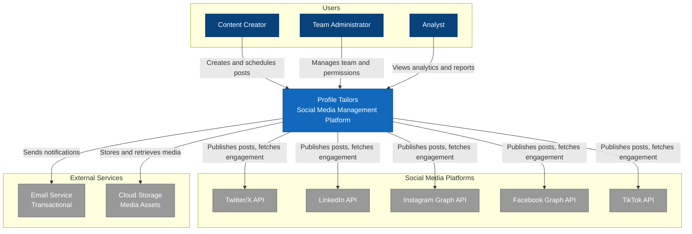

# Level 1: System Context Diagram

## Overview

The System Context diagram shows Profile Tailors and how it fits into the world around it. It shows
the people who use it and the other systems it interacts with.

**Audience**: Everyone (technical and non-technical)

**Purpose**: Understand the big picture — what Profile Tailors does and who/what it interacts with.

---

## Diagram

```plantuml
@startuml C4_Context
!include https://raw.githubusercontent.com/plantuml-stdlib/C4-PlantUML/master/C4_Context.puml

LAYOUT_WITH_LEGEND()

title System Context Diagram for Profile Tailors

Person(content_creator, "Content Creator", "Individual or team member who creates and schedules social media content")
Person(team_admin, "Team Administrator", "Manages team members, workspaces, and permissions")
Person(analyst, "Analyst", "Reviews analytics and engagement metrics")

System(profile_tailors, "Profile Tailors", "Social media management platform for scheduling, publishing, analyzing, and collaborating across multiple social networks")

System_Ext(twitter, "Twitter/X API", "Social media platform for posting and engagement")
System_Ext(linkedin, "LinkedIn API", "Professional networking platform")
System_Ext(instagram, "Instagram Graph API", "Photo and video sharing platform")
System_Ext(facebook, "Facebook Graph API", "Social networking platform")
System_Ext(tiktok, "TikTok API", "Short-form video platform")

System_Ext(email_service, "Email Service", "Transactional email delivery (e.g., Resend, SendGrid)")
System_Ext(storage, "Cloud Storage", "Media asset storage (e.g., S3, Cloudflare R2)")

Rel(content_creator, profile_tailors, "Creates and schedules posts", "HTTPS")
Rel(team_admin, profile_tailors, "Manages team and permissions", "HTTPS")
Rel(analyst, profile_tailors, "Views analytics and reports", "HTTPS")

Rel(profile_tailors, twitter, "Publishes posts, fetches engagement", "HTTPS/REST")
Rel(profile_tailors, linkedin, "Publishes posts, fetches engagement", "HTTPS/REST")
Rel(profile_tailors, instagram, "Publishes posts, fetches engagement", "HTTPS/REST")
Rel(profile_tailors, facebook, "Publishes posts, fetches engagement", "HTTPS/REST")
Rel(profile_tailors, tiktok, "Publishes posts, fetches engagement", "HTTPS/REST")

Rel(profile_tailors, email_service, "Sends notifications", "HTTPS/REST")
Rel(profile_tailors, storage, "Stores and retrieves media", "HTTPS/S3")

@enduml
```

---

## Mermaid Alternative



---

## Elements

### People

| Name                   | Description                                                              | Responsibilities                                                                 |
| ---------------------- | ------------------------------------------------------------------------ | -------------------------------------------------------------------------------- |
| **Content Creator**    | Individual or team member who creates and schedules social media content | Create posts, schedule publishing, manage content calendar, engage with audience |
| **Team Administrator** | Manages team members, workspaces, and permissions                        | Invite team members, assign roles, configure workspace settings, manage billing  |
| **Analyst**            | Reviews analytics and engagement metrics                                 | View reports, analyze performance, export data, track KPIs                       |

### Software Systems

| Name                    | Type     | Description                                                                                                               | Technology                              |
| ----------------------- | -------- | ------------------------------------------------------------------------------------------------------------------------- | --------------------------------------- |
| **Profile Tailors**     | Internal | Social media management platform for scheduling, publishing, analyzing, and collaborating across multiple social networks | Spring Boot 4, Kotlin, WebFlux, Astro 7 |
| **Twitter/X API**       | External | Social media platform for posting and engagement                                                                          | REST API                                |
| **LinkedIn API**        | External | Professional networking platform                                                                                          | REST API                                |
| **Instagram Graph API** | External | Photo and video sharing platform                                                                                          | REST API                                |
| **Facebook Graph API**  | External | Social networking platform                                                                                                | REST API                                |
| **TikTok API**          | External | Short-form video platform                                                                                                 | REST API                                |
| **Email Service**       | External | Transactional email delivery (e.g., Resend, SendGrid)                                                                     | SMTP/REST API                           |
| **Cloud Storage**       | External | Media asset storage (e.g., S3, Cloudflare R2)                                                                             | S3-compatible API                       |

## Key Relationships

### User Interactions

- **Content Creators** interact with Profile Tailors to create, schedule, and publish content
  across multiple platforms.
- **Team Administrators** manage workspace configuration, team members, and access control.
- **Analysts** consume analytics data and generate reports on content performance.

### External System Integrations

#### Social Media Platforms

- Profile Tailors publishes scheduled posts to each platform via their respective APIs.
- Profile Tailors fetches engagement metrics (likes, comments, shares, impressions) for analytics.
- OAuth2 flows are used to authorize Profile Tailors to act on behalf of users.

#### Supporting Services

- **Email Service** sends transactional emails (invitations, notifications, reports).
- **Cloud Storage** stores uploaded media assets (images, videos) before publishing.

## Business Context

### Core Value Proposition

Profile Tailors enables teams to:

1. **Schedule smarter** — Plan and schedule content across multiple platforms from a single
  interface
2. **Post everywhere** — Publish to Twitter, LinkedIn, Instagram, Facebook, and TikTok
  simultaneously
3. **Analyze performance** — Track engagement metrics and optimize content strategy
4. **Collaborate effectively** — Coordinate team workflows with roles, permissions, and approval
  flows

### Key Constraints

- **Rate Limits**: Each social media platform imposes API rate limits.
- **OAuth Token Expiry**: Social media tokens must be refreshed periodically.
- **Media Format Requirements**: Each platform has specific image/video format requirements.
- **Compliance**: The platform must comply with each provider's API terms and data policies.

## Current Implementation Status

**Implemented**:

- Marketing site (Astro 7, static)
- Dashboard web app (Vue 3 SPA)
- Backend foundation (Spring Boot 4, Kotlin, WebFlux)
- Core bounded contexts (Identity, Authorization, Tenancy, Credentials, Governance, Platform,
  Audit, Observability)
- JWT and API key authentication

**Planned**:

- Social media platform integrations
- Content scheduling engine hardening
- Analytics and reporting expansion
- Team collaboration enhancements
- Media asset management improvements

Last updated: 2026-08-31
