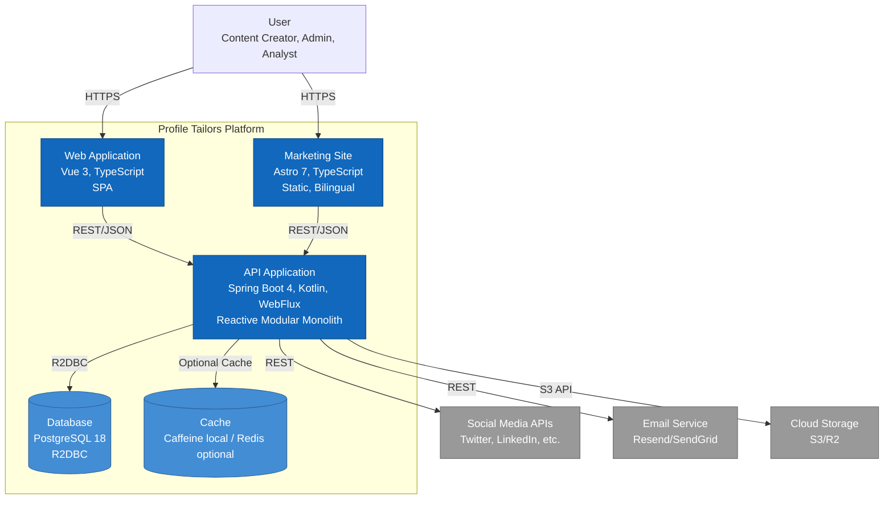

# Level 2: Container Diagram

## Overview

The Container diagram zooms into Profile Tailors and shows the high-level technology choices, how
containers communicate, and where data lives.

**Audience**: Technical leadership, architects, senior developers

**Purpose**: Understand the deployable units, technology stack, and communication patterns.

---

## Diagram

```plantuml
@startuml C4_Container
!include https://raw.githubusercontent.com/plantuml-stdlib/C4-PlantUML/master/C4_Container.puml

LAYOUT_WITH_LEGEND()

title Container Diagram for Profile Tailors

Person(user, "User", "Content creator, team admin, or analyst")

System_Boundary(profile_tailors, "Profile Tailors") {
    Container(web_app, "Marketing Site", "Astro 7, TypeScript", "Static marketing site with waitlist flow. Bilingual (EN/ES). Nothing-inspired design system.")
    
    Container(spa, "Web Application", "Vue 3, TypeScript", "Single-page application for content management, scheduling, and analytics")
    
    Container(api, "API Application", "Spring Boot 4, Kotlin, WebFlux", "Reactive REST API with 19 bounded contexts including Identity, Tenancy, Publishing, Media, Privacy, etc.")
    
    ContainerDb(db, "Database", "PostgreSQL 18", "Stores user data, workspaces, posts, schedules, credentials, and audit logs. R2DBC for reactive access.")
    
    ContainerDb(cache, "Cache", "Redis / Caffeine (optional)", "Optional rate limiting cache store (default Caffeine local)")
}

System_Ext(social_media, "Social Media APIs", "Twitter, LinkedIn, Instagram, Facebook, TikTok")
System_Ext(email, "Email Service", "Resend, SendGrid")
System_Ext(storage, "Cloud Storage", "S3, Cloudflare R2")

Rel(user, web_app, "Visits", "HTTPS")
Rel(user, spa, "Uses", "HTTPS")

Rel(spa, api, "Makes API calls", "HTTPS/REST, JSON")
Rel(web_app, api, "Submits waitlist", "HTTPS/REST, JSON")

Rel(api, db, "Reads/writes", "R2DBC, PostgreSQL wire protocol")
Rel(api, cache, "Reads/writes when enabled", "Redis/In-memory")
Rel(api, storage, "Stores/retrieves media", "HTTPS/S3 API")
Rel(api, social_media, "Publishes posts, fetches engagement", "HTTPS/REST")
Rel(api, email, "Sends notifications", "HTTPS/REST")

@enduml
```

---

## Mermaid Alternative



---

## Containers

### Frontend Containers

#### Marketing Site

- **Technology**: Astro 7, TypeScript, Tailwind CSS v4
- **Deployment**: Static files on CDN (Vercel, Cloudflare Pages)
- **Purpose**: Public-facing marketing site with waitlist flow
- **Key Features**: Bilingual (English/Spanish) with i18n routing, Nothing-inspired monochrome
  design system, client-side waitlist form submission, static-first (no SSR).

#### Web Application (SPA)

- **Technology**: Vue 3, TypeScript, Tailwind CSS v4
- **Deployment**: Static files on CDN
- **Purpose**: Authenticated user interface for content management
- **Key Features**: Content creation and scheduling, multi-platform publishing, analytics
  dashboards, team collaboration, workspace management.

### Backend Containers

#### API Application

- **Technology**: Spring Boot 4, Kotlin, WebFlux (reactive)
- **Deployment**: Container (Docker) on Docker Swarm (`infra/apps/smp/swarm/`)
- **Purpose**: Core business logic and REST API
- **Architecture**: Hexagonal architecture with bounded contexts
- **Composition**: Shared modules (`shared:common`, `shared:bus`, `shared:spring-boot-common`,
  `shared:security`, `shared:presentation`, `shared:storage`, `shared:shield:ratelimit`,
  `shared:lead-capture:*`) and `server:smp` (application assembly).
- **Bounded Contexts**: Analytics, Audit, Authorization, Config, Credentials, Governance, Hashtags,
  Ideas, Identity, Leadcapture, MCP, Media, Notifications, Observability, Platform, Platformadmin, Privacy,
  Publishing, Tenancy.
- **Key Features**: Reactive programming with Kotlin coroutines, native JWT/cookie authentication,
  non-blocking R2DBC access, internal in-process event publishing via Reactor (`ChannelEventPublisher`),
  Spring Modulith modular monolith.

### Data Containers

#### Database (PostgreSQL 18)

- **Technology**: PostgreSQL 18 with R2DBC driver
- **Deployment**: Managed service (AWS RDS, Google Cloud SQL, Neon)
- **Purpose**: Primary data store
- **Schema**: Users/authentication, workspaces/memberships, posts/schedules,
  credentials/tokens, audit logs, analytics metrics.
- **Access Pattern**: Reactive via R2DBC (non-blocking)

#### Cache (Caffeine Local / Redis Optional)

- **Technology**: Caffeine local in-memory cache, optional Redis via `shared:shield:ratelimit`
- **Deployment**: Embedded JVM in-memory / optional container
- **Purpose**: Rate limiting (Bucket4j) and ephemeral caching.
- **Use Cases**: Rate limiting for public and waitlist endpoints (defaults to Caffeine). Session management relies on stateless signed JWT cookies rather than central session cache storage.

#### Event Bus (In-Process Event Dispatch)

- **Technology**: Reactor Sinks (`ReactorChannelEventPublisher`) for ChannelEvent SSE updates; EventEmitter/EventMultiplexer and Spring ApplicationEventPublisher (`SpringDomainEventPublisher`) for DomainEvent dispatch
- **Deployment**: In-process within `server:smp`
- **Purpose**: Asynchronous internal event publishing. `ReactorChannelEventPublisher` handles channel-change events (ChannelEvent) for Server-Sent Events (SSE) updates only. `SpringDomainEventPublisher` dispatches DomainEvent instances to @Subscribe-annotated consumers and @EventListener methods.

---

## Communication Patterns

### Synchronous (Request/Response)

| From              | To                | Protocol     | Purpose                    |
| ----------------- | ----------------- | ------------ | -------------------------- |
| Web App / SPA     | API Application   | HTTPS/REST   | User actions, data queries |
| API Application   | Database          | R2DBC        | Data persistence           |
| API Application   | Cloud Storage     | HTTPS/S3     | Media upload/download      |
| API Application   | Social Media APIs | HTTPS/REST   | Post publishing & metrics  |

### Asynchronous (Event-Driven)

| From              | To                | Via           | Purpose                    |
| ----------------- | ----------------- | ------------- | -------------------------- |
| Publishing Context| Channel Subscribers| In-process Reactor Channel| OAuth connection / channel events |

---

## Technology Choices

### Backend Stack

| Component           | Technology                   | Rationale                                           |
| ------------------- | ---------------------------- | --------------------------------------------------- |
| **Language**        | Kotlin                       | Type-safe, concise, excellent coroutines support    |
| **Framework**       | Spring Boot 4                | Mature ecosystem, reactive support, Spring Modulith |
| **Reactive**        | WebFlux + Coroutines         | Non-blocking I/O, better resource utilization       |
| **Database Access** | R2DBC                        | Reactive database driver for PostgreSQL             |
| **Architecture**    | Hexagonal + Bounded Contexts | Clean separation, testability, domain-driven design |
| **API Docs**        | SpringDoc OpenAPI            | Auto-generated API documentation                    |

### Frontend Stack

| Component     | Technology      | Rationale                                               |
| ------------- | --------------- | ------------------------------------------------------- |
| **Marketing** | Astro 7         | Static-first, fast, excellent DX                        |
| **Web App**   | Vue 3           | Component-based, reactive, excellent TypeScript support |
| **Language**  | TypeScript      | Type safety, better tooling                             |
| **Styling**   | Tailwind CSS v4 | Utility-first, design system tokens                     |
| **State**     | Pinia           | Official Vue state management                           |

### Infrastructure

| Component    | Technology       | Rationale                                   |
| ------------ | ---------------- | ------------------------------------------- |
| **Database** | PostgreSQL 18    | Robust, ACID, JSON support, mature          |
| **Cache**    | Redis            | Fast, simple, widely supported              |
| **Event Bus**| Reactor Channels | Reactive in-process event publishing        |
| **Storage**  | S3-compatible    | Standard API, multiple providers            |
| **Auth**     | OAuth2/OIDC      | Industry standard, delegated authentication |

---

## Deployment Architecture

### Current State (Development)

```text
┌─────────────────────────────────────────────────────────┐
│ Local Development                                       │
├─────────────────────────────────────────────────────────┤
│ • Marketing Site: localhost:4321 (Astro dev server)    │
│ • API Application: localhost:7638 (Spring Boot)        │
│ • PostgreSQL: localhost:5432 (Docker Compose)          │
└─────────────────────────────────────────────────────────┘
```

### Target State (Production)

```text
┌─────────────────────────────────────────────────────────┐
│ CDN (Cloudflare / Vercel)                               │
│ • Marketing Site (static)                               │
│ • Web Application (static)                              │
└─────────────────────────────────────────────────────────┘
                        │
                        ▼
┌─────────────────────────────────────────────────────────┐
│ Docker Swarm (`infra/apps/smp/swarm/stack.yaml`)        │
│ • Dashboard Service (Vue 3 SPA, port 8080)              │
│ • Backend Service (API Application, port 7638)          │
└─────────────────────────────────────────────────────────┘
                        │
                        ▼
┌─────────────────────────────────────────────────────────┐
│ Managed & Local Storage                                 │
│ • PostgreSQL (PostgreSQL 18 + R2DBC)                    │
│ • Local Storage (/var/lib/profiletailors/media)         │
└─────────────────────────────────────────────────────────┘
```

---

## Security Considerations

### Authentication & Authorization

- JWT tokens for user sessions (short-lived, 15 min)
- API keys for service-to-service communication
- OAuth2 for social media platform authorization
- Role-based access control (RBAC) at workspace level

### Data Protection

- TLS 1.3 for all external communication
- Encrypted credentials at rest (AES-256)
- Secrets management via environment variables or secret manager
- Database connection pooling with encrypted connections

### Rate Limiting

- Per-user rate limits enforced by API gateway
- Per-workspace rate limits for fair usage
- Public waitlist joins use the shared WAITLIST limiter, default-off in SMP until distributed
  buckets and trusted-proxy address resolution are implemented
- Social media API rate limit tracking and backoff

---

## Scalability Considerations

### Horizontal Scaling

- API Application: Stateless, can scale horizontally
- Scheduler Service: Partitioned by workspace or time slot
- Analytics Service: Partitioned by platform or metric type

### Database Scaling

- Read replicas for analytics queries
- Connection pooling (R2DBC)
- Partitioning by workspace or time range

### Caching Strategy

- Redis for session data (TTL: 15 min)
- API response cache (TTL: 1-5 min)
- OAuth token cache (TTL: token expiry - 5 min)

---

## Current Implementation Status

**Implemented**:

- ✅ Marketing Site (Astro 7, deployed)
- ✅ API Application (Spring Boot 4, core bounded contexts)
- ✅ Database (PostgreSQL with R2DBC)
- ✅ Authentication (JWT + API Key)
- ✅ Lead Capture Waitlist (public endpoint, persistence, marketing form integration)

**In Progress**:

- 🔄 Web Application (Vue 3, design phase)
**Planned / In Progress**:

- 🔲 Social media platform publishing execution
- 🔲 Advanced analytics aggregation

---

Last updated: 2026-08-31
