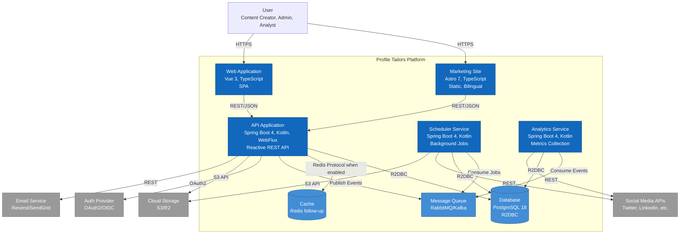

# Level 2: Container Diagram

## Overview

The Container diagram zooms into Profile Tailors and shows the high-level technology choices, how
containers communicate, and where data lives.

**Audience**: Technical leadership, architects, senior developers

**Purpose**: Understand the deployable units, technology stack, and communication patterns.

---

## Diagram

```plantuml
@startuml C4_Container
!include https://raw.githubusercontent.com/plantuml-stdlib/C4-PlantUML/master/C4_Container.puml

LAYOUT_WITH_LEGEND()

title Container Diagram for Profile Tailors

Person(user, "User", "Content creator, team admin, or analyst")

System_Boundary(profile_tailors, "Profile Tailors") {
    Container(web_app, "Marketing Site", "Astro 7, TypeScript", "Static marketing site with waitlist flow. Bilingual (EN/ES). Nothing-inspired design system.")
    
    Container(spa, "Web Application", "Vue 3, TypeScript", "Single-page application for content management, scheduling, and analytics")
    
    Container(api, "API Application", "Spring Boot 4, Kotlin, WebFlux", "Reactive REST API with bounded contexts: Identity, Authorization, Tenancy, Credentials, Governance, Platform")
    
    Container(scheduler, "Scheduler Service", "Spring Boot 4, Kotlin", "Background service for publishing scheduled posts to social media platforms")
    
    Container(analytics, "Analytics Service", "Spring Boot 4, Kotlin", "Collects and aggregates engagement metrics from social media platforms")
    
    ContainerDb(db, "Database", "PostgreSQL 18", "Stores user data, workspaces, posts, schedules, credentials, and audit logs. R2DBC for reactive access.")
    
    ContainerDb(cache, "Cache", "Redis (follow-up)", "Session cache and future distributed rate limiting; not the MVP waitlist limiter")
    
    Container(queue, "Message Queue", "RabbitMQ / Kafka", "Asynchronous job processing and event streaming")
}

System_Ext(social_media, "Social Media APIs", "Twitter, LinkedIn, Instagram, Facebook, TikTok")
System_Ext(auth_provider, "Auth Provider", "OAuth2/OIDC (Auth0, Clerk)")
System_Ext(email, "Email Service", "Resend, SendGrid")
System_Ext(storage, "Cloud Storage", "S3, Cloudflare R2")

Rel(user, web_app, "Visits", "HTTPS")
Rel(user, spa, "Uses", "HTTPS")

Rel(spa, api, "Makes API calls", "HTTPS/REST, JSON")
Rel(web_app, api, "Submits waitlist", "HTTPS/REST, JSON")

Rel(api, db, "Reads/writes", "R2DBC, PostgreSQL wire protocol")
Rel(api, cache, "Reads/writes when enabled", "Redis protocol")
Rel(api, queue, "Publishes events", "AMQP / Kafka protocol")
Rel(api, auth_provider, "Authenticates users", "HTTPS/OAuth2")
Rel(api, storage, "Stores/retrieves media", "HTTPS/S3 API")

Rel(scheduler, queue, "Consumes jobs", "AMQP / Kafka protocol")
Rel(scheduler, db, "Reads schedules", "R2DBC")
Rel(scheduler, social_media, "Publishes posts", "HTTPS/REST")
Rel(scheduler, storage, "Retrieves media", "HTTPS/S3 API")

Rel(analytics, queue, "Consumes events", "AMQP / Kafka protocol")
Rel(analytics, db, "Writes metrics", "R2DBC")
Rel(analytics, social_media, "Fetches engagement", "HTTPS/REST")

Rel(api, email, "Sends notifications", "HTTPS/REST")

@enduml
```

---

## Mermaid Alternative



---

## Containers

### Frontend Containers

#### Marketing Site

- **Technology**: Astro 7, TypeScript, Tailwind CSS v4
- **Deployment**: Static files on CDN (Vercel, Cloudflare Pages)
- **Purpose**: Public-facing marketing site with waitlist flow
- **Key Features**: Bilingual (English/Spanish) with i18n routing, Nothing-inspired monochrome
  design system, client-side waitlist form submission, static-first (no SSR).

#### Web Application (SPA)

- **Technology**: Vue 3, TypeScript, Tailwind CSS v4
- **Deployment**: Static files on CDN
- **Purpose**: Authenticated user interface for content management
- **Key Features**: Content creation and scheduling, multi-platform publishing, analytics
  dashboards, team collaboration, workspace management.

### Backend Containers

#### API Application

- **Technology**: Spring Boot 4, Kotlin, WebFlux (reactive)
- **Deployment**: Container (Docker) on Kubernetes or Cloud Run
- **Purpose**: Core business logic and REST API
- **Architecture**: Hexagonal architecture with bounded contexts
- **Composition**: `shared:common` (Shared Kernel), `shared:bus`, `shared:spring-boot-common`,
  `shared:security`, `shared:presentation`, `shared:storage`, and `server:smp` (application
  assembly).
- **Bounded Contexts**: Identity, Authorization, Tenancy, Credentials, Governance, Platform,
  Audit, Observability.
- **Key Features**: Reactive programming with Kotlin coroutines, JWT/API key authentication,
  non-blocking R2DBC access, OpenAPI docs with SpringDoc, Spring Modulith modular monolith.

#### Scheduler Service

- **Technology**: Spring Boot 4, Kotlin
- **Deployment**: Container (Docker) on Kubernetes or Cloud Run
- **Purpose**: Background job processing for scheduled posts
- **Key Features**: Consumes scheduling jobs from the queue, publishes posts at scheduled times,
  handles retries and recovery, respects platform rate limits.

#### Analytics Service

- **Technology**: Spring Boot 4, Kotlin
- **Deployment**: Container (Docker) on Kubernetes or Cloud Run
- **Purpose**: Collects and aggregates engagement metrics
- **Key Features**: Polls social APIs for engagement data, processes analytics events from queue,
  aggregates metrics for reporting, stores time-series data.

### Data Containers

#### Database (PostgreSQL 18)

- **Technology**: PostgreSQL 18 with R2DBC driver
- **Deployment**: Managed service (AWS RDS, Google Cloud SQL, Neon)
- **Purpose**: Primary data store
- **Schema**: Users/authentication, workspaces/memberships, posts/schedules,
  credentials/tokens, audit logs, analytics metrics.
- **Access Pattern**: Reactive via R2DBC (non-blocking)

#### Cache (Redis — follow-up)

- **Technology**: Redis 7+
- **Deployment**: Managed service (AWS ElastiCache, Upstash)
- **Purpose**: Session cache and future distributed data; not the MVP waitlist rate-limit backend
- **Use Cases**: Session storage, OAuth token cache, API response cache, and future distributed
  rate-limit counters after the relevant production blockers are resolved.

The current SMP waitlist limiter is intentionally different: it uses a bounded per-JVM Caffeine
cache for Bucket4j buckets, and `application.rate-limit.waitlist.enabled` defaults to `false`.
Redis/distributed waitlist rate limiting is deferred out of MVP until DALLAY-512 (distributed
bucket backend) and DALLAY-513 (trusted proxy/client identity) are resolved.

#### Message Queue (RabbitMQ / Kafka)

- **Technology**: RabbitMQ or Apache Kafka
- **Deployment**: Managed service (CloudAMQP, Confluent Cloud)
- **Purpose**: Asynchronous job processing and event streaming
- **Use Cases**: Scheduling jobs (publishing), analytics events (engagement updates), audit
  events (governance), notification events (email/webhooks).

---

## Communication Patterns

### Synchronous (Request/Response)

| From              | To                | Protocol     | Purpose                    |
| ----------------- | ----------------- | ------------ | -------------------------- |
| Web App / SPA     | API Application   | HTTPS/REST   | User actions, data queries |
| API Application   | Database          | R2DBC        | Data persistence           |
| API Application   | Auth Provider     | HTTPS/OAuth2 | User authentication        |
| API Application   | Cloud Storage     | HTTPS/S3     | Media upload/download      |
| Scheduler Service | Social Media APIs | HTTPS/REST   | Post publishing            |
| Analytics Service | Social Media APIs | HTTPS/REST   | Engagement data fetching   |

### Asynchronous (Event-Driven)

| From              | To                | Via           | Purpose                    |
| ----------------- | ----------------- | ------------- | -------------------------- |
| API Application   | Scheduler Service | Message Queue | Schedule post publishing   |
| API Application   | Analytics Service | Message Queue | Trigger metrics collection |
| Scheduler Service | Analytics Service | Message Queue | Post published event       |
| API Application   | Email Service     | Message Queue | Send notifications         |

---

## Technology Choices

### Backend Stack

| Component           | Technology                   | Rationale                                           |
| ------------------- | ---------------------------- | --------------------------------------------------- |
| **Language**        | Kotlin                       | Type-safe, concise, excellent coroutines support    |
| **Framework**       | Spring Boot 4                | Mature ecosystem, reactive support, Spring Modulith |
| **Reactive**        | WebFlux + Coroutines         | Non-blocking I/O, better resource utilization       |
| **Database Access** | R2DBC                        | Reactive database driver for PostgreSQL             |
| **Architecture**    | Hexagonal + Bounded Contexts | Clean separation, testability, domain-driven design |
| **API Docs**        | SpringDoc OpenAPI            | Auto-generated API documentation                    |

### Frontend Stack

| Component     | Technology      | Rationale                                               |
| ------------- | --------------- | ------------------------------------------------------- |
| **Marketing** | Astro 7         | Static-first, fast, excellent DX                        |
| **Web App**   | Vue 3           | Component-based, reactive, excellent TypeScript support |
| **Language**  | TypeScript      | Type safety, better tooling                             |
| **Styling**   | Tailwind CSS v4 | Utility-first, design system tokens                     |
| **State**     | Pinia           | Official Vue state management                           |

### Infrastructure

| Component    | Technology       | Rationale                                   |
| ------------ | ---------------- | ------------------------------------------- |
| **Database** | PostgreSQL 18    | Robust, ACID, JSON support, mature          |
| **Cache**    | Redis            | Fast, simple, widely supported              |
| **Queue**    | RabbitMQ / Kafka | Reliable message delivery, event streaming  |
| **Storage**  | S3-compatible    | Standard API, multiple providers            |
| **Auth**     | OAuth2/OIDC      | Industry standard, delegated authentication |

---

## Deployment Architecture

### Current State (Development)

```text
┌─────────────────────────────────────────────────────────┐
│ Local Development                                       │
├─────────────────────────────────────────────────────────┤
│ • Marketing Site: localhost:4321 (Astro dev server)    │
│ • API Application: localhost:7638 (Spring Boot)        │
│ • PostgreSQL: localhost:5432 (Docker Compose)          │
│ • Redis: localhost:6379 (Docker Compose)               │
│ • RabbitMQ: localhost:5672 (Docker Compose)            │
└─────────────────────────────────────────────────────────┘
```

### Target State (Production)

```text
┌─────────────────────────────────────────────────────────┐
│ CDN (Cloudflare / Vercel)                               │
│ • Marketing Site (static)                               │
│ • Web Application (static)                              │
└─────────────────────────────────────────────────────────┘
                        │
                        ▼
┌─────────────────────────────────────────────────────────┐
│ Kubernetes / Cloud Run                                  │
│ • API Application (3+ replicas)                         │
│ • Scheduler Service (2+ replicas)                       │
│ • Analytics Service (2+ replicas)                       │
└─────────────────────────────────────────────────────────┘
                        │
                        ▼
┌─────────────────────────────────────────────────────────┐
│ Managed Services                                        │
│ • PostgreSQL (AWS RDS / Google Cloud SQL / Neon)       │
│ • Redis (AWS ElastiCache / Upstash)                    │
│ • RabbitMQ (CloudAMQP) / Kafka (Confluent Cloud)       │
│ • S3 (AWS S3 / Cloudflare R2)                          │
└─────────────────────────────────────────────────────────┘
```

---

## Security Considerations

### Authentication & Authorization

- JWT tokens for user sessions (short-lived, 15 min)
- API keys for service-to-service communication
- OAuth2 for social media platform authorization
- Role-based access control (RBAC) at workspace level

### Data Protection

- TLS 1.3 for all external communication
- Encrypted credentials at rest (AES-256)
- Secrets management via environment variables or secret manager
- Database connection pooling with encrypted connections

### Rate Limiting

- Per-user rate limits enforced by API gateway
- Per-workspace rate limits for fair usage
- Public waitlist joins use the shared WAITLIST limiter, default-off in SMP until distributed
  buckets and trusted-proxy address resolution are implemented
- Social media API rate limit tracking and backoff

---

## Scalability Considerations

### Horizontal Scaling

- API Application: Stateless, can scale horizontally
- Scheduler Service: Partitioned by workspace or time slot
- Analytics Service: Partitioned by platform or metric type

### Database Scaling

- Read replicas for analytics queries
- Connection pooling (R2DBC)
- Partitioning by workspace or time range

### Caching Strategy

- Redis for session data (TTL: 15 min)
- API response cache (TTL: 1-5 min)
- OAuth token cache (TTL: token expiry - 5 min)

---

## Current Implementation Status

**Implemented**:

- ✅ Marketing Site (Astro 7, deployed)
- ✅ API Application (Spring Boot 4, core bounded contexts)
- ✅ Database (PostgreSQL with R2DBC)
- ✅ Authentication (JWT + API Key)
- ✅ Lead Capture Waitlist (public endpoint, persistence, marketing form integration)

**In Progress**:

- 🔄 Web Application (Vue 3, design phase)
- 🔄 Scheduler Service (architecture defined)
- 🔄 Analytics Service (architecture defined)

**Planned**:

- 🔲 Redis/distributed bucket backend for production-safe waitlist rate limiting (follow-up after
  DALLAY-512/DALLAY-513; explicitly out of MVP)
- 🔲 Message queue integration
- 🔲 Social media API integrations
- 🔲 Cloud storage integration

---

Last updated: 2026-07-18
