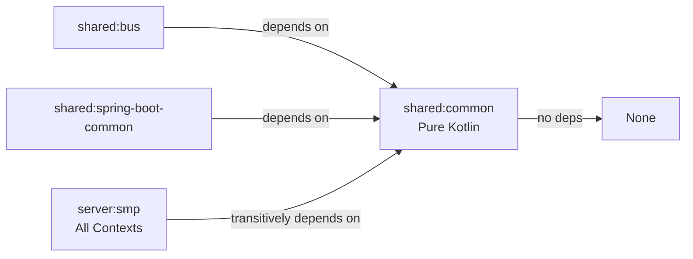

# Level 3: Component Diagram

## Overview

The Component diagram zooms into the API Application container and shows the internal structure
using bounded contexts from Domain-Driven Design.

**Audience**: Developers, architects

**Purpose**: Understand the internal organization, bounded contexts, and component interactions
within the API Application.

---

## Diagram

```plantuml
@startuml C4_Component
!include https://raw.githubusercontent.com/plantuml-stdlib/C4-PlantUML/master/C4_Component.puml

LAYOUT_WITH_LEGEND()

title Component Diagram for Profile Tailors API Application

Container(spa, "Web Application", "Vue 3, TypeScript", "User interface")
ContainerDb(db, "Database", "PostgreSQL 18", "Data store")
ContainerDb(cache, "Cache", "Caffeine / Redis (optional)", "Rate limiting store")
System_Ext(social_media, "Social Media APIs", "External platforms")

Container_Boundary(api, "API Application") {
    
    Component(http_layer, "HTTP Layer", "Spring WebFlux Controllers", "REST endpoints, request validation, response serialization")
    
    Component(identity, "Identity Context", "Bounded Context", "User authentication, principal management, JWT/API key validation")
    
    Component(authorization, "Authorization Context", "Bounded Context", "Permission checks, RBAC, workspace access control, direct grants")
    
    Component(tenancy, "Tenancy Context", "Bounded Context", "Workspace management, membership lifecycle, ownership transfers")
    
    Component(credentials, "Credentials Context", "Bounded Context", "API keys, OAuth tokens, service accounts, secret management")
    
    Component(governance, "Governance Context", "Bounded Context", "Audit logging, compliance, data retention, mutation tracking")
    
    Component(platform, "Platform Context", "Bounded Context", "Request context, mediator pattern, cross-cutting concerns")

    Component(platformadmin, "Platformadmin Context", "Bounded Context", "Global platform administration, feature flag management")
    
    Component(audit, "Audit Context", "Bounded Context", "Request outcome tracking, authorization decision auditing, mutation event capture")
    
    Component(observability, "Observability Context", "Bounded Context", "Metrics collection, rate limiting hooks, request monitoring")
    
    Component(publishing, "Publishing Context", "Bounded Context", "Post creation, scheduling, OAuth channel connections, publishing handlers")
    
    Component(analytics, "Analytics Context", "Bounded Context", "Metrics aggregation, reporting")
    
    Component(media, "Media Context", "Bounded Context", "Media asset storage, CAS deduplication")

    Component(lead_capture, "Lead Capture Context", "Bounded Context", "Public waitlist joins, lead storage, consent capture, rate-limited endpoint")

    Component(privacy, "Privacy Context", "Bounded Context", "Data subject privacy requests, erasure, export")

    Component(notifications, "Notifications Context", "Bounded Context", "Transactional email and user notification channels")

    Component(hashtags, "Hashtags Context", "Bounded Context", "Hashtag group management and performance tracking")

    Component(ideas, "Ideas Context", "Bounded Context", "Content ideas and draft brainstorming")

    Component(mcp, "MCP Context", "Bounded Context", "Model Context Protocol tools and platform AI integration")
}

Rel(spa, http_layer, "Makes API calls", "HTTPS/REST, JSON")

Rel(http_layer, identity, "Authenticates requests")
Rel(http_layer, authorization, "Checks permissions")
Rel(http_layer, tenancy, "Manages workspaces")
Rel(http_layer, credentials, "Manages credentials")
Rel(http_layer, publishing, "Manages posts & channels")
Rel(http_layer, analytics, "Queries metrics")
Rel(http_layer, lead_capture, "Joins waitlists")

Rel(identity, platform, "Uses request context")
Rel(authorization, platform, "Uses request context")
Rel(tenancy, platform, "Uses request context")
Rel(credentials, platform, "Uses request context")
Rel(publishing, platform, "Uses request context")
Rel(analytics, platform, "Uses request context")

Rel(identity, governance, "Logs authentication events")
Rel(authorization, governance, "Logs authorization decisions")
Rel(tenancy, governance, "Logs workspace changes")
Rel(credentials, governance, "Logs credential operations")

Rel(identity, audit, "Logs request outcomes")
Rel(authorization, audit, "Logs authorization decisions")
Rel(tenancy, audit, "Logs mutations")
Rel(credentials, audit, "Logs mutations")

Rel(identity, observability, "Reports metrics")
Rel(authorization, observability, "Reports metrics")
Rel(tenancy, observability, "Reports metrics")
Rel(http_layer, observability, "Rate limiting checks")
Rel(lead_capture, observability, "Rate-limit consumption")

Rel(authorization, tenancy, "Resolves workspace membership")
Rel(authorization, identity, "Resolves principal identity")
Rel(credentials, identity, "Validates API keys and tokens")

Rel(publishing, social_media, "Publishes posts")
Rel(analytics, social_media, "Fetches engagement")

Rel(identity, db, "Reads/writes", "R2DBC")
Rel(authorization, db, "Reads/writes", "R2DBC")
Rel(tenancy, db, "Reads/writes", "R2DBC")
Rel(credentials, db, "Reads/writes", "R2DBC")
Rel(governance, db, "Writes", "R2DBC")
Rel(publishing, db, "Reads/writes", "R2DBC")
Rel(analytics, db, "Reads/writes", "R2DBC")
Rel(lead_capture, db, "Reads/writes", "R2DBC")

Rel(observability, cache, "Enforces rate limits", "In-memory/Redis")

@enduml
```

---

## Mermaid Alternative

```mermaid
graph TB
    SPA[Web Application]
    DB[(Database)]
    CACHE[(Cache)]
    SOCIAL[Social Media APIs]

    subgraph "API Application"
        HTTP[HTTP Layer<br/>WebFlux Controllers]
        
        subgraph "Shared Kernel"
            KERNEL[Shared Kernel<br/>shared:common<br/>Domain Primitives, Value Objects,<br/>@Service Marker<br/>Zero Spring Dependencies]

            SHARED_BUS[shared:bus<br/>Event Bus & CQRS]
            SHARED_SEC[shared:security<br/>Hasher & Crypto]
            SHARED_PRES[shared:presentation<br/>PageResponse, DTOs]

            SHARED_SBC[shared:spring-boot-common<br/>Spring Boot Integration<br/>Exception handlers, presenters, repos]

            SHARED_STORAGE[shared:storage<br/>S3/R2 Abstraction]
            SHARED_RL[shared:shield:ratelimit<br/>Rate Limiting]
            SHARED_LC_COMMON[shared:lead-capture:common<br/>Value Objects]
            SHARED_LC_WAIT[shared:lead-capture:waitlist<br/>Domain + Ports]

            SHARED_BUS --> KERNEL
            SHARED_SEC --> KERNEL
            SHARED_PRES --> KERNEL
            SHARED_SBC --> KERNEL
            SHARED_SBC --> SHARED_BUS
            SHARED_SBC --> SHARED_SEC
            SHARED_SBC --> SHARED_PRES
            SHARED_RL --> SHARED_SBC
            SHARED_RL --> SHARED_BUS
            SHARED_STORAGE --> KERNEL
            SHARED_STORAGE --> SHARED_BUS
            SHARED_STORAGE --> SHARED_RL
            SHARED_LC_WAIT --> SHARED_LC_COMMON
        end

        %% All bounded contexts use the shared kernel
        IDENTITY -.->|Uses| SHARED_SBC
        AUTHZ -.->|Uses| SHARED_SBC
        TENANCY -.->|Uses| SHARED_SBC
        CREDS -.->|Uses| SHARED_SBC
        GOV -.->|Uses| SHARED_SBC
        PLATFORM -.->|Uses| SHARED_SBC
        AUDIT -.->|Uses| SHARED_SBC
        OBS -.->|Uses| SHARED_SBC
        CONTENT -.->|Uses| SHARED_SBC
        ANALYTICS_CTX -.->|Uses| SHARED_SBC
        INTEGRATIONS -.->|Uses| SHARED_SBC
        LEAD -.->|Uses| SHARED_SBC
        LEAD -.->|Uses| SHARED_LC_WAIT
        LEAD -.->|Uses| SHARED_LC_COMMON

        subgraph "Core Bounded Contexts"
            IDENTITY[Identity Context<br/>Authentication & Principals]
            AUTHZ[Authorization Context<br/>Permissions & RBAC]
            TENANCY[Tenancy Context<br/>Workspaces & Memberships]
            CREDS[Credentials Context<br/>API Keys & Tokens]
            GOV[Governance Context<br/>Audit & Compliance]
            PLATFORM[Platform Context<br/>Cross-Cutting Concerns]
            AUDIT[Audit Context<br/>Request & Decision Tracking]
            OBS[Observability Context<br/>Metrics & Rate Limiting]
            LEAD[Lead Capture Context<br/>Waitlist Joins & Consent]
        end
        
        subgraph "Domain Bounded Contexts (Planned)"
            CONTENT[Content Context<br/>Posts & Scheduling]
            ANALYTICS_CTX[Analytics Context<br/>Metrics & Reporting]
            INTEGRATIONS[Integrations Context<br/>Platform Adapters]
        end
    end

    SPA -->|REST/JSON| HTTP

    HTTP --> IDENTITY
    HTTP --> AUTHZ
    HTTP --> TENANCY
    HTTP --> CREDS
    HTTP --> CONTENT
    HTTP --> ANALYTICS_CTX
    HTTP --> LEAD
    
    IDENTITY --> PLATFORM
    AUTHZ --> PLATFORM
    TENANCY --> PLATFORM
    CREDS --> PLATFORM
    CONTENT --> PLATFORM
    ANALYTICS_CTX --> PLATFORM
    
    IDENTITY --> GOV
    AUTHZ --> GOV
    TENANCY --> GOV
    CREDS --> GOV
    
    IDENTITY --> AUDIT
    AUTHZ --> AUDIT
    TENANCY --> AUDIT
    CREDS --> AUDIT
    
    IDENTITY --> OBS
    AUTHZ --> OBS
    TENANCY --> OBS
    HTTP --> OBS
    LEAD --> OBS
    
    AUTHZ --> TENANCY
    AUTHZ --> IDENTITY
    CREDS --> IDENTITY
    
    CONTENT --> INTEGRATIONS
    ANALYTICS_CTX --> INTEGRATIONS
    
    IDENTITY --> DB
    AUTHZ --> DB
    TENANCY --> DB
    CREDS --> DB
    GOV --> DB
    CONTENT --> DB
    ANALYTICS_CTX --> DB
    LEAD --> DB
    
    IDENTITY --> CACHE
    CREDS --> CACHE
    
    IDENTITY --> AUTH
    INTEGRATIONS --> SOCIAL
    
    SCHED --> CONTENT
    SCHED --> INTEGRATIONS

    classDef implemented fill:#1168BD,stroke:#0B4884,color:#fff
    classDef planned fill:#666666,stroke:#444444,color:#fff
    classDef infrastructure fill:#438DD5,stroke:#2E6295,color:#fff
    classDef external fill:#999999,stroke:#6B6B6B,color:#fff
    classDef shared fill:#1a3a5c,stroke:#2a5a8c,color:#fff

    class HTTP,IDENTITY,AUTHZ,TENANCY,CREDS,GOV,PLATFORM,AUDIT,OBS,LEAD implemented
    class CONTENT,ANALYTICS_CTX,INTEGRATIONS planned
    class DB,CACHE infrastructure
    class SPA,SCHED,SOCIAL,AUTH external
    class KERNEL,SHARED_BUS,SHARED_SEC,SHARED_PRES,SHARED_SBC,SHARED_STORAGE,SHARED_RL,SHARED_LC_COMMON,SHARED_LC_WAIT shared
```



> **Full dependency graph:** See [Shared Module Dependencies](../shared/dependencies.md) for
> the complete module dependency diagram with all `api` vs `implementation` edges.

---

## Bounded Contexts

### Core Contexts (Implemented)

#### 1. Identity Context

**Purpose**: User authentication and principal management

**Responsibilities**:

- Authenticate users via JWT or API key
- Materialize authenticated principals
- Validate OAuth2 tokens
- Manage user identity lifecycle
- Provide principal context to other contexts

**Key Components**:

- `AuthenticatedPrincipal` (domain model)
- `PrincipalIdentityLookup` (application service)
- `JwtAuthenticatedPrincipalMaterializer` (infrastructure)
- `ApiKeyAuthenticatedPrincipalMaterializer` (infrastructure)
- `ApiKeyAuthenticationWebFilter` (HTTP filter)
- `JwtPrincipalAuthenticationConverter` (security)

**Dependencies**:

- Platform Context (request context)
- Credentials Context (token validation)
- Governance Context (audit logging)
- Auth Provider (JWT validation)

**Database Tables**:

- `users`
- `user_profiles`

---

#### 2. Authorization Context

**Purpose**: Permission checks and access control

**Responsibilities**:

- Enforce role-based access control (RBAC)
- Check workspace-level permissions
- Resolve direct grants
- Provide resource preview (what user can do)
- Calculate workspace access summary

**Key Components**:

- `WorkspaceAuthorizationService` (application service)
- `Role` (domain model)
- `PermissionKey` (domain model)
- `R2dbcWorkspaceMembershipRoleResolver` (infrastructure)
- `R2dbcDirectGrantResolver` (infrastructure)
- `R2dbcWorkspaceEntitlementResolver` (infrastructure)
- `ResourcePreviewController` (HTTP)

**Dependencies**:

- Identity Context (principal resolution)
- Tenancy Context (workspace membership)
- Platform Context (request context)
- Governance Context (audit logging)

**Database Tables**:

- `workspace_roles`
- `workspace_permissions`
- `direct_grants`
- `feature_entitlements`

---

#### 3. Tenancy Context

**Purpose**: Workspace and membership management

**Responsibilities**:

- Create and manage workspaces
- Manage workspace memberships
- Handle ownership transfers
- Resolve active workspace context
- Enforce membership lifecycle rules

**Key Components**:

- `Workspace` (domain model)
- `WorkspaceMembership` (domain model)
- `WorkspaceOwnership` (domain model)
- `WorkspaceOwnershipPolicy` (domain service)
- `ActiveWorkspaceContextResolver` (application service)
- `R2dbcWorkspaceMembershipRepository` (infrastructure)
- `WorkspaceContextWebFilter` (HTTP filter)

**Dependencies**:

- Identity Context (user resolution)
- Authorization Context (permission checks)
- Platform Context (request context)
- Governance Context (audit logging)

**Database Tables**:

- `workspaces`
- `workspace_memberships`
- `workspace_ownership`

---

#### 4. Credentials Context

**Purpose**: API keys, OAuth tokens, and secret management

**Responsibilities**:

- Generate and validate API keys
- Store and refresh OAuth tokens
- Manage service account credentials
- Verify federated tokens
- Handle credential lifecycle (rotation, revocation)

**Key Components**:

- `ValidatedToken` (domain model)
- `CredentialType` (domain model)
- `ApiKeySecretVerifier` (application service)
- `FederatedTokenValidator` (application service)
- `R2dbcApiKeyCredentialStateLookup` (infrastructure)
- `R2dbcServiceAccountCredentialStateLookup` (infrastructure)
- `SpringJwtValidatedTokenMapper` (infrastructure)

**Dependencies**:

- Identity Context (principal association)
- Platform Context (request context)
- Governance Context (audit logging)

**Database Tables**:

- `api_keys`
- `oauth_tokens`
- `service_accounts`
- `credential_audit_log`

---

#### 5. Governance Context

**Purpose**: Audit logging, compliance, and data retention

**Responsibilities**:

- Log all mutations and sensitive operations
- Track audit trails for compliance
- Enforce data retention policies
- Provide audit query capabilities
- Support compliance reporting

**Key Components**:

- `TenancyMutationAuditor` (application service)
- `R2dbcAuditHook` (infrastructure)
- Audit event publishers

**Dependencies**:

- Platform Context (request context)

**Database Tables**:

- `audit_log`
- `mutation_events`
- `compliance_snapshots`

---

#### 6. Platform Context

**Purpose**: Cross-cutting concerns and infrastructure

**Responsibilities**:

- Provide request context (principal, workspace, trace ID)
- Implement mediator pattern for command/query dispatch
- Manage request-scoped state
- Provide common contracts and abstractions

**Key Components**:

- `RequestContextStore` (infrastructure)
- `RequestContextProviders` (infrastructure)
- `SpringMediator` (infrastructure)
- `PlatformContracts` (application)
- `ResourceContext` (domain model)
- `PrincipalContext` (domain model)

**Dependencies**: None (foundational)

**Database Tables**: None (stateless)

---

#### 7. Audit Context

**Purpose**: Request outcome tracking and decision auditing

**Responsibilities**:

- Track request outcomes (success, failure, error)
- Audit authorization decisions with context
- Capture mutation events with before/after state
- Provide audit hooks for other contexts
- Support compliance and forensic analysis

**Key Components**:

- `AuditHook` (application service)
- `AuthorizationDecisionAuditFact` (domain model)
- `MutationAuditFact` (domain model)
- `RequestOutcome` (domain model)

**Dependencies**:

- Platform Context (request context)

**Database Tables**:

- `audit_events`
- `authorization_decisions`
- `mutation_log`

---

#### 8. Observability Context

**Purpose**: Metrics collection and rate limiting

**Responsibilities**:

- Collect request metrics (latency, throughput, errors)
- Implement rate limiting hooks
- Monitor system health
- Provide observability hooks for other contexts
- Support operational dashboards

**Key Components**:

- `MetricsHook` (application service)
- `RateLimitHook` (application service)
- `RequestOutcome` (domain model)

**Dependencies**:

- Platform Context (request context)

**Database Tables**: None (metrics exported to external systems)

---

### Domain Contexts (Planned)

#### 9. Content Context

**Purpose**: Post creation, scheduling, and draft management

**Responsibilities**:

- Create and edit posts
- Schedule posts for publishing
- Manage drafts and revisions
- Handle multi-platform post variants
- Publish via platform channels

**Key Components** (planned):

- `Post` (domain model)
- `Schedule` (domain model)
- `Draft` (domain model)
- `PostCreationService` (application service)
- `SchedulingService` (application service)

**Dependencies**:

- Identity Context (author)
- Tenancy Context (workspace)
- Authorization Context (permissions)
- Integrations Context (platform validation)
- Platform Context (request context)
- Governance Context (audit logging)

**Database Tables** (planned):

- `posts`
- `post_schedules`
- `post_drafts`
- `post_revisions`

---

#### 10. Analytics Context

**Purpose**: Metrics aggregation and reporting

**Responsibilities**:

- Aggregate engagement metrics
- Generate performance reports
- Track KPIs over time
- Provide analytics queries
- Export data for external tools

**Key Components** (planned):

- `Metric` (domain model)
- `Report` (domain model)
- `MetricsAggregationService` (application service)
- `ReportingService` (application service)

**Dependencies**:

- Tenancy Context (workspace)
- Authorization Context (permissions)
- Integrations Context (platform data)
- Platform Context (request context)

**Database Tables** (planned):

- `metrics`
- `metric_aggregates`
- `reports`
- `kpi_snapshots`

---

#### 11. Integrations Context

**Purpose**: Social media platform adapters

**Responsibilities**:

- Abstract platform-specific APIs
- Handle OAuth flows for each platform
- Normalize post formats
- Fetch engagement metrics
- Handle rate limiting and retries

**Key Components** (planned):

- `PlatformAdapter` (interface)
- `TwitterAdapter` (implementation)
- `LinkedInAdapter` (implementation)
- `InstagramAdapter` (implementation)
- `FacebookAdapter` (implementation)
- `TikTokAdapter` (implementation)
- `RateLimiter` (infrastructure)

**Dependencies**:

- Credentials Context (OAuth tokens)
- Platform Context (request context)
- Governance Context (audit logging)

**Database Tables** (planned):

- `platform_connections`
- `rate_limit_state`

---

## Component Interactions

### Authentication Flow

```
1. HTTP Request → HTTP Layer
2. HTTP Layer → Identity Context (authenticate)
3. Identity Context → Credentials Context (validate token)
4. Credentials Context → Auth Provider (verify JWT)
5. Identity Context → Platform Context (set principal context)
6. HTTP Layer → Authorization Context (check permissions)
7. Authorization Context → Tenancy Context (resolve membership)
8. Authorization Context → Platform Context (get principal)
9. HTTP Layer → Domain Context (execute business logic)
10. Domain Context → Governance Context (log mutation)
```

### Post Scheduling Flow

```text
1. HTTP Request → HTTP Layer
2. HTTP Layer → Publishing Context (create/schedule post)
3. Publishing Context → Media Context (validate and resolve attachments)
4. Publishing Context → Database (save post and schedule)
5. Publishing Context → Governance Context (log creation)
6. Publishing Context → Social Media API (publish via channel connection)
7. Publishing Context → Analytics Context (record publish event)
8. Analytics Context → Database (save event)
```

---

## Architecture Patterns

### Hexagonal Architecture (Ports & Adapters)

Each bounded context follows hexagonal architecture:

```
┌─────────────────────────────────────────────────────────┐
│ Bounded Context                                         │
├─────────────────────────────────────────────────────────┤
│                                                         │
│  ┌─────────────┐      ┌─────────────┐                 │
│  │   Domain    │      │ Application │                 │
│  │   Models    │◄─────│  Services   │                 │
│  │             │      │             │                 │
│  │  • Entities │      │  • Commands │                 │
│  │  • VOs      │      │  • Queries  │                 │
│  │  • Policies │      │  • Handlers │                 │
│  └─────────────┘      └─────────────┘                 │
│         ▲                     ▲                        │
│         │                     │                        │
│         │                     │                        │
│  ┌──────┴──────────────────────┴──────┐               │
│  │     Infrastructure (Adapters)      │               │
│  │                                    │               │
│  │  • R2DBC Repositories              │               │
│  │  • HTTP Controllers                │               │
│  │  • WebFilters                      │               │
│  │  • External API Clients            │               │
│  └────────────────────────────────────┘               │
│                                                         │
└─────────────────────────────────────────────────────────┘
```

### CQRS (Command Query Responsibility Segregation)

- **Commands**: Mutate state, return success/failure
- **Queries**: Read state, return data

Example:

- `UpdateWorkspaceMembershipStatusCommand` (command)
- `GetCurrentWorkspaceAccessSummaryQuery` (query)

### Mediator Pattern

`SpringMediator` dispatches commands and queries to handlers:

```kotlin
// Command
val command = UpdateWorkspaceMembershipStatusCommand(...)
mediator.send(command)

// Query
val query = GetResourcePreviewQuery(...)
val result = mediator.send(query)
```

### Repository Pattern

Each aggregate root has a repository interface in the application layer and an R2DBC implementation
in the infrastructure layer:

```kotlin
// Application layer (port)
interface WorkspaceMembershipRepository {
    suspend fun findById(id: UUID): WorkspaceMembership?
    suspend fun save(membership: WorkspaceMembership)
}

// Infrastructure layer (adapter)
class R2dbcWorkspaceMembershipRepository : WorkspaceMembershipRepository {
    // R2DBC implementation
}
```

---

## Shared Kernel (`shared:common`)

The **Shared Kernel** is the foundational Gradle module that provides framework-agnostic domain
primitives
used by EVERY bounded context in the API Application. In DDD terms, it is the subset of the domain
model
that all bounded contexts share.

### Key Properties

| Property          | Value                                                        |
|-------------------|--------------------------------------------------------------|
| **Gradle module** | `:shared:common`                                             |
| **Plugin**        | `com.profiletailors.kotlin.library` (pure Kotlin, no Spring) |
| **Dependencies**  | None (zero framework dependencies)                           |
| **Consumed by**   | All 8 implemented + 3 planned bounded contexts               |

### What It Provides

| Package                   | Types                                                                                                        |
|---------------------------|--------------------------------------------------------------------------------------------------------------|
| `domain`                  | `@Service` annotation (hexagonal marker), `Memoizers`, `Generated`, `SYSTEM_USER` constants                  |
| `domain.bus.event`        | `DomainEvent` interface, `BaseDomainEvent`                                                                   |
| `domain.bus.query`        | `Response` marker, `QueryResponse`                                                                           |
| `domain.model`            | `BaseEntity`, `AggregateRoot`, `AuditableEntity`, `AuditableEntityFields`, `WorkspaceId`, `Language`         |
| `domain.model.pagination` | `OffsetPage`, `CursorPage`                                                                                   |
| `domain.error`            | `BusinessRuleValidationException`, `EntityNotFoundException`, `AggregateException`, `DomainMappingException` |
| `domain.vo`               | `Username`                                                                                                   |
| `domain.vo.credential`    | `Credential`, `CredentialId`, `CredentialValue`, `CredentialException`                                       |
| `domain.vo.email`         | `Email`                                                                                                      |
| `domain.vo.ip`            | `IpHash`                                                                                                     |
| `domain.vo.name`          | `FirstName`, `LastName`, `Name`                                                                              |
| `domain.authentication`   | `AccessToken`                                                                                                |
| `domain.context`          | `PrincipalType`                                                                                              |
| `domain.observability`    | `RequestOutcome`                                                                                             |
| `domain.workspace`        | `WorkspaceMembershipSnapshot`, `WorkspaceMembershipStatus`                                                   |
| `util`                    | `SystemEnvironment`                                                                                          |

### Dependency Chain



### Design Rationale

The module intentionally has **zero Spring dependencies** to enforce hexagonal architecture rules:
domain primitives must not depend on framework concerns. If a type needs Spring annotations or
framework features, it belongs in `shared/spring-boot-common` instead.

---

## Technology Stack (Component Level)

### Domain Layer

- **Language**: Kotlin
- **Patterns**: DDD entities, value objects, domain services
- **Dependencies**: None (pure domain logic)

### Application Layer

- **Language**: Kotlin with coroutines
- **Patterns**: CQRS, mediator, repository interfaces
- **Dependencies**: Domain layer only

### Infrastructure Layer

- **Language**: Kotlin
- **Frameworks**: Spring Boot 4, Spring WebFlux, Spring Security
- **Database**: R2DBC (reactive PostgreSQL driver)
- **HTTP**: Spring WebFlux (reactive REST)
- **Security**: Spring Security (JWT, API Key)
- **Documentation**: SpringDoc OpenAPI

---

## Testing Strategy

### Unit Tests

- Domain logic (pure functions, policies)
- Application services (mocked repositories)
- Infrastructure adapters (mocked external dependencies)

### Integration Tests

- R2DBC repositories (Testcontainers PostgreSQL)
- HTTP controllers (WebTestClient)
- Security filters (MockMvc)

### Architecture Tests

- Spring Modulith verification
- Bounded context isolation
- Dependency rules

---

## Current Implementation Status

**Implemented Contexts** (19 total):

- ✅ Analytics Context (engagement metrics & reporting)
- ✅ Audit Context (request outcomes, authorization decisions, mutations)
- ✅ Authorization Context (RBAC, direct grants, workspace permissions)
- ✅ Config Context (system & application configuration)
- ✅ Credentials Context (API keys, token validation, secret management)
- ✅ Governance Context (audit logging, mutation tracking, compliance)
- ✅ Hashtags Context (hashtag group management & tracking)
- ✅ Ideas Context (content ideas & draft brainstorming)
- ✅ Identity Context (native JWT + API Key auth)
- ✅ Lead Capture Context (public waitlist joins, consent, rate-limited endpoint)
- ✅ MCP Context (Model Context Protocol integration for AI tools)
- ✅ Media Context (media asset storage, CAS deduplication)
- ✅ Notifications Context (transactional email & user notification channels)
- ✅ Observability Context (metrics hooks, rate limiting)
- ✅ Platform Context (request context, mediator pattern, cross-cutting concerns)
- ✅ Platformadmin Context (global platform administration, feature flags)
- ✅ Privacy Context (data subject privacy requests, DSAR, erasure)
- ✅ Publishing Context (posts, schedules, OAuth channel connections)
- ✅ Tenancy Context (workspaces, memberships, ownership)

---

Last updated: 2026-08-14
