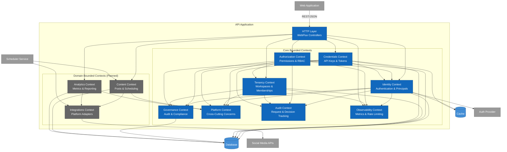

# Level 3: Component Diagram

## Overview

The Component diagram zooms into the API Application container and shows the internal structure using bounded contexts from Domain-Driven Design.

**Audience**: Developers, architects

**Purpose**: Understand the internal organization, bounded contexts, and component interactions within the API Application.

---

## Diagram

```plantuml
@startuml C4_Component
!include https://raw.githubusercontent.com/plantuml-stdlib/C4-PlantUML/master/C4_Component.puml

LAYOUT_WITH_LEGEND()

title Component Diagram for Profile Tailors API Application

Container(spa, "Web Application", "Vue 3, TypeScript", "User interface")
Container(scheduler, "Scheduler Service", "Spring Boot 4, Kotlin", "Background jobs")
ContainerDb(db, "Database", "PostgreSQL 16", "Data store")
ContainerDb(cache, "Cache", "Redis", "Session cache")
System_Ext(social_media, "Social Media APIs", "External platforms")
System_Ext(auth_provider, "Auth Provider", "OAuth2/OIDC")

Container_Boundary(api, "API Application") {
    
    Component(http_layer, "HTTP Layer", "Spring WebFlux Controllers", "REST endpoints, request validation, response serialization")
    
    Component(identity, "Identity Context", "Bounded Context", "User authentication, principal management, JWT/API key validation")
    
    Component(authorization, "Authorization Context", "Bounded Context", "Permission checks, RBAC, workspace access control, direct grants")
    
    Component(tenancy, "Tenancy Context", "Bounded Context", "Workspace management, membership lifecycle, ownership transfers")
    
    Component(credentials, "Credentials Context", "Bounded Context", "API keys, OAuth tokens, service accounts, secret management")
    
    Component(governance, "Governance Context", "Bounded Context", "Audit logging, compliance, data retention, mutation tracking")
    
    Component(platform, "Platform Context", "Bounded Context", "Request context, mediator pattern, cross-cutting concerns")
    
    Component(audit, "Audit Context", "Bounded Context", "Request outcome tracking, authorization decision auditing, mutation event capture")
    
    Component(observability, "Observability Context", "Bounded Context", "Metrics collection, rate limiting hooks, request monitoring")
    
    Component(content, "Content Context", "Bounded Context", "Post creation, scheduling, draft management (planned)")
    
    Component(analytics, "Analytics Context", "Bounded Context", "Metrics aggregation, reporting (planned)")
    
    Component(integrations, "Integrations Context", "Bounded Context", "Social media platform adapters (planned)")
}

Rel(spa, http_layer, "Makes API calls", "HTTPS/REST, JSON")

Rel(http_layer, identity, "Authenticates requests")
Rel(http_layer, authorization, "Checks permissions")
Rel(http_layer, tenancy, "Manages workspaces")
Rel(http_layer, credentials, "Manages credentials")
Rel(http_layer, content, "Manages posts")
Rel(http_layer, analytics, "Queries metrics")

Rel(identity, platform, "Uses request context")
Rel(authorization, platform, "Uses request context")
Rel(tenancy, platform, "Uses request context")
Rel(credentials, platform, "Uses request context")
Rel(content, platform, "Uses request context")
Rel(analytics, platform, "Uses request context")

Rel(identity, governance, "Logs authentication events")
Rel(authorization, governance, "Logs authorization decisions")
Rel(tenancy, governance, "Logs workspace changes")
Rel(credentials, governance, "Logs credential operations")

Rel(identity, audit, "Logs request outcomes")
Rel(authorization, audit, "Logs authorization decisions")
Rel(tenancy, audit, "Logs mutations")
Rel(credentials, audit, "Logs mutations")

Rel(identity, observability, "Reports metrics")
Rel(authorization, observability, "Reports metrics")
Rel(tenancy, observability, "Reports metrics")
Rel(http_layer, observability, "Rate limiting checks")

Rel(authorization, tenancy, "Resolves workspace membership")
Rel(authorization, identity, "Resolves principal identity")
Rel(credentials, identity, "Validates API keys and tokens")

Rel(content, integrations, "Publishes posts")
Rel(analytics, integrations, "Fetches engagement")

Rel(identity, db, "Reads/writes", "R2DBC")
Rel(authorization, db, "Reads/writes", "R2DBC")
Rel(tenancy, db, "Reads/writes", "R2DBC")
Rel(credentials, db, "Reads/writes", "R2DBC")
Rel(governance, db, "Writes", "R2DBC")
Rel(content, db, "Reads/writes", "R2DBC")
Rel(analytics, db, "Reads/writes", "R2DBC")

Rel(identity, cache, "Caches sessions", "Redis")
Rel(credentials, cache, "Caches tokens", "Redis")

Rel(identity, auth_provider, "Validates JWT", "HTTPS/OAuth2")
Rel(integrations, social_media, "Calls APIs", "HTTPS/REST")

Rel(scheduler, content, "Reads schedules", "Internal API")
Rel(scheduler, integrations, "Publishes posts", "Internal API")

@enduml
```

---

## Mermaid Alternative



---

## Bounded Contexts

### Core Contexts (Implemented)

#### 1. Identity Context
**Purpose**: User authentication and principal management

**Responsibilities**:
- Authenticate users via JWT or API key
- Materialize authenticated principals
- Validate OAuth2 tokens
- Manage user identity lifecycle
- Provide principal context to other contexts

**Key Components**:
- `AuthenticatedPrincipal` (domain model)
- `PrincipalIdentityLookup` (application service)
- `JwtAuthenticatedPrincipalMaterializer` (infrastructure)
- `ApiKeyAuthenticatedPrincipalMaterializer` (infrastructure)
- `ApiKeyAuthenticationWebFilter` (HTTP filter)
- `JwtPrincipalAuthenticationConverter` (security)

**Dependencies**:
- Platform Context (request context)
- Credentials Context (token validation)
- Governance Context (audit logging)
- Auth Provider (JWT validation)

**Database Tables**:
- `users`
- `user_profiles`

---

#### 2. Authorization Context
**Purpose**: Permission checks and access control

**Responsibilities**:
- Enforce role-based access control (RBAC)
- Check workspace-level permissions
- Resolve direct grants
- Provide resource preview (what user can do)
- Calculate workspace access summary

**Key Components**:
- `WorkspaceAuthorizationService` (application service)
- `Role` (domain model)
- `PermissionKey` (domain model)
- `R2dbcWorkspaceMembershipRoleResolver` (infrastructure)
- `R2dbcDirectGrantResolver` (infrastructure)
- `R2dbcWorkspaceEntitlementResolver` (infrastructure)
- `ResourcePreviewController` (HTTP)

**Dependencies**:
- Identity Context (principal resolution)
- Tenancy Context (workspace membership)
- Platform Context (request context)
- Governance Context (audit logging)

**Database Tables**:
- `workspace_roles`
- `workspace_permissions`
- `direct_grants`
- `feature_entitlements`

---

#### 3. Tenancy Context
**Purpose**: Workspace and membership management

**Responsibilities**:
- Create and manage workspaces
- Manage workspace memberships
- Handle ownership transfers
- Resolve active workspace context
- Enforce membership lifecycle rules

**Key Components**:
- `Workspace` (domain model)
- `WorkspaceMembership` (domain model)
- `WorkspaceOwnership` (domain model)
- `WorkspaceOwnershipPolicy` (domain service)
- `ActiveWorkspaceContextResolver` (application service)
- `R2dbcWorkspaceMembershipRepository` (infrastructure)
- `WorkspaceContextWebFilter` (HTTP filter)

**Dependencies**:
- Identity Context (user resolution)
- Authorization Context (permission checks)
- Platform Context (request context)
- Governance Context (audit logging)

**Database Tables**:
- `workspaces`
- `workspace_memberships`
- `workspace_ownership`

---

#### 4. Credentials Context
**Purpose**: API keys, OAuth tokens, and secret management

**Responsibilities**:
- Generate and validate API keys
- Store and refresh OAuth tokens
- Manage service account credentials
- Verify federated tokens
- Handle credential lifecycle (rotation, revocation)

**Key Components**:
- `ValidatedToken` (domain model)
- `CredentialType` (domain model)
- `ApiKeySecretVerifier` (application service)
- `FederatedTokenValidator` (application service)
- `R2dbcApiKeyCredentialStateLookup` (infrastructure)
- `R2dbcServiceAccountCredentialStateLookup` (infrastructure)
- `SpringJwtValidatedTokenMapper` (infrastructure)

**Dependencies**:
- Identity Context (principal association)
- Platform Context (request context)
- Governance Context (audit logging)

**Database Tables**:
- `api_keys`
- `oauth_tokens`
- `service_accounts`
- `credential_audit_log`

---

#### 5. Governance Context
**Purpose**: Audit logging, compliance, and data retention

**Responsibilities**:
- Log all mutations and sensitive operations
- Track audit trails for compliance
- Enforce data retention policies
- Provide audit query capabilities
- Support compliance reporting

**Key Components**:
- `TenancyMutationAuditor` (application service)
- `R2dbcAuditHook` (infrastructure)
- Audit event publishers

**Dependencies**:
- Platform Context (request context)

**Database Tables**:
- `audit_log`
- `mutation_events`
- `compliance_snapshots`

---

#### 6. Platform Context
**Purpose**: Cross-cutting concerns and infrastructure

**Responsibilities**:
- Provide request context (principal, workspace, trace ID)
- Implement mediator pattern for command/query dispatch
- Manage request-scoped state
- Provide common contracts and abstractions

**Key Components**:
- `RequestContextStore` (infrastructure)
- `RequestContextProviders` (infrastructure)
- `SpringMediator` (infrastructure)
- `PlatformContracts` (application)
- `ResourceContext` (domain model)
- `PrincipalContext` (domain model)

**Dependencies**: None (foundational)

**Database Tables**: None (stateless)

---

#### 6. Platform Context
**Purpose**: Cross-cutting concerns and infrastructure

**Responsibilities**:
- Provide request context (principal, workspace, trace ID)
- Implement mediator pattern for command/query dispatch
- Manage request-scoped state
- Provide common contracts and abstractions

**Key Components**:
- `RequestContextStore` (infrastructure)
- `RequestContextProviders` (infrastructure)
- `SpringMediator` (infrastructure)
- `PlatformContracts` (application)
- `ResourceContext` (domain model)
- `PrincipalContext` (domain model)

**Dependencies**: None (foundational)

**Database Tables**: None (stateless)

---

#### 7. Audit Context
**Purpose**: Request outcome tracking and decision auditing

**Responsibilities**:
- Track request outcomes (success, failure, error)
- Audit authorization decisions with context
- Capture mutation events with before/after state
- Provide audit hooks for other contexts
- Support compliance and forensic analysis

**Key Components**:
- `AuditHook` (application service)
- `AuthorizationDecisionAuditFact` (domain model)
- `MutationAuditFact` (domain model)
- `RequestOutcome` (domain model)

**Dependencies**:
- Platform Context (request context)

**Database Tables**:
- `audit_events`
- `authorization_decisions`
- `mutation_log`

---

#### 8. Observability Context
**Purpose**: Metrics collection and rate limiting

**Responsibilities**:
- Collect request metrics (latency, throughput, errors)
- Implement rate limiting hooks
- Monitor system health
- Provide observability hooks for other contexts
- Support operational dashboards

**Key Components**:
- `MetricsHook` (application service)
- `RateLimitHook` (application service)
- `RequestOutcome` (domain model)

**Dependencies**:
- Platform Context (request context)

**Database Tables**: None (metrics exported to external systems)

---

### Domain Contexts (Planned)

#### 9. Content Context
**Purpose**: Post creation, scheduling, and draft management

**Responsibilities**:
- Create and edit posts
- Schedule posts for publishing
- Manage drafts and revisions
- Handle multi-platform post variants
- Coordinate with scheduler service

**Key Components** (planned):
- `Post` (domain model)
- `Schedule` (domain model)
- `Draft` (domain model)
- `PostCreationService` (application service)
- `SchedulingService` (application service)

**Dependencies**:
- Identity Context (author)
- Tenancy Context (workspace)
- Authorization Context (permissions)
- Integrations Context (platform validation)
- Platform Context (request context)
- Governance Context (audit logging)

**Database Tables** (planned):
- `posts`
- `post_schedules`
- `post_drafts`
- `post_revisions`

---

#### 10. Analytics Context
**Purpose**: Metrics aggregation and reporting

**Responsibilities**:
- Aggregate engagement metrics
- Generate performance reports
- Track KPIs over time
- Provide analytics queries
- Export data for external tools

**Key Components** (planned):
- `Metric` (domain model)
- `Report` (domain model)
- `MetricsAggregationService` (application service)
- `ReportingService` (application service)

**Dependencies**:
- Tenancy Context (workspace)
- Authorization Context (permissions)
- Integrations Context (platform data)
- Platform Context (request context)

**Database Tables** (planned):
- `metrics`
- `metric_aggregates`
- `reports`
- `kpi_snapshots`

---

#### 11. Integrations Context
**Purpose**: Social media platform adapters

**Responsibilities**:
- Abstract platform-specific APIs
- Handle OAuth flows for each platform
- Normalize post formats
- Fetch engagement metrics
- Handle rate limiting and retries

**Key Components** (planned):
- `PlatformAdapter` (interface)
- `TwitterAdapter` (implementation)
- `LinkedInAdapter` (implementation)
- `InstagramAdapter` (implementation)
- `FacebookAdapter` (implementation)
- `TikTokAdapter` (implementation)
- `RateLimiter` (infrastructure)

**Dependencies**:
- Credentials Context (OAuth tokens)
- Platform Context (request context)
- Governance Context (audit logging)

**Database Tables** (planned):
- `platform_connections`
- `rate_limit_state`

---

## Component Interactions

### Authentication Flow

```
1. HTTP Request → HTTP Layer
2. HTTP Layer → Identity Context (authenticate)
3. Identity Context → Credentials Context (validate token)
4. Credentials Context → Auth Provider (verify JWT)
5. Identity Context → Platform Context (set principal context)
6. HTTP Layer → Authorization Context (check permissions)
7. Authorization Context → Tenancy Context (resolve membership)
8. Authorization Context → Platform Context (get principal)
9. HTTP Layer → Domain Context (execute business logic)
10. Domain Context → Governance Context (log mutation)
```

### Post Scheduling Flow (Planned)

```
1. HTTP Request → HTTP Layer
2. HTTP Layer → Content Context (create post)
3. Content Context → Integrations Context (validate format)
4. Content Context → Database (save post and schedule)
5. Content Context → Governance Context (log creation)
6. Scheduler Service → Content Context (fetch due posts)
7. Scheduler Service → Integrations Context (publish post)
8. Integrations Context → Social Media API (POST)
9. Integrations Context → Analytics Context (record publish event)
10. Analytics Context → Database (save event)
```

---

## Architecture Patterns

### Hexagonal Architecture (Ports & Adapters)

Each bounded context follows hexagonal architecture:

```
┌─────────────────────────────────────────────────────────┐
│ Bounded Context                                         │
├─────────────────────────────────────────────────────────┤
│                                                         │
│  ┌─────────────┐      ┌─────────────┐                 │
│  │   Domain    │      │ Application │                 │
│  │   Models    │◄─────│  Services   │                 │
│  │             │      │             │                 │
│  │  • Entities │      │  • Commands │                 │
│  │  • VOs      │      │  • Queries  │                 │
│  │  • Policies │      │  • Handlers │                 │
│  └─────────────┘      └─────────────┘                 │
│         ▲                     ▲                        │
│         │                     │                        │
│         │                     │                        │
│  ┌──────┴──────────────────────┴──────┐               │
│  │     Infrastructure (Adapters)      │               │
│  │                                    │               │
│  │  • R2DBC Repositories              │               │
│  │  • HTTP Controllers                │               │
│  │  • WebFilters                      │               │
│  │  • External API Clients            │               │
│  └────────────────────────────────────┘               │
│                                                         │
└─────────────────────────────────────────────────────────┘
```

### CQRS (Command Query Responsibility Segregation)

- **Commands**: Mutate state, return success/failure
- **Queries**: Read state, return data

Example:
- `UpdateWorkspaceMembershipStatusCommand` (command)
- `GetCurrentWorkspaceAccessSummaryQuery` (query)

### Mediator Pattern

`SpringMediator` dispatches commands and queries to handlers:

```kotlin
// Command
val command = UpdateWorkspaceMembershipStatusCommand(...)
mediator.send(command)

// Query
val query = GetResourcePreviewQuery(...)
val result = mediator.send(query)
```

### Repository Pattern

Each aggregate root has a repository interface in the application layer and an R2DBC implementation in the infrastructure layer:

```kotlin
// Application layer (port)
interface WorkspaceMembershipRepository {
    suspend fun findById(id: UUID): WorkspaceMembership?
    suspend fun save(membership: WorkspaceMembership)
}

// Infrastructure layer (adapter)
class R2dbcWorkspaceMembershipRepository : WorkspaceMembershipRepository {
    // R2DBC implementation
}
```

---

## Technology Stack (Component Level)

### Domain Layer
- **Language**: Kotlin
- **Patterns**: DDD entities, value objects, domain services
- **Dependencies**: None (pure domain logic)

### Application Layer
- **Language**: Kotlin with coroutines
- **Patterns**: CQRS, mediator, repository interfaces
- **Dependencies**: Domain layer only

### Infrastructure Layer
- **Language**: Kotlin
- **Frameworks**: Spring Boot 4, Spring WebFlux, Spring Security
- **Database**: R2DBC (reactive PostgreSQL driver)
- **HTTP**: Spring WebFlux (reactive REST)
- **Security**: Spring Security (JWT, API Key)
- **Documentation**: SpringDoc OpenAPI

---

## Testing Strategy

### Unit Tests
- Domain logic (pure functions, policies)
- Application services (mocked repositories)
- Infrastructure adapters (mocked external dependencies)

### Integration Tests
- R2DBC repositories (Testcontainers PostgreSQL)
- HTTP controllers (WebTestClient)
- Security filters (MockMvc)

### Architecture Tests
- Spring Modulith verification
- Bounded context isolation
- Dependency rules

---

## Current Implementation Status

**Implemented Contexts**:
- ✅ Identity Context (JWT + API Key auth)
- ✅ Authorization Context (RBAC, direct grants, entitlements)
- ✅ Tenancy Context (workspaces, memberships, ownership)
- ✅ Credentials Context (API keys, token validation)
- ✅ Governance Context (audit logging, mutation tracking)
- ✅ Platform Context (request context, mediator)
- ✅ Audit Context (request outcomes, authorization decisions, mutations)
- ✅ Observability Context (metrics hooks, rate limiting)

**Planned Contexts**:
- 🔲 Content Context (posts, scheduling, drafts)
- 🔲 Analytics Context (metrics, reporting)
- 🔲 Integrations Context (social media adapters)

---

Last updated: 2026-05-21
