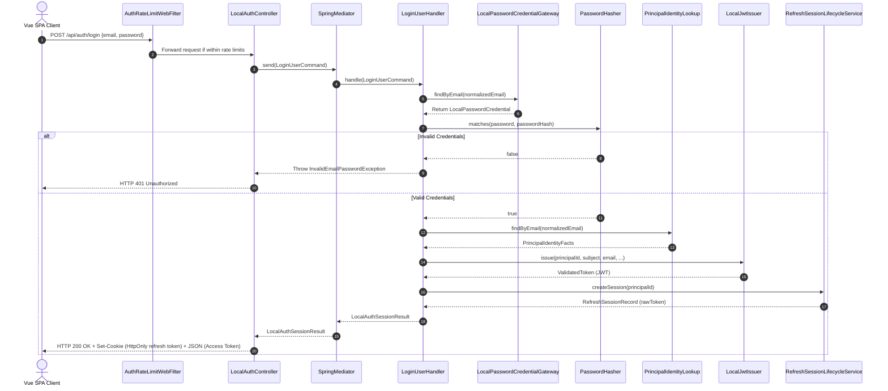
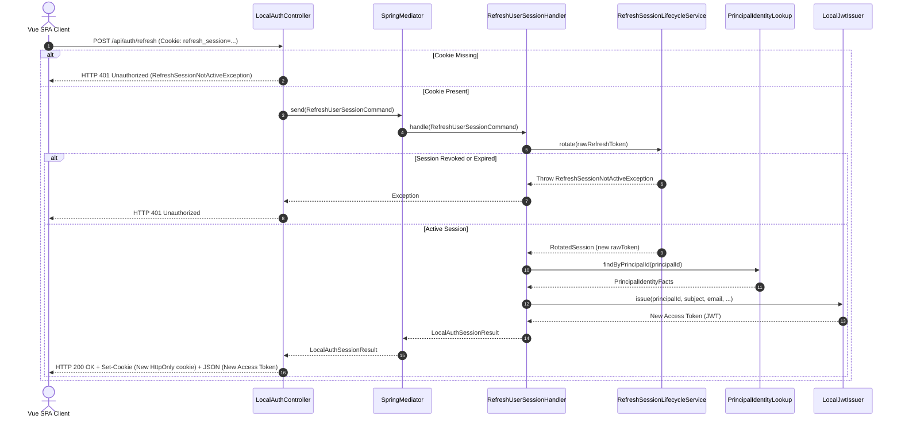
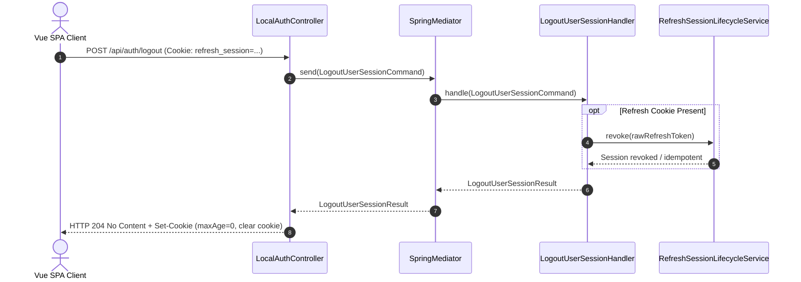
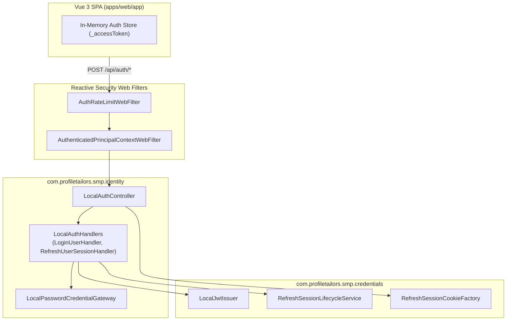

# Login Flow Architecture & Sequence Diagrams

- **Status**: Active / Implemented
- **Bounded Contexts**: `com.profiletailors.smp.identity`, `com.profiletailors.smp.credentials`
- **Related Specifications**: [ADR-0009: JWT & HttpOnly Cookie Authentication](adr/0009-jwt-and-httponly-cookie-authentication.md), [IAM Platform](iam-platform.md)

---

## Overview

The authentication architecture for Profile Tailors uses a dual-token strategy adhering to [ADR-0009](adr/0009-jwt-and-httponly-cookie-authentication.md):

1. **Short-Lived Access Token (JWT)**: Carried in memory by the SPA client and sent via `Authorization: Bearer <token>` header for API requests.
2. **Long-Lived Refresh Token**: Issued via secure `HttpOnly`, `SameSite=Lax` (or Strict), `Secure` cookie, validated exclusively at `/api/auth/refresh`.

This document details the exact sequence and component relationships for **Login**, **Silent Refresh**, and **Logout** flows.

Visual companions: [login sequence](./diagrams/login-sequence.html), [login decisions](./diagrams/login-decisiones.html), [refresh, rotation and hydrate](./diagrams/login-refresh.html).

---

## 1. Login Flow (`POST /api/auth/login`)

When a user submits credentials via the Vue SPA dashboard:

1. `AuthRateLimitWebFilter` checks rate limits on `/api/auth/login`.
2. `LocalAuthController` receives `LoginUserRequest` and dispatches `LoginUserCommand` via `Mediator`.
3. `LoginUserHandler` normalizes input email and verifies the password hash via `LocalPasswordCredentialGateway` and `PasswordHasher`.
4. Upon successful verification, `LoginUserHandler` looks up principal identity details (`PrincipalIdentityLookup`).
5. `LocalJwtIssuer` issues a short-lived access JWT token.
6. `RefreshSessionLifecycleService` creates a persisted refresh session and generates a raw refresh token.
7. `LocalAuthController` builds the HTTP response containing the `AuthTokens` JSON body (access token, principal ID, email, emailStatus) and sets the `HttpOnly` refresh cookie via `RefreshSessionCookieFactory`.

### Sequence Diagram: User Login

---

## 2. Silent Refresh Flow (`POST /api/auth/refresh`)

When the access token in memory expires or on initial SPA load with an active session:

1. SPA issues `POST /api/auth/refresh` carrying the `HttpOnly` refresh cookie automatically attached by the browser.
2. `LocalAuthController` extracts the cookie value. If missing, it throws `RefreshSessionNotActiveException`.
3. `RefreshUserSessionHandler` calls `RefreshSessionLifecycleService.rotate(rawRefreshToken)` to atomically invalidate the old refresh token and issue a new rotated session token.
4. `PrincipalIdentityLookup` resolves updated principal identity facts.
5. `LocalJwtIssuer` generates a fresh JWT access token.
6. `LocalAuthController` sets the rotated refresh cookie in the `Set-Cookie` header and returns the updated `AuthTokens` payload.

### Sequence Diagram: Token Refresh & Session Rotation

---

## 3. Logout Flow (`POST /api/auth/logout`)

When a user initiates explicit logout:

1. SPA calls `POST /api/auth/logout`.
2. `LocalAuthController` extracts the refresh cookie if present and sends `LogoutUserSessionCommand`.
3. `LogoutUserSessionHandler` revokes the refresh session in `RefreshSessionLifecycleService`. If the session was already inactive, revocation behaves idempotently.
4. `LocalAuthController` builds a `204 No Content` response with a cleared cookie (`maxAge = 0`).

### Sequence Diagram: User Logout

---

## 4. Architectural Boundaries & Security Guarantees

### Security Properties
- **XSS Protection**: Access tokens reside exclusively in memory. Refresh tokens are isolated inside `HttpOnly` cookies and cannot be accessed via JavaScript `document.cookie`.
- **CSRF Protection**: Refresh cookies carry `SameSite=Lax`/`Strict` policy and are restricted solely to `/api/auth/refresh`.
- **Stateless Verification**: API requests evaluate JWT access tokens statelessly without DB roundtrips on protected endpoints.
- **Session Rotation**: Every refresh invocation revokes the prior refresh token and issues a new one, mitigating token replay attacks.

Last updated: 2026-09-04
