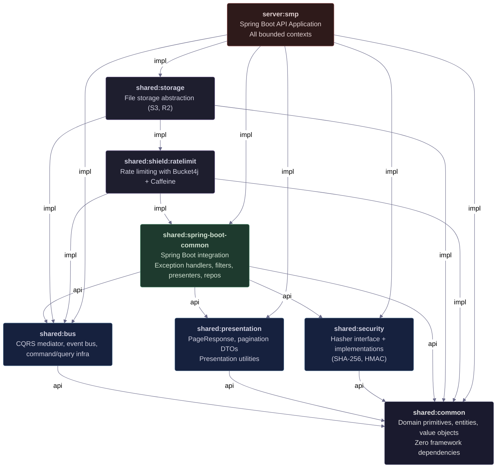

# Shared Module Dependencies

> Quick-reference dependency graph for the `shared/` Gradle modules in the Profile Tailors monorepo.
> Last updated: 2026-06-13

## Dependency Graph



## Module Reference

| Module | Path | Type | Depends On | Consumed By |
|--------|------|------|------------|-------------|
| `:shared:common` | `shared/common/` | Foundation (no deps) | — | All modules |
| `:shared:bus` | `shared/bus/` | Shared | `:shared:common` | SBC, storage, ratelimit, smp |
| `:shared:presentation` | `shared/presentation/` | Shared | `:shared:common` | SBC, smp |
| `:shared:security` | `shared/security/` | Shared | `:shared:common` | SBC, smp |
| `:shared:spring-boot-common` | `shared/spring-boot-common/` | Spring Boot integration | `:shared:common`, `:shared:bus`, `:shared:security`, `:shared:presentation` | ratelimit, smp |
| `:shared:storage` | `shared/storage/` | Infrastructure | `:shared:common`, `:shared:bus`, `:shared:shield:ratelimit` | smp |
| `:shared:shield:ratelimit` | `shared/shield/ratelimit/` | Infrastructure | `:shared:common`, `:shared:bus`, `:shared:spring-boot-common` | storage |
| `:server:smp` | `server/smp/` | Application | All `shared:*` modules | — |

## Layer Rules

```
┌─────────────────────────────────────────────┐
│         server:smp (Application)            │
│  Bounded contexts with Spring Boot + WebFlux │
├─────────────────────────────────────────────┤
│         shared:spring-boot-common           │
│  Spring-specific: controllers, filters,      │
│  presenters, exception handlers, repos       │
├──────────────────┬──────────────────────────┤
│ shared:bus       │  shared:presentation     │
│ shared:security  │  shared:storage          │
│                  │  shared:shield:ratelimit │
├──────────────────┴──────────────────────────┤
│             shared:common                   │
│  Pure domain primitives, zero Spring deps   │
│  DDD building blocks, value objects, errors │
└─────────────────────────────────────────────┘
```

## Design Rules

1. **Cycles forbidden** — The graph is strictly acyclic. No module depends on something that depends on it.
2. **Foundation** — `shared:common` has zero dependencies. All domain primitives live here.
3. **Spring isolation** — If a type needs Spring annotations, it belongs in `shared:spring-boot-common`, never in `shared:common`.
4. **api vs implementation** — Modules use `api(...)` when their consumers need the transitive dependency (e.g., SBC exposes bus types). Use `implementation(...)` when the dependency is internal.
5. **Version alignment** — All shared modules use the same Kotlin, Jackson, and Spring Boot versions via the Gradle version catalog (`gradle/libs.versions.toml`).
