# Design: MCP Write Tools for Publication Lifecycle

- **Change**: `mcp-write-tools`
- **Linear**: DALLAY-590 (also fixes the broken read path shipped by DALLAY-434)
- **Companion ADR**: ADR-0019 (`openspec/changes/mcp-write-tools/adr-0019-mcp-write-tools.md`)
- **Branch series**: `feature/mcp-write-tools-{00..04}-*`
- **Base**: each PR rebases onto `main`

## 1. Architecture overview

```mermaid
flowchart LR
    A[AI Agent] -->|Streamable HTTP POST /api/mcp| B[McpSecurityConfiguration]
    B -->|JWT validated, audience, expiry, workspace claim| C[Spring AI MCP transport]
    C -->|resolves @McpTool method| D[McpToolInvocationAuthorizer]
    D -->|scope required via McpToolMetadata.registry| E[McpWorkspaceMembershipChecker]
    E -->|tenant-bound| F[Tool Handler]
    F -->|mediator.send command/query| G[Domain]
    G -->|PublicationResult / error| H[McpErrorMapper]
    H --> I[McpToolInvocationAuditFact Publisher]
    F --> J[McpRateLimitFilter]
    I --> K[mcp.audit logger]
    H -->|JSON-RPC envelope| A
```



**Key invariants**

- Discovery is annotation-driven, not programmatic — every `@McpTool` method on an
  `@Component` bean becomes part of the catalog automatically.
- Authorization runs after the transport resolves the method, before the handler runs.
- Audit emission is a side-effect that MUST NOT alter the tool outcome; failures in the
  audit sink are logged at WARN and the original outcome is returned to the agent.
- Rate limiting, error mapping, and audit emission are cross-cutting and share no
  mutable state with the handler.

## 2. PR 0 — Registration + security hardening

### 2.1 Spring AI 2.0 tool discovery

`server/smp/src/main/kotlin/com/profiletailors/smp/mcp/tools/{Publication,Channel,Provider}Tools.kt`
MUST add `@Component` and `@McpTool(name, description, generateOutputSchema = true)` to
every tool method. Parameters MUST use `@McpToolParam`. The four tool classes become
Spring beans; `McpConfiguration` registers nothing programmatic for discovery unless a
smoke test shows the auto-configuration did not pick the beans up.

**Smoke evidence** (run on a fresh checkout before merging PR 0):

```bash
curl -sS -H 'Authorization: Bearer <mcp-token>' \
     -H 'Accept: application/json' \
     -d '{"jsonrpc":"2.0","id":"1","method":"tools/list"}' \
     http://localhost:8080/api/mcp
# Expect: result.tools[*].name contains exactly mcp_ping,
#         list_publications, get_calendar, list_channels, list_providers
```

If `tools/list` returns zero entries, register the beans explicitly via
`@Bean ToolCallbackProvider` so the project does not silently regress on every Spring
AI upgrade. The smoke test is the durable proof.

### 2.2 Workspace membership — replace the stub

`McpWorkspaceMembershipChecker` currently returns `Mono.just(true)`. PR 0 MUST replace
it with a real query against the tenancy bounded context. The query takes the resolved
`workspaceId` from the JWT and a `principalId`, looks up active membership, and returns
`Mono<Boolean>`. Failures MUST close: a query exception becomes `false` (reject), not
`true` (allow). The existing `McpAuthenticationToken` already carries the claims needed
to drive the query — no DTO changes required.

### 2.3 Per-tool authorization

`McpToolInvocationAuthorizer.authorize(toolName, scopes)` MUST look up
`McpToolMetadata.requiredScope(toolName)` and require exact scope membership. The
mapping table lives in `McpToolMetadata` and matches the spec. `mcp_ping` MUST be the
only tool with no required scope. On mismatch, the authorizer MUST cause
`ApplicationError(code = "insufficient_scope", category = "authorization", retryable =
false)` to be returned. The current `scopes.any { it.startsWith("mcp:") }` MUST be
deleted.

### 2.4 Audit emission

A new `McpAuditEmitter` (in `server/smp/.../mcp/infrastructure/audit/`) MUST publish a
`McpToolInvocationAuditFact` per call. Approach: a WebFlux `WebFilter` ordered *after*
authentication. The filter inspects the resolver for `McpContext` (or a header set by
the security filter), extracts the tool name from the JSON-RPC request, and emits at the
end via `doFinally`. The fact MUST carry `toolName`, `workspaceId`, `principal`,
`outcome`, `timestamp`. `clientToolCallId` and `publicationId` are populated only when
known (see §6 open questions).

Sink: the existing `mcp.audit` structured logger at INFO level. The filter MUST log a
correlation marker `mcp.audit.correlation=<correlationId>` so operators can trace.

### 2.5 End-to-end proof

Two BDD scenarios MUST land with PR 0:

1. **Fresh `tools/list`** — assert the catalog contains the five declared tools and
   nothing else.
2. **`list_publications` payload** — invoke the tool end-to-end through the
   `/api/mcp` transport and assert the payload matches what direct mediator invocation
   returns. This is the bug DALLAY-434 left open: the BDD asserts the payload, not just
   the `200 OK` from the transport.

The `McpApplicationBootTest` style (when present) is reused. The MCP client uses the
JSON-RPC envelope over HTTP exactly as an agent would.

## 3. PR 1 — Write-tool foundation (depends on ADR-0019)

### 3.1 Idempotency

New table `idempotency_records` (Liquibase `0001-mcp-idempotency-records.xml`):

```sql
CREATE TABLE idempotency_records (
    id BIGSERIAL PRIMARY KEY,
    workspace_id UUID NOT NULL,
    principal_id UUID NOT NULL,
    tool_name VARCHAR(80) NOT NULL,
    key_hash CHAR(64) NOT NULL,                -- SHA-256 of the plaintext key
    response_json JSONB NOT NULL,
    created_at TIMESTAMPTZ NOT NULL DEFAULT now(),
    UNIQUE (workspace_id, principal_id, tool_name, key_hash)
);
CREATE INDEX idempotency_records_workspace_idx ON idempotency_records(workspace_id);
```

Repository: `IdempotencyRecordRepository.find(workspaceId, principalId, toolName, keyHash)`
returns `Mono<Optional<String>>` (the cached JSON) or empty. `save(...)` writes through.
The MCP adapter dispatches: lookup → if hit, return cached JSON parsed; if miss, run
handler, save, return. Plaintext key is hashed with SHA-256 before storage; never
persisted.

### 3.2 `mcp:publications:write` scope

Keycloak realm: add `mcp-publications-write` to the MCP client scope, declare the
`mcp:publications:write` scope name, and grant it on tokens issued for MCP clients. The
archived spike (`openspec/changes/archive/2026-08-27-mcp-server/spikes/SPIKE_OUTCOME.md`)
already documents the protocol mapper pattern for the read scopes; PR 1 extends it. The
`ResourceMetadataController.scopesSupported` list grows from two to three.

### 3.3 Rate-limit bucket split

`McpRateLimitFilter` (existing) gains a `mcp-publications-write` bucket alongside the
existing `mcp-publications-read` and `mcp-channels` buckets. Budgets (configurable in
`application.yml`):

- `mcp-publications-read`: 30/min (existing)
- `mcp-channels`: 60/min (existing)
- `mcp-publications-write`: 15/min — chosen lower than reads because the side effect
  is more expensive; revisit once DALLAY-416 produces a real consumer profile.

### 3.4 Error contract

`McpErrorMapper` (existing) gains five codes tied to write paths:

- `insufficient_scope` (category: authorization)
- `publication_not_found` (category: not_found)
- `publication_state_conflict` (category: validation) — e.g. retry against `CANCELLED`
- `publication_validation_failed` (category: validation)
- `idempotency_conflict` (category: idempotency) — malformed collision
- `media_unavailable` (category: platform) — referenced assets not reachable

The `ApplicationError` shape is unchanged; new codes flow through the existing mapper.

### 3.5 Decision carried from ADR-0019 §Q1

Return shape is the existing `PublicationResult` plus `correlationId`. No new types.

## 4. PR 2 — `create_publication`, `edit_publication`, `delete_publication`

### 4.1 Input contracts

| Tool | Required params | Optional params | Maps to |
|---|---|---|---|
| `create_publication` | `socialAccountId`, `scheduleMode` ∈ {`SCHEDULED_AT`,`NEXT_SLOT`,`NOW`} | `title`, `bodyText`, `assetIds[]`, `scheduledFor`, `priority`, `idempotencyKey` | `CreatePublicationCommand` |
| `edit_publication` | `publicationId` | `title`, `bodyText`, `assetIds[]`, `scheduleMode`, `scheduledFor`, `priority`, `idempotencyKey` | `EditPublicationCommand` |
| `delete_publication` | `publicationId` | `idempotencyKey` | `DeletePublicationCommand` |

Annotations per `@McpToolParam` for description and required-ness. Nullables are
annotated `@McpToolParam(required = false)`.

### 4.2 Error mapping

`McpErrorMapper.mapToError(throwable)` (existing) handles the standard cases
(IllegalArgumentException → `publication_validation_failed`, NotFound →
`publication_not_found`, Conflict → `publication_state_conflict`). New code mappings
SHOULD reuse the existing `category` taxonomy so the consumer's switch statement in
DALLAY-416 stays shallow.

### 4.3 Hints

Per ADR-0019 §Q4: `destructiveHint = true`, `idempotentHint = true` for delete only;
`create` and `edit` carry `destructiveHint = true` only.

## 5. PR 3 — `cancel_publication`, `retry_publication`

Same shape as PR 2. `cancel` and `retry` accept optional `idempotencyKey`. They map to
`CancelPublicationCommand` and `RetryPublicationCommand` respectively. The
`publication_state_conflict` error covers retry against `CANCELLED` or already-`DRAFT`
state. `destructiveHint = true` for `retry` only; `cancel` is destructive + idempotent
per ADR-0019.

## 6. PR 4 — BDD + documentation

### 6.1 BDD scenarios

For each write tool: happy path, missing scope, missing required field, invalid
schedule, idempotency replay, platform failure (simulated by injecting a transport
exception in the handler). For PR 4 the scenario count is roughly 30 — one matrix per
tool plus the read-side end-to-end smoke that already lives in PR 0.

### 6.2 Documentation

- `docs/mcp-server.md` updates the tool catalog (5 → 9), the scope list, and the
  onboarding flow for `mcp:publications:write`.
- MCP Inspector walkthrough shows the new `destructiveHint` / `idempotentHint`
  annotations in the response.
- DALLAY-416 onboarding pointer: this is the API the AI-Powered Post Generator
  consumes.

## 7. Open design questions (carried from exploration.md)

The following are unverified at design time. Each MUST be resolved by either a
re-target spike in PR 0 or a small follow-up ADR.

- **`spring_ai_jsonrpc_id_uncertain`** — verify that `@McpTool` methods receive the
  JSON-RPC request `id` either as a parameter or via a context object in Spring AI 2.0.
  If yes, populate `clientToolCallId`. If no, drop the field from the audit fact for
  v1 and revisit.
- **`idempotency_unproven_for_publish`** — confirm no existing command accepts an
  idempotency key today; if any does, reuse it instead of the new adapter-layer table.
- **`no_publish_failure_signal`** — confirm the publishing worker surfaces no event
  agent subscribers can hook into today; ADR-0019 §Q2 accepts polling as the v1
  contract.
- **`idempotency_key_required_or_optional`** — ADR-0019 defaults to optional; confirm
  with DALLAY-416 design before PR 2 lands.

## 8. Source-of-truth impact

- `openspec/specs/mcp-server/spec.md` — modified (Tool Registration delta).
- `openspec/specs/iam/spec.md` — modified if `mcp:publications:write` scope is added to
  the credential model.
- `docs/architecture/adr/README.md` — add ADR-0019 entry; index the new file.
- `docs/architecture/adr/0019-mcp-write-tools.md` — new file (moved from
  `openspec/changes/mcp-write-tools/adr-0019-mcp-write-tools.md` on archive).
- Keycloak realm JSON — `mcp-publications-write` scope + protocol mapper.
- `docs/mcp-server.md` — updated catalog and onboarding.

## 9. Quality gates

`just backend-check`, `just backend-test`, `just backend-bdd-fast`,
`just backend-test-postgres` (when persistence changes apply) MUST pass. The MCP
Inspector walkthrough is manual evidence and MUST be captured in the verification
report.
