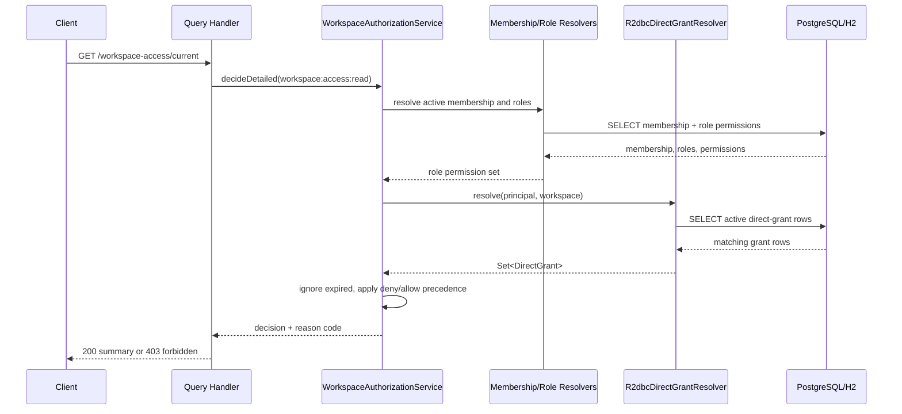

# Design: Backend Authorization Breadth

## Technical Approach

This change keeps the existing authorization proving slice intact and makes one currently stubbed
concept real: persisted workspace-scoped direct grants. The implementation stays inside `server/smp`
and uses the same shape already present in the runtime flow: Liquibase creates one narrow
authorization table, an R2DBC adapter resolves active grants for the current principal and
workspace, and `WorkspaceAuthorizationService` continues to decide access through its existing
deterministic order.

The design intentionally does **not** broaden the platform into scopes, entitlements,
grant-management APIs, or a separate deny-rule subsystem. It operationalizes the already-modeled
`DirectGrant` concept only for `/api/authorization/workspace-access/current`.

## Architecture Decisions

### Decision: Persist direct grants in one dedicated authorization table

**Choice**: Add a single Liquibase changelog that creates a `workspace_direct_grants` table keyed to
workspace, principal, and permission, with `effect`, optional `expires_at`, optional serialized
`conditions`, and standard timestamps.

**Alternatives considered**:

- Reuse `workspace_memberships` or `membership_roles` for direct grants.
- Introduce a generic policy/rule table for grants, deny rules, scopes, and entitlements together.
- Model deny as a separate table now.

**Rationale**: Direct grants are already a first-class domain concept distinct from roles, so a
dedicated table preserves that boundary cleanly. Reusing membership/role tables would blur semantics
and complicate precedence. A generic policy store or separate deny subsystem is broader than this
change and would force decisions the proposal explicitly defers.

### Decision: Resolve grants by current principal + current workspace only

**Choice**: Implement an R2DBC resolver that queries only grants matching the active `principal_id`,
`principal_type`, `workspace_id`, and requested resource context type, then maps rows to existing
`DirectGrant` domain objects.

**Alternatives considered**:

- Load all grants for a principal and filter in memory.
- Add a generalized resource-context abstraction in persistence now.
- Resolve grants through membership instead of principal identity.

**Rationale**: The current proving slice is workspace-scoped and already resolves by current
principal and current workspace. Matching that shape keeps the query narrow, indexable, and easy to
prove on H2/PostgreSQL. Loading extra rows or generalizing resource-context persistence now would
broaden scope without adding value for this slice.

### Decision: Integrate through the existing `DirectGrantResolver` seam only

**Choice**: Replace the no-op `DirectGrantResolver` bean in `AuthorizationBootstrapConfiguration`
with an R2DBC-backed implementation while leaving `WorkspaceAuthorizationService` contracts
unchanged.

**Alternatives considered**:

- Add repository calls directly inside `WorkspaceAuthorizationService`.
- Introduce a new application service just for direct-grant precedence.
- Broaden the service API to accept multiple authorization dimensions at once.

**Rationale**: The current service already has the correct dependency seam and evaluation order.
Wiring the persisted implementation through that seam preserves the architecture and keeps the
change small. Pulling infrastructure directly into the service would weaken boundaries for no gain.

### Decision: Preserve current evaluation breadth and precedence semantics

**Choice**: Keep the runtime order as it exists today: active membership required -> resolve
roles -> resolve direct grants -> ignore inactive grants -> deny wins -> allow wins -> role
permission fallback -> deny by default.

**Alternatives considered**:

- Evaluate direct grants before membership.
- Introduce new scope or entitlement enforcement while touching the service.
- Add a separate deny pass or deny store.

**Rationale**: The current service already encodes the intended semantics and current tests depend
on them. This change is about making direct grants persisted and executable, not redesigning
authorization breadth. Keeping the order stable minimizes regression risk and proves only the
missing capability.

## Data Flow

### Runtime flow

```text
HTTP GET /api/authorization/workspace-access/current
  -> WorkspaceAccessSummaryController
  -> GetCurrentWorkspaceAccessSummaryHandler
  -> WorkspaceAuthorizationService.decideDetailed(workspace:access:read)
      -> PrincipalContextProvider.require()
      -> ResourceContextProvider.require()
      -> WorkspaceMembershipResolver.resolve(...)
      -> WorkspaceMembershipRoleResolver.resolve(membership)
      -> DirectGrantResolver.resolve(principal, workspace)
          -> R2dbcDirectGrantResolver
          -> workspace_direct_grants + permissions lookup
      -> filter to required permission + active grants
      -> DENY direct grant? deny
      -> ALLOW direct grant? allow
      -> role permission present? allow
      -> else deny
  -> audit fact emitted with DIRECT_ALLOW / DIRECT_DENY / ROLE_PERMISSION / MISSING_PERMISSION
  -> handler returns summary or throws AuthorizationDeniedException
```

### Sequence diagram



### Persistence query shape

The resolver query stays narrow and read-only:

- filter by `workspace_id`
- filter by `principal_id`
- filter by `principal_type`
- optionally constrain `resource_context_type = 'WORKSPACE'`
- join to `permissions` so persisted rows map back to `PermissionKey`
- return both `ALLOW` and `DENY` rows; expiration is checked again in application logic via
  `DirectGrant.isActive(clock.instant())`

This preserves one place for authoritative precedence and time-based activity rules:
`WorkspaceAuthorizationService`.

## Minimal Schema Additions

### New table: `workspace_direct_grants`

Purpose: persist direct grants for a principal inside one workspace without introducing management
breadth.

Proposed columns:

| Column            | Type                                | Notes                                                      |
|-------------------|-------------------------------------|------------------------------------------------------------|
| `id`              | `varchar(64)`                       | Stable row identifier, aligned with current schema style   |
| `workspace_id`    | `varchar(64)`                       | FK to `workspaces(id)`                                     |
| `principal_id`    | `varchar(64)`                       | FK to `principals(id)`                                     |
| `principal_type`  | `varchar(32)`                       | Mirrors current membership modeling                        |
| `permission_id`   | `varchar(64)`                       | FK to `permissions(id)`                                    |
| `effect`          | `varchar(16)`                       | `ALLOW` or `DENY`                                          |
| `expires_at`      | `timestamp with time zone` nullable | Null means non-expiring                                    |
| `conditions_json` | `text` nullable                     | Reserved seam only; stored but not executed in this change |
| `created_at`      | `timestamp with time zone`          | default current timestamp                                  |

### Constraints and indexes

- FK to `workspaces`, `principals`, and `permissions`
- unique constraint on `(workspace_id, principal_id, principal_type, permission_id, effect)`
- non-unique index on `(workspace_id, principal_id, principal_type)` for the resolver path
- optional supporting index on `(permission_id, expires_at)` is **not required** for the first slice
  and can be deferred unless query plans show a need

### Why this is minimal

- No separate deny table
- No grant history table
- No audit persistence table
- No scope/entitlement tables
- No admin metadata beyond what runtime resolution requires

## R2DBC Adapter Design

### New adapter responsibility

Add one repository-style infrastructure class under
`server/smp/src/main/kotlin/com/profiletailors/smp/authorization/infrastructure/` that implements
`DirectGrantResolver`.

Responsibilities:

- read direct-grant rows for the current principal and workspace
- join persisted permission key data
- map `effect` to `GrantEffect`
- map the row back into the existing `DirectGrant` domain model with
  `ResourceContext(type = WORKSPACE, workspaceId = ...)`
- deserialize `conditions_json` only into `Map<String, String>` if present; otherwise default empty
  map
- return a `Set<DirectGrant>`

Non-responsibilities:

- no precedence logic
- no expiration filtering beyond optional SQL narrowing if desired
- no scope or entitlement lookup
- no write path or CRUD operations

### Query outline

```sql
SELECT dg.workspace_id,
       dg.principal_id,
       dg.principal_type,
       p.permission_key,
       dg.effect,
       dg.expires_at,
       dg.conditions_json
FROM workspace_direct_grants dg
JOIN permissions p ON p.id = dg.permission_id
WHERE dg.workspace_id = :workspaceId
  AND dg.principal_id = :principalId
  AND dg.principal_type = :principalType
ORDER BY p.permission_key, dg.effect
```

### Why expiration stays enforced in the service

The service already owns `clock` and `DirectGrant.isActive(at)` semantics. Keeping expiration
enforcement there prevents drift between in-memory tests and persisted behavior. The adapter may
optionally exclude clearly expired rows in SQL later, but the design does not depend on SQL-time
evaluation for correctness.

## Integration with `WorkspaceAuthorizationService`

No scope broadening is required.

### Service changes

The service contract stays the same:

- `DirectGrantResolver.resolve(principalContext, resourceContext): Set<DirectGrant>` remains
  unchanged
- `ScopeResolver` and `EntitlementResolver` stay present and no-op by default unless already wired
  elsewhere
- evaluation order remains exactly as implemented today

### Narrow runtime behavior

The only behavior change is that `directGrantResolver` now returns persisted rows instead of always
returning an empty set.

That means:

- role-only allow still works unchanged
- role-only deny-by-default still works unchanged
- a persisted `ALLOW` grant can authorize the proving slice even when roles do not
- a persisted `DENY` grant still overrides role-based allow
- an expired persisted grant is ignored because `grant.isActive(clock.instant())` remains
  authoritative

### What is explicitly deferred here

- scope reduction is still unresolved runtime breadth because the proving slice has no natural
  narrowing surface
- entitlements are still not part of the decision for this slice
- `conditions` remain stored-but-not-executed
- no admin APIs or service methods for creating/updating/deleting grants

## File Changes

| File                                                                                                                     | Action            | Description                                                                                                                |
|--------------------------------------------------------------------------------------------------------------------------|-------------------|----------------------------------------------------------------------------------------------------------------------------|
| `server/smp/src/main/resources/db/changelog/authorization/005-create-workspace-direct-grants.yaml`                       | Create            | Adds the persisted direct-grant table, constraints, and query-supporting index.                                            |
| `server/smp/src/main/resources/db/changelog/db.changelog-master.yaml`                                                    | Modify            | Includes the new authorization changelog in the baseline.                                                                  |
| `server/smp/src/main/kotlin/com/profiletailors/smp/authorization/infrastructure/R2dbcDirectGrantResolver.kt`             | Create            | R2DBC adapter that resolves persisted direct grants for current principal + workspace.                                     |
| `server/smp/src/main/kotlin/com/profiletailors/smp/authorization/infrastructure/AuthorizationBootstrapConfiguration.kt`  | Modify            | Wires the R2DBC direct-grant resolver bean instead of the no-op resolver.                                                  |
| `server/smp/src/main/kotlin/com/profiletailors/smp/authorization/application/WorkspaceAuthorizationService.kt`           | Modify            | Keep logic narrow; only minimal cleanup if needed so persisted grant behavior remains explicit and deterministic.          |
| `server/smp/src/main/kotlin/com/profiletailors/smp/authorization/domain/AuthorizationModels.kt`                          | Modify (optional) | Only if needed to support persistence mapping details without changing semantics.                                          |
| `server/smp/src/test/kotlin/com/profiletailors/smp/authorization/application/WorkspaceAuthorizationServiceTest.kt`       | Modify            | Preserve service-level semantics for direct allow/direct deny reason codes.                                                |
| `server/smp/src/test/kotlin/com/profiletailors/smp/authorization/application/DirectGrantPrecedenceTest.kt`               | Modify            | Keep focused precedence and expiration coverage aligned with persisted-grant behavior assumptions.                         |
| `server/smp/src/test/kotlin/com/profiletailors/smp/integration/WorkspaceAccessSummaryEndpointIntegrationTest.kt`         | Modify            | Seed direct-grant rows and prove direct allow, direct deny override, and expired direct grant ignored on H2 proving slice. |
| `server/smp/src/test/kotlin/com/profiletailors/smp/integration/WorkspaceAccessSummaryEndpointPostgresIntegrationTest.kt` | Modify            | Prove the same direct-grant scenarios on PostgreSQL-backed execution.                                                      |
| `server/smp/src/test/kotlin/com/profiletailors/smp/infrastructure/db/LiquibaseBaselineChangelogTest.kt`                  | Modify            | Assert the new changelog resource and table are part of the baseline.                                                      |

## Interfaces / Contracts

The design keeps the main application contract stable.

### Existing application seam retained

```kotlin
interface DirectGrantResolver {
    suspend fun resolve(
        principalContext: PrincipalContext,
        resourceContext: ResourceContext,
    ): Set<DirectGrant>
}
```

### Persisted row mapped to existing domain object

```kotlin
data class DirectGrant(
    val permission: PermissionKey,
    val effect: GrantEffect,
    val resourceContext: ResourceContext,
    val expiresAt: Instant? = null,
    val conditions: Map<String, String> = emptyMap(),
)
```

### Infrastructure row shape (design-level only)

```kotlin
data class DirectGrantRow(
    val workspaceId: String,
    val principalId: String,
    val principalType: String,
    val permissionKey: String,
    val effect: String,
    val expiresAt: Instant?,
    val conditionsJson: String?,
)
```

This row type is infrastructure-only and should not escape the adapter boundary.

## Testing Strategy

| Layer       | What to Test                                                                                                                                       | Approach                                                                                                                                    |
|-------------|----------------------------------------------------------------------------------------------------------------------------------------------------|---------------------------------------------------------------------------------------------------------------------------------------------|
| Unit        | `WorkspaceAuthorizationService` still returns `DIRECT_ALLOW`, `DIRECT_DENY`, `ROLE_PERMISSION`, and `MISSING_PERMISSION` with unchanged precedence | Keep current in-memory resolver tests focused on deterministic semantics and expiration behavior.                                           |
| Integration | `/api/authorization/workspace-access/current` honors persisted direct grants on H2                                                                 | Seed `workspace_direct_grants` rows directly in `WorkspaceAccessSummaryEndpointIntegrationTest` and assert 200/403 plus audit reason codes. |
| Integration | `/api/authorization/workspace-access/current` honors persisted direct grants on PostgreSQL                                                         | Mirror the same seeded scenarios in `WorkspaceAccessSummaryEndpointPostgresIntegrationTest`.                                                |
| Schema      | Liquibase baseline includes the new direct-grant changelog/table                                                                                   | Extend `LiquibaseBaselineChangelogTest` resource and table assertions.                                                                      |
| E2E         | Not required                                                                                                                                       | Existing proving-slice integration coverage is the practical end-to-end proof for this narrow backend change.                               |

### Proof scenarios on the existing proving slice

1. **Direct allow**
    - principal has active membership
    - roles do **not** include `workspace:access:read`
    - direct grant row exists with `effect = ALLOW`
    - endpoint returns `200 OK`
    - audit reason code is `DIRECT_ALLOW`

2. **Direct deny override**
    - principal has active membership
    - roles **do** include `workspace:access:read`
    - direct grant row exists with `effect = DENY`
    - endpoint returns `403 Forbidden`
    - audit reason code is `DIRECT_DENY`

3. **Expired direct grant ignored**
    - principal has active membership
    - no role permission for `workspace:access:read`
    - direct grant row exists with past `expires_at`
    - endpoint returns `403 Forbidden`
    - audit reason code is `MISSING_PERMISSION`

These three scenarios prove the new breadth without introducing any new endpoint.

## Migration / Rollout

No feature flag is required.

Rollout is one schema-plus-runtime increment:

1. add Liquibase changelog for `workspace_direct_grants`
2. include it in the master changelog
3. wire the R2DBC resolver
4. extend proving-slice tests on H2 and PostgreSQL

Because there is no admin flow and no production write path in this change, rollout risk is
contained to read-time authorization behavior. Existing role-only behavior remains intact for
principals with no direct grants.

## Scope Boundaries and Deferrals

This design intentionally defers the following:

- **Scopes**: no scope storage, no scope enforcement, no partial-access runtime semantics
- **Entitlements**: no entitlement tables, no feature-gated execution on this slice
- **Separate deny subsystem**: `DENY` remains an effect on `DirectGrant`, not a new policy type
- **Grant administration**: no controller, command handler, service, UI, CLI, or seed API for
  managing grants
- **Conditions execution**: `conditions_json` is preserved as future-ready storage only, not
  evaluated
- **Broader authorization surfaces**: no new protected endpoints or generalized policy APIs

If a task is not required to persist, resolve, or prove direct grants on
`/api/authorization/workspace-access/current`, it is out of scope for this change.

## Open Questions

- [ ] None blocking. The main design assumption is that direct grants remain workspace-scoped for
  this change and use existing `PermissionKey` rows rather than introducing ad hoc permission text
  storage.
