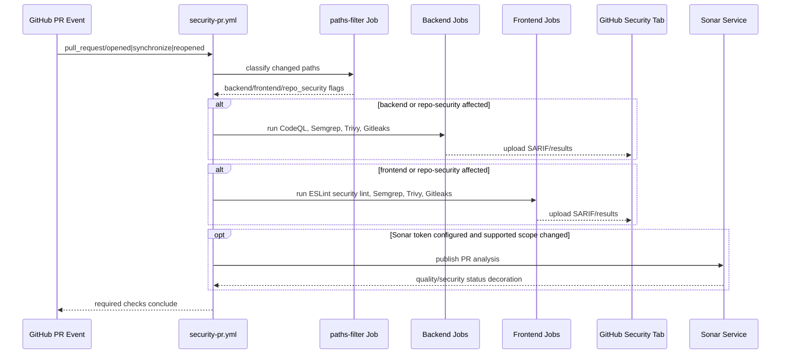
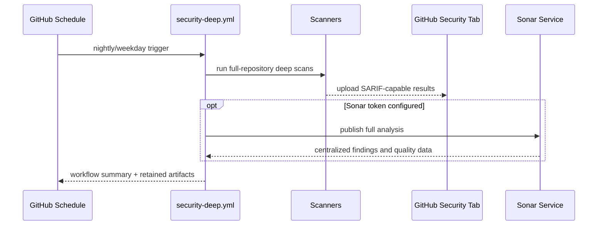

# Design: DevSecOps Scanning Stack Hardening

## Technical Approach

This change introduces a two-lane DevSecOps scanning architecture for `profiletailors.com`: a fast pull-request lane for high-signal merge feedback and a scheduled deep-scan lane for broader repository analysis. The design keeps existing workflows intact, scopes expensive work by changed paths where safe, uses explicit concurrency and least-privilege permissions, and assigns one clear responsibility to each scanner to minimize overlap and alert fatigue.

The implementation follows the approved proposal and `security-scanning` delta spec by adding repository-local scanner configuration, two additive GitHub Actions workflows, frontend lint coverage for `apps/web/marketing`, backend-focused CodeQL coverage for `server/smp` plus `shared/**`, and centralized Sonar reporting with explicit operational dependencies.

## Architecture Decisions

### Decision: Use two additive workflows instead of one monolithic security pipeline

**Choice**: Create one PR-focused workflow and one scheduled deep-scan workflow, both additive to the existing `.github/workflows/cla.yml`, `.github/workflows/detekt.yml`, and `.github/workflows/release-please.yml`.

**Alternatives considered**:
- One single workflow handling PR and scheduled behavior with many conditional branches.
- Folding all security work into the existing `detekt.yml` workflow.

**Rationale**: Separate workflows make intent obvious, keep required PR checks understandable, and avoid turning the existing static-analysis lane into an overloaded security orchestrator. This separation also aligns directly with the spec requirement for distinct fast and deep lanes.

### Decision: Use path classification as the workflow topology entrypoint

**Choice**: Use a dedicated `changes` job based on `dorny/paths-filter` to classify repository changes into `backend`, `frontend`, `repo_security`, and `docs_only` buckets, then fan out only the relevant PR jobs.

**Alternatives considered**:
- Rely only on top-level workflow `paths:` filters.
- Run all scanners on every PR regardless of changed files.
- Maintain custom shell scripts for changed-file detection.

**Rationale**: Top-level `paths:` filters are too coarse for a mixed monorepo because they skip the whole workflow rather than selecting jobs precisely. A classifier job keeps the logic explicit, reviewable, and conservative while still reducing cost and noise.

### Decision: Keep repo-wide scanners repo-wide when change impact is ambiguous

**Choice**: Treat `.github/workflows/**`, scanner configs, dependency manifests, Gradle build files, lockfiles, and shared modules as repo-security-affecting paths that trigger broader PR checks.

**Alternatives considered**:
- Strictly isolate backend/frontend jobs with narrow app-only paths.
- Run broader checks only on the scheduled workflow.

**Rationale**: Security-impacting config changes can invalidate narrow path assumptions. Conservative widening on ambiguous changes is the safest way to honor the spec requirement to prefer omission safety over maximum runtime savings.

### Decision: Assign one primary responsibility per tool

**Choice**:
- **CodeQL**: backend code-graph security analysis for Kotlin/Java.
- **Semgrep**: fast cross-language SAST and security-sensitive text/config scanning.
- **Gitleaks**: secrets detection.
- **Trivy**: dependency, filesystem, and config/IaC vulnerability scanning.
- **Detekt**: Kotlin static analysis and code-quality hygiene.
- **ESLint security rules**: frontend JS/TS/Astro security-focused linting.
- **SonarQube/SonarCloud**: centralized repository quality and security reporting.

**Alternatives considered**:
- Using Semgrep or Sonar as the primary blocker for all issue classes.
- Replacing Detekt with Semgrep on Kotlin.
- Adding more overlapping SAST tools.

**Rationale**: Low-noise gating depends on role clarity. Each scanner remains in the stack for a specific problem class so the repo avoids duplicate merge blockers for the same category.

### Decision: Make only high-signal PR jobs merge-blocking at first

**Choice**: PR required checks are limited to the fast, deterministic lanes with actionable feedback: Gitleaks, Semgrep, path-relevant Trivy filesystem/dependency scan, path-relevant ESLint security lint, and backend CodeQL when backend scope is affected. Sonar remains reporting-oriented initially, and scheduled deep scans do not become required checks.

**Alternatives considered**:
- Make every security tool blocking from day one.
- Make all scanning informational only.

**Rationale**: Blocking every scan immediately would create noise and trust erosion, especially while repo-local tuning is still being established. Making everything informational would undercut the proposal’s goal of practical security feedback. This balanced gate keeps developer trust while still enforcing real signal.

### Decision: Use SARIF where supported, native channels where not

**Choice**: Upload SARIF for CodeQL, Semgrep, Trivy, and Gitleaks when supported by the selected action path; use workflow annotations/artifacts for Detekt and ESLint; use Sonar’s external dashboard plus PR decoration where configured.

**Alternatives considered**:
- Standardize every tool on logs only.
- Force every tool through one external platform.

**Rationale**: GitHub code scanning is the most understandable default surface for SARIF-capable tools, but not every scanner integrates identically. Mixed publication is acceptable if the documentation clearly states where each result appears.

### Decision: Keep external-service integrations explicit and optional-by-secret

**Choice**: Sonar integration is designed as operationally explicit: if `SONAR_TOKEN` and project metadata are configured, the workflow publishes centralized results; if not, the workflow path and docs must state that Sonar reporting is unavailable rather than pretending it is active.

**Alternatives considered**:
- Hard-fail the whole security workflow when Sonar secrets are missing.
- Omit Sonar from the design despite the spec requirement.

**Rationale**: The spec requires SonarQube or SonarCloud coverage and explicit operational dependencies. Conditional enablement preserves least privilege and maintainability while making the dependency visible.

## Data Flow

### PR lane topology

```text
pull_request event
      |
      v
changes job (paths classifier)
      |
      +--> repo-security changed? ---- yes ----> run broader PR jobs
      |
      +--> backend changed? ---------- yes ----> CodeQL + Semgrep + Trivy + Gitleaks + Detekt
      |
      +--> frontend changed? --------- yes ----> ESLint + Semgrep + Trivy + Gitleaks
      |
      +--> docs only? ---------------- yes ----> skip path-specific heavy jobs
      |
      v
SARIF / annotations / artifacts / optional Sonar reporting
```

### Scheduled lane topology

```text
schedule / workflow_dispatch
      |
      v
full-repo deep scan workflow
      |
      +--> full Gitleaks history-aware scan
      +--> full-repo Semgrep
      +--> backend CodeQL full analysis
      +--> Trivy fs + config + dependency scan
      +--> optional Sonar full analysis
      +--> aggregate artifacts and SARIF uploads
      |
      v
central security views + workflow summary + retained artifacts
```

### Sequence diagram: PR security flow



### Sequence diagram: Scheduled deep-scan flow



## Workflow Topology

### 1. PR fast lane: `.github/workflows/security-pr.yml`

**Triggers**
- `pull_request` on `main`
- event types: `opened`, `synchronize`, `reopened`, `ready_for_review`

**Concurrency**
- Workflow-level group: `security-pr-${{ github.event.pull_request.number || github.ref }}`
- `cancel-in-progress: true`

**Jobs**
1. `changes`
   - Uses `dorny/paths-filter`.
   - Emits booleans and changed-files summaries.
2. `gitleaks-pr`
   - Runs for any non-doc-only PR because secrets can appear anywhere.
   - Fast scan against PR diff / checked-out tree.
3. `semgrep-backend`
   - Runs when `backend == true` or `repo_security == true`.
4. `semgrep-frontend`
   - Runs when `frontend == true` or `repo_security == true`.
5. `codeql-backend`
   - Runs when `backend == true` or `repo_security == true`.
   - Limited to Kotlin/Java and configured backend/shared paths.
6. `trivy-backend`
   - Runs when backend/repo-security scope changes.
   - Filesystem + dependency focus for Gradle backend/shared modules.
7. `frontend-eslint-security`
   - Runs when `frontend == true` or `repo_security == true`.
   - Installs pnpm dependencies in `apps/web/marketing` and runs lint.
8. `sonar-pr` (optional)
   - Runs when token/binding exists and meaningful code scope changed.
   - Reporting-oriented unless the team later promotes it to required.
9. `summary`
   - Collates which jobs ran and where findings appear.

### 2. Scheduled deep lane: `.github/workflows/security-deep.yml`

**Triggers**
- `schedule`: nightly on weekdays or daily off-peak UTC
- `workflow_dispatch`

**Concurrency**
- Group: `security-deep-${{ github.ref }}`
- `cancel-in-progress: false` to preserve full scheduled evidence unless manually retriggered

**Jobs**
1. `gitleaks-history`
   - Full-history secret scan or bounded deep history scan.
2. `semgrep-full`
   - Full-repo scan with repo-local config.
3. `codeql-full-backend`
   - Full backend/shared graph analysis.
4. `trivy-full`
   - Full filesystem, dependency, and config scan.
5. `sonar-full` (optional but explicit)
   - Full repository analysis for centralized dashboards.
6. `retention-summary`
   - Upload artifacts and summarize reporting channels.

### 3. Existing workflow coexistence

- `.github/workflows/detekt.yml` stays as an independent Kotlin static-analysis workflow.
- `.github/workflows/cla.yml` and `.github/workflows/release-please.yml` are preserved unchanged unless minimal permissions/convention alignment is required elsewhere.
- The new security workflows do not replace build, release, or contributor automation.

## Path Filter Strategy

The PR workflow uses a conservative classifier with these buckets:

### Backend

Paths that trigger backend-focused jobs:
- `server/smp/**`
- `shared/**`
- `server/smp/build.gradle.kts`
- `server/smp/settings.gradle.kts`
- `shared/**/build.gradle.kts`
- `gradle/**` if added later
- `.github/codeql/**`
- `.semgrep/**`
- `.trivyignore`
- `.gitleaks.toml`
- `sonar-project.properties`

### Frontend

Paths that trigger frontend-focused jobs:
- `apps/web/marketing/**`
- `apps/web/marketing/package.json`
- `apps/web/marketing/pnpm-workspace.yaml`
- `apps/web/marketing/tsconfig.json`
- `apps/web/marketing/astro.config.mjs`
- root/shared lint configs if created for frontend linting
- `.semgrep/**`
- `.trivyignore`
- `.gitleaks.toml`
- `sonar-project.properties`

### Repo security / broad-impact

Paths that trigger broader PR coverage:
- `.github/workflows/**`
- `.github/actions/**`
- `.github/codeql/**`
- `.semgrep/**`
- `.gitleaks.toml`
- `.trivyignore`
- `sonar-project.properties`
- `pnpm-lock.yaml` if introduced at app level or root
- `**/gradle-wrapper.properties`
- dependency manifests and lockfiles

### Docs-only

Paths safe to treat as docs-only:
- `docs/**`
- `openspec/**`
- markdown files outside active code/config surfaces

**Conservative rule**: if a change matches both docs-only and any security-relevant bucket, the security-relevant bucket wins.

## Per-Tool Responsibilities

### CodeQL

**Scope**
- `server/smp/**`
- `shared/**`

**Role**
- Deep backend code-graph analysis for Kotlin/Java.
- Best for taint-style and framework-aware security queries.

**Why it exists separately**
- Semgrep is faster but shallower; CodeQL is the deep backend graph analyzer.

**PR behavior**
- Required only when backend or repo-security scope changed.

**Scheduled behavior**
- Full backend/shared analysis.

### Semgrep

**Scope**
- Backend Kotlin sources.
- Frontend JS/TS/Astro-compatible sources.
- YAML, shell, and security-sensitive config files it supports.

**Role**
- Fast cross-language SAST and misconfiguration detection.

**Why it exists separately**
- Covers language and config breadth that CodeQL does not, and produces faster PR feedback.

**PR behavior**
- Required in path-relevant scopes.

**Scheduled behavior**
- Full-repo run with broader rule execution.

### Gitleaks

**Scope**
- Entire repository.

**Role**
- Secret detection.

**Why it exists separately**
- Secret scanning must stay repo-wide because secrets can appear in code, config, docs, or workflow files.

**PR behavior**
- Required on non-doc-only PRs.

**Scheduled behavior**
- History-aware full scan for drift detection.

### Trivy

**Scope**
- Backend Gradle dependency surface.
- Frontend dependency surface under `apps/web/marketing`.
- Repository config/IaC-like files where supported.

**Role**
- Dependency, filesystem, and config vulnerability scanning.

**Why it exists separately**
- Neither CodeQL nor Semgrep is the primary dependency vulnerability engine.

**PR behavior**
- Required in path-relevant scopes with severity threshold tuned for high-signal findings.

**Scheduled behavior**
- Broader full-repo fs/config/dependency scan.

### Detekt

**Scope**
- Existing Kotlin backend/shared modules via Gradle.

**Role**
- Kotlin static-analysis and code-quality lane.

**Why it remains separate**
- The repository already uses it, and the spec explicitly requires coexistence instead of replacement.

**PR behavior**
- Continues through existing `detekt.yml` workflow.

**Scheduled behavior**
- No new deep-scan role required under this change.

### ESLint security-focused rules

**Scope**
- `apps/web/marketing/**`

**Role**
- Frontend JS/TS security-focused linting and unsafe pattern detection.

**Why it exists separately**
- The active frontend app currently has `astro check` but no lint script; dedicated linting is the most maintainable way to add frontend-local policy.

**PR behavior**
- Required for frontend or repo-security changes.

**Scheduled behavior**
- Re-runs as part of broader reporting if desired, but main value is PR feedback.

### SonarQube / SonarCloud

**Scope**
- Repository areas supported by the configured scanner and project binding.

**Role**
- Centralized quality/security reporting, history, and trend visibility.

**Why it exists separately**
- GitHub SARIF views are good for findings, but Sonar provides persistent quality/security dashboards and PR decoration when configured.

**PR behavior**
- Reporting-oriented initially; explicit operational dependency on secrets and project configuration.

**Scheduled behavior**
- Full analysis preferred for stable centralized reporting.

## Scan Cadence and Gating Model

### PR lane cadence

- Runs on every relevant PR update.
- Cancels superseded runs immediately.
- Optimized for turnaround time and merge clarity.

### Scheduled deep-scan cadence

- Nightly off-peak UTC is the default recommendation.
- `workflow_dispatch` provides on-demand reruns after tuning or incident response.

### Blocking vs reporting-only

**Initially blocking in PRs**
- Gitleaks
- Semgrep (path-relevant)
- Trivy with tuned severity threshold (path-relevant)
- ESLint security lint (frontend-relevant)
- CodeQL (backend-relevant)
- Existing Detekt remains whatever its repo policy already defines

**Initially reporting-only**
- Scheduled deep-scan jobs
- Sonar centralized reporting
- Any artifact-only summaries

### Low-noise gating reasons

- **Secrets are high confidence**: Gitleaks should block because exposed credentials are immediate risk.
- **Semgrep is fast and tunable**: good fit for required PR signal if rule set is kept practical.
- **CodeQL is deep but scoped**: only block when backend/shared code is involved, avoiding frontend-only PR slowdown.
- **Trivy can be noisy on transitive vulnerabilities**: block only at tuned severity thresholds and keep broader drift findings in scheduled reports.
- **Sonar often overlaps with local linters/SAST**: keep it reporting-first to avoid duplicate blockers while still gaining centralized visibility.

## Secrets Model and Permissions

### GitHub token permissions

**Default workflow permission policy**
- `permissions: {}` at workflow level where possible, then elevate per job.

**Expected job-level permissions**
- `contents: read` for checkout-based jobs.
- `security-events: write` only for SARIF upload jobs.
- `actions: read` only if required by a specific maintained action.
- Avoid `pull-requests: write` unless a specific integration truly needs PR comments/decoration beyond standard checks.

### External secrets

**Required only when corresponding integration is enabled**
- `SONAR_TOKEN` for SonarCloud/SonarQube publication.
- `SONAR_HOST_URL` if self-hosted SonarQube is used.
- Sonar project key/org metadata through variables or config.

**Not required**
- CodeQL, Semgrep, Gitleaks, Trivy, and ESLint should run from repository content plus standard GitHub context only, assuming selected actions support that mode.

### Operational boundaries

- No new broad write-capable repository token is introduced for scanners that only read content and upload SARIF.
- Missing Sonar secrets must produce explicit skip messaging in workflow summaries and docs.
- Scanner suppressions live in repo-local config files, never hidden in external undocumented dashboards.

## Findings Publication Model

| Scanner | Publication Channel | PR Gate | Notes |
|--------|----------------------|---------|-------|
| CodeQL | GitHub code scanning / SARIF | Yes, backend-relevant | Backend-only path scope |
| Semgrep | GitHub code scanning / SARIF | Yes, path-relevant | Fast cross-language SAST |
| Gitleaks | SARIF if supported, else workflow output/artifact | Yes | Repo-wide secret detection |
| Trivy | SARIF + workflow summary | Yes, tuned severity/path-relevant | Dependency/fs/config coverage |
| Detekt | Existing artifact/log output | Existing repo policy | Separate Kotlin quality lane |
| ESLint | Workflow annotations/logs, optional SARIF formatter if adopted | Yes, frontend-relevant | Focused on marketing app |
| Sonar | External Sonar dashboard + optional PR decoration | No initially | Centralized reporting |

## False-Positive Control and Tuning Governance

### Repo-local config strategy

- `.semgrep/` or repo-root `semgrep.yml` for rule selection and narrow excludes.
- `.github/codeql/codeql-config.yml` for backend/shared path selection and query suite tuning.
- `.gitleaks.toml` for precise allowlists with English justifications.
- `.trivyignore` for narrowly scoped suppressions with English rationale comments where format supports it.
- `eslint.config.mjs` for frontend security rule tuning.
- `sonar-project.properties` for explicit scope and exclusion boundaries.

### Tuning rules

- Prefer upstream defaults first.
- Suppress by rule ID + path + reason when possible.
- Never suppress an entire tool because of one noisy rule family.
- Any ignore entry must explain **why this repo is different** in plain English.

## File Changes

| File | Action | Description |
|------|--------|-------------|
| `.github/workflows/security-pr.yml` | Create | Fast PR security workflow with path classification, concurrency cancellation, minimal permissions, and high-signal gates. |
| `.github/workflows/security-deep.yml` | Create | Scheduled full-repository deep security workflow for broader analysis and reporting. |
| `.github/codeql/codeql-config.yml` | Create | Restrict CodeQL scope to backend/shared modules and document query intent. |
| `.semgrep/config.yml` | Create | Minimal Semgrep configuration with explicit rule sources and narrow exclusions. |
| `.gitleaks.toml` | Create | Repo-local secret scanning baseline and reviewable allowlists. |
| `.trivyignore` | Create | Narrow vulnerability/config false-positive suppressions with documented reasons. |
| `sonar-project.properties` | Create | Sonar project binding, source scope, exclusions, and scanner metadata. |
| `apps/web/marketing/package.json` | Modify | Add `lint` script and ESLint security-oriented dependencies. |
| `apps/web/marketing/eslint.config.mjs` | Create | Flat ESLint config for JS/TS/Astro security-focused linting in the marketing app. |
| `docs/security/scanning-stack.md` | Create | English documentation for scanner roles, lanes, local usage, findings channels, and suppression policy. |
| `.github/workflows/detekt.yml` | Modify | Align permissions, naming, or concurrency conventions only if needed for consistency without changing its role. |

## Interfaces / Contracts

### Paths-filter outputs

```yaml
outputs:
  backend: "true|false"
  frontend: "true|false"
  repo_security: "true|false"
  docs_only: "true|false"
```

These outputs are the contract between the classifier job and all path-aware PR jobs.

### Required check contract

```text
Required checks (initial target state):
- security / gitleaks
- security / semgrep-backend   (conditional on backend/repo_security)
- security / semgrep-frontend  (conditional on frontend/repo_security)
- security / codeql-backend    (conditional on backend/repo_security)
- security / trivy-backend     (conditional on backend/repo_security)
- security / frontend-eslint-security (conditional on frontend/repo_security)
- existing detekt check remains separate
```

Conditional checks must be implemented so skipped jobs are clearly non-applicable rather than looking like silent failures.

### Documentation contract

`docs/security/scanning-stack.md` must answer:
1. What each scanner is for.
2. Which checks are blocking vs reporting-only.
3. Which repository paths each scanner covers.
4. Where findings appear.
5. How to run supported checks locally.
6. How to propose a suppression with justification.

## Testing Strategy

| Layer | What to Test | Approach |
|-------|-------------|----------|
| Config validation | Workflow YAML structure, permissions, concurrency, and conditional expressions | Validate with `actionlint` locally or in CI if available; review YAML parsing and expression correctness. |
| Unit-like config verification | Path filter classification behavior for representative file changes | Use workflow examples / dry reasoning with changed-path matrices documented in the PR; optionally add a lightweight script or fixture-based validation if the team wants stronger regression checks. |
| Integration | Scanner invocation contracts and required tool setup | Run workflow jobs on a feature branch or `workflow_dispatch` with safe sample changes; verify jobs start only for intended scopes. |
| Integration | SARIF and reporting behavior | Confirm SARIF uploads appear in GitHub code scanning for CodeQL/Semgrep/Trivy/Gitleaks where configured; confirm Sonar publishes only when secrets exist. |
| Integration | Frontend lint contract | Run `pnpm lint` inside `apps/web/marketing` after adding config and dependencies. |
| Integration | Backend scanner contract | Run Gradle/CodeQL-related jobs against `server/smp` and `shared/**` changes; verify no frontend-only dependency is required. |
| Manual verification | Concurrency cancellation | Push two quick successive commits to the same PR and confirm the earlier security run is cancelled. |
| Manual verification | Non-disruption | Confirm existing `cla`, `detekt`, and `release-please` workflows remain present and unaffected in trigger behavior. |

## Verification Plan

1. **Static review**
   - Confirm workflow files use explicit `permissions`.
   - Confirm PR workflow has `cancel-in-progress: true`.
   - Confirm path filters include backend, frontend, repo-security, and docs-only cases.
2. **Local scanner verification**
   - `pnpm install && pnpm lint` inside `apps/web/marketing`.
   - Run Semgrep locally if available against representative backend and frontend files.
   - Run Gitleaks and Trivy locally if available using the documented commands.
3. **GitHub workflow verification**
   - Frontend-only PR: frontend lint + frontend Semgrep + Gitleaks should run; backend CodeQL should not be required.
   - Backend-only PR: backend CodeQL + backend Semgrep + backend Trivy + Gitleaks should run; frontend lint should not be required.
   - Shared/config/workflow PR: broader path-relevant checks should run.
   - Docs-only PR: heavy security jobs should skip cleanly.
4. **Publication verification**
   - Confirm SARIF findings land in the correct GitHub security surface.
   - Confirm workflow summaries explain non-SARIF channels.
   - Confirm Sonar step explicitly skips when secrets are missing.
5. **Noise verification**
   - Seed at least one intentional, known-safe suppression example and review that it is narrow and justified.
   - Review whether transitive dependency noise from Trivy stays within the intended severity threshold.

## Migration / Rollout

No application runtime migration is required.

Rollout is phased:
1. Add configs and workflows.
2. Enable PR required checks only for the high-signal jobs.
3. Keep Sonar and scheduled deep-scan findings reporting-only initially.
4. Observe noise for a short tuning window.
5. Tighten thresholds or required status set only after evidence supports it.

## Tradeoffs

### Tradeoff: Faster PRs vs full certainty

Path-aware execution reduces cost and latency but can miss impact if classification is too narrow. The design resolves this by treating shared modules, workflow files, and scanner/dependency configs as broad-impact triggers and by keeping nightly full scans as the safety net.

### Tradeoff: Strong gating vs developer trust

Making every tool blocking would maximize enforcement but would likely create duplicate failures and suppression churn. The design intentionally blocks only high-signal PR checks first and leaves broader or overlapping reporting in scheduled/centralized channels.

### Tradeoff: Minimal secrets vs richer reporting

Least-privilege operation favors scanners that run with repository read access plus SARIF uploads. Sonar adds value for centralized visibility but requires external credentials, so it is modeled as explicit and optional-by-secret rather than assumed.

### Tradeoff: Separate workflows vs fewer files

Two workflows and several config files add surface area, but they keep responsibility boundaries understandable and tuneable. For security architecture, explicitness is worth the extra files.

## Open Questions

- [ ] Should Sonar use SonarCloud or self-hosted SonarQube for this repository, and what project key/binding naming convention should be standardized?
- [ ] Which exact Trivy severity threshold should be merge-blocking at PR time for this repo: `HIGH+CRITICAL` or `CRITICAL` only?
- [ ] Should `actionlint` be added as a lightweight workflow-validation helper for `.github/workflows/**`, or should workflow verification stay manual for now?
- [ ] Does the team want ESLint findings to stay log/annotation-based only, or adopt a SARIF formatter for consistency with GitHub code scanning?