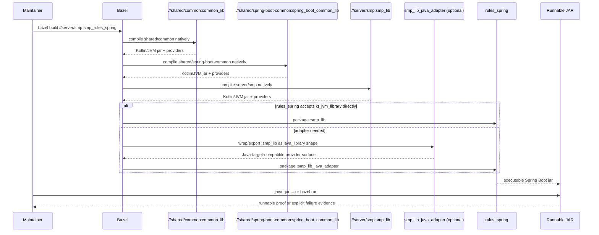
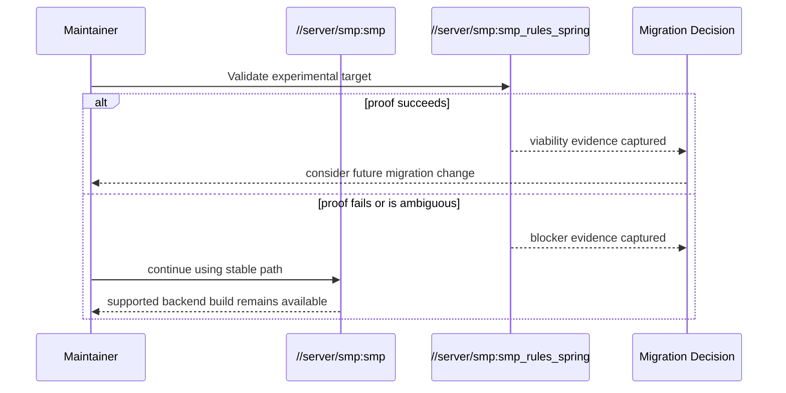

# Design: Controlled rules_spring Migration Spike for Spring Boot Backend

## Technical Approach

This change adds a **parallel native Bazel proof path** for `server/smp` while preserving the current Gradle-backed packaging target as the only stable/default backend entrypoint. The spike will model the local Gradle subprojects `shared/common` and `shared/spring-boot-common` as first-class Bazel Kotlin/JVM libraries, then model `server/smp` application code as a Bazel Kotlin/JVM library that can be packaged by Salesforce `rules_spring`.

The design intentionally separates three concerns:

1. **Stable path preservation** — keep `//server/smp:smp` and root alias `//:smp` unchanged.
2. **Native compilation proof** — create Bazel-native library targets for the minimum local dependency closure required by `SmpApplication`.
3. **Experimental packaging proof** — add a non-default `springboot(...)` target wired to the native library graph and validate whether it can produce a runnable Spring Boot artifact on this repository’s Kotlin + Spring Boot 4 stack.

This maps directly to the proposal and delta spec requirements:

- stable path remains default and supported,
- native proof must cover the minimum local dependency closure,
- packaging must be classified with explicit evidence,
- rollback removes only spike wiring.

## Architecture Decisions

### Decision: Preserve the current stable target and root alias unchanged

**Choice**: Retain `//server/smp:smp` as the Gradle-wrapper `genrule` and retain root alias `//:smp -> //server/smp:smp` without modification.

**Alternatives considered**:
- Replace `//server/smp:smp` with the experimental `rules_spring` target.
- Repoint `//:smp` to an experimental or configurable alias.
- Introduce a new default aggregate backend alias that includes the experimental target.

**Rationale**: The spec explicitly requires stable path preservation and non-disruption of current consumers. The existing root alias is already the public backend label. Changing it during a spike would convert an experiment into an operational cutover, which is out of scope.

### Decision: Add experimental targets as explicit non-default labels

**Choice**: Add new labels under `server/smp` for native compilation and packaging proof, while keeping them out of root aliases and aggregate server entrypoints.

Planned labels:

- **Retain** `//server/smp:smp` — stable Gradle-backed fat jar target
- **Retain** `//:smp` — stable root alias
- **Retain** `//:all_servers` contents pointing only at `//server/smp:smp`
- **Add** `//shared/common:common_lib` — native Bazel Kotlin/JVM model of `shared/common`
- **Add** `//shared/spring-boot-common:spring_boot_common_lib` — native Bazel Kotlin/JVM model of `shared/spring-boot-common`
- **Add** `//server/smp:smp_lib` — native Bazel Kotlin/JVM model of backend application sources
- **Add** `//server/smp:smp_lib_java_adapter` — optional adapter `java_library` if `rules_spring` cannot consume `kt_jvm_library` directly
- **Add** `//server/smp:smp_rules_spring` — experimental `springboot(...)` packaging target
- **Optional add** `//server/smp:smp_native_compile` as an alias or filegroup if a dedicated proof label improves validation clarity

**Alternatives considered**:
- Put the experimental label at root, e.g. `//:smp_rules_spring`.
- Overload `//server/smp:smp` with a configurable select-based implementation.
- Add a macro in `tools/bazel` immediately.

**Rationale**: The experimental path must be easy to invoke but impossible to confuse with the stable path. Keeping all spike-only labels local to `server/smp` minimizes accidental adoption and keeps rollback small.

### Decision: Model shared modules as Bazel Kotlin/JVM libraries mirroring Gradle boundaries

**Choice**: Create one BUILD package for each existing Gradle subproject and preserve the current dependency direction:

- `shared/common` becomes a standalone Kotlin/JVM library target.
- `shared/spring-boot-common` becomes a standalone Kotlin/JVM library target depending on `shared/common`.
- `server/smp` depends on both, matching current Gradle semantics.

**Alternatives considered**:
- Collapse both shared modules into a single Bazel target for the spike.
- Skip shared module BUILD files and keep them on Gradle wrappers.
- Move shared code into `server/smp` temporarily.

**Rationale**: The spec requires native compilation of the minimum local dependency closure. The Gradle module graph is already explicit in `server/smp/settings.gradle.kts`, so preserving those boundaries gives the cleanest proof with the least architectural distortion.

### Decision: Use `kt_jvm_library` as the primary modeling rule for all three local code modules

**Choice**: Model `shared/common`, `shared/spring-boot-common`, and `server/smp` with `kt_jvm_library` targets, including Kotlin sources and runtime resources.

**Alternatives considered**:
- Model everything as `java_library` with mixed Java/Kotlin indirection.
- Split each module into multiple finer-grained Bazel libraries now.
- Introduce KSP/KAPT-like processing in the spike.

**Rationale**: The codebase is Kotlin-first, and `rules_kotlin` is already present in `MODULE.bazel`. `kt_jvm_library` is the least disruptive native Bazel representation and aligns with the current source layout. Finer target decomposition can be deferred until the spike proves the packaging path is viable.

### Decision: Keep an adapter `java_library` as a planned fallback for Kotlin target-shape compatibility

**Choice**: Design for two possible packaging shapes:

1. **Preferred**: `springboot(java_library = ":smp_lib")` if `kt_jvm_library` provides the providers `rules_spring` needs in practice.
2. **Fallback**: `java_library(name = "smp_lib_java_adapter", exports = [":smp_lib"], runtime_deps = [":smp_lib"])` and point `springboot` at that adapter.

**Alternatives considered**:
- Assume `kt_jvm_library` always works and omit fallback design.
- Always force a Java adapter even if unnecessary.

**Rationale**: Exploration already identified Kotlin target shape as a high-risk unknown. `rules_spring` documentation is Java-centric and describes `java_library` as the expected input shape. Designing the adapter in advance keeps the spike precise without prematurely committing to unnecessary indirection.

### Decision: Preserve Gradle as the source of truth for feature-rich behavior; scope Bazel to the spike’s minimum viable proof

**Choice**: During the spike, Bazel models compilation and packaging only for the minimum path needed to prove viability. The following remain Gradle-owned and explicitly deferred:

- detekt enforcement,
- wrapper-based test execution,
- configuration metadata generation parity,
- developmentOnly behavior parity (`devtools`, `docker-compose`),
- broader dependency deduplication,
- full repository Spring Boot conventions.

**Alternatives considered**:
- Attempt feature parity with Gradle in the spike.
- Declare Bazel as the new source of truth immediately.

**Rationale**: This is a spike, not a migration. Trying to absorb every Gradle responsibility would destroy the spike’s risk boundary and blur success/failure classification.

### Decision: Align on Java 21 at runtime/toolchain level, but treat Kotlin plugin/version convergence as deferred unless it blocks proof

**Choice**: The spike SHALL align on the already shared, lowest-risk runtime/toolchain baseline:

- Java 21 remains the common executable/runtime target.
- Spring Boot stays at 4.0.6 in both Gradle and Bazel dependency resolution.
- Kotlin compiler option parity is limited to the currently meaningful flags already declared in Gradle (`-Xjsr305=strict`, `-Xannotation-default-target=param-property`).
- Full Kotlin version convergence between Gradle (`2.3.21`) and Bazel `rules_kotlin` (`2.2.0`) is deferred unless the mismatch prevents native compilation or runnable packaging.

**Alternatives considered**:
- Upgrade/downgrade all Kotlin toolchains now.
- Change Gradle toolchain or Boot version for Bazel compatibility.
- Force full parity for all Gradle dependency management behavior.

**Rationale**: The repository already converges on Java 21 and Spring Boot 4.0.6, while Kotlin tooling is visibly drifted. The spike’s job is to determine whether that drift is tolerable, not to solve repo-wide convergence unless required for proof.

## Target Topology

### Stable topology to retain

```text
//:smp ----------------------------> //server/smp:smp
                                       |
                                       +--> genrule -> ./gradlew bootJar
```

This remains the only supported backend packaging entrypoint during the spike.

### Experimental topology to add

```text
//shared/common:common_lib
        |
        v
//shared/spring-boot-common:spring_boot_common_lib
        |                         \
        |                          \
        +---------------------------+---> //server/smp:smp_lib
                                              |
                                              +--> optional //server/smp:smp_lib_java_adapter
                                                          |
                                                          v
                                              //server/smp:smp_rules_spring
```

### Label policy

- `//server/smp:smp` and `//:smp` stay stable.
- Experimental labels are **not** added to root aliases or aggregate filegroups.
- Any documentation or tasks produced after this design MUST present `//server/smp:smp_rules_spring` as an opt-in proof target only.

## Data Flow

### Build / packaging flow



### Fallback / rollback behavior



## Module Modeling Details

### `shared/common`

**Planned target**: `//shared/common:common_lib`

**Rule shape**: `kt_jvm_library`

**Inputs**:
- `shared/common/src/main/kotlin/**/*.kt`
- no custom resources observed for runtime packaging

**Dependency mapping from Gradle**:
- `com.fasterxml.jackson.module:jackson-module-kotlin` (note: current source uses `tools.jackson.*` imports in some modules; this is a compatibility watch item)
- `org.jetbrains.kotlin:kotlin-reflect`
- `org.jetbrains.kotlinx:kotlinx-coroutines-core` / resolved JVM artifact
- `org.slf4j:slf4j-api`

**Compiler options**:
- preserve `-Xjsr305=strict`
- preserve `-Xannotation-default-target=param-property`

**Reasoning**: This module is plain shared Kotlin/domain/util code and is the lowest-risk place to establish native Bazel compilation.

### `shared/spring-boot-common`

**Planned target**: `//shared/spring-boot-common:spring_boot_common_lib`

**Rule shape**: `kt_jvm_library`

**Inputs**:
- `shared/spring-boot-common/src/main/kotlin/**/*.kt`
- `shared/spring-boot-common/src/main/resources/**`

**Resources that must be preserved**:
- `META-INF/spring/org.springframework.boot.autoconfigure.AutoConfiguration.imports`
- `META-INF/spring.factories`

These resources are critical because this module declares Boot auto-configuration (`AppAutoConfiguration`) and configuration-properties support used by Spring Boot discovery.

**Dependency mapping from Gradle**:
- local dependency on `//shared/common:common_lib`
- Spring Boot starter and Spring Framework dependencies already represented in Bazel Maven graph where available
- `kotlinx-coroutines-reactor`
- `kotlinx-coroutines-reactive`
- `kotlinx-coroutines-slf4j` if added to Bazel graph for spike
- `commons-text`
- `springdoc-openapi-starter-webflux-ui`

**Reasoning**: `server/smp` depends on this module both as Kotlin code and as Spring Boot resource metadata. Omitting its resources would make packaging proof misleading even if compilation succeeded.

### `server/smp`

**Planned target**: `//server/smp:smp_lib`

**Rule shape**: `kt_jvm_library`

**Inputs**:
- `server/smp/src/main/kotlin/**/*.kt`
- `server/smp/src/main/resources/**` if present now or added later

**Entrypoint**:
- `boot_app_class = "com.profiletailors.smp.SmpApplication"`
- main function lives in `server/smp/src/main/kotlin/com/profiletailors/smp/SmpApplication.kt`

**Dependency structure**:
- local deps on `//shared/common:common_lib` and `//shared/spring-boot-common:spring_boot_common_lib`
- Spring Boot/WebFlux/Security/R2DBC/Modulith/OpenAPI runtime deps from the Bazel Maven repo

**Not part of this spike**:
- native Bazel test targets
- detekt target
- decomposition by bounded context
- annotation processor parity beyond what is strictly required for successful build/package

**Reasoning**: `server/smp` is already bounded-context organized, but the spike only needs one application-level library target to prove packaging viability.

## Experimental Packaging Wiring

### Preferred wiring

The experimental target SHALL be added in `server/smp/BUILD.bazel` and wired to the native application library:

```starlark
springboot(
    name = "smp_rules_spring",
    boot_app_class = "com.profiletailors.smp.SmpApplication",
    boot_launcher_class = "org.springframework.boot.loader.launch.JarLauncher",
    java_library = ":smp_lib",  # preferred if compatible
)
```

### Fallback wiring if Kotlin target shape is rejected

```starlark
java_library(
    name = "smp_lib_java_adapter",
    exports = [":smp_lib"],
    runtime_deps = [":smp_lib"],
)

springboot(
    name = "smp_rules_spring",
    boot_app_class = "com.profiletailors.smp.SmpApplication",
    boot_launcher_class = "org.springframework.boot.loader.launch.JarLauncher",
    java_library = ":smp_lib_java_adapter",
)
```

### Packaging dependency policy

The `springboot` packaging target will need access to both:

1. the application dependency graph for `server/smp`, and
2. any `rules_spring` required packaging/runtime labels such as:
   - `@rules_spring//springboot/import_bundles:springboot_required_deps`
   - Spring Boot loader/tooling artifacts if not already brought transitively or by bundle

Because current repo evidence did **not** show `spring-boot-loader`, `spring-boot-loader-tools`, or `spring-boot-jarmode-tools` pinned in `maven_install.json`, the spike design assumes `MODULE.bazel` and `maven_install.json` may require additions/regeneration. That work is in scope for implementation, but design treats it as explicit packaging support, not feature migration.

### Stable target preservation rules

The existing targets remain untouched in behavior:

- `genrule(name = "smp", ...)` stays as-is
- `sh_test(name = "unit_tests", ...)` stays wrapper-based
- `sh_test(name = "integration_tests", ...)` stays wrapper-based
- root `alias(name = "smp", actual = "//server/smp:smp")` stays unchanged
- root `filegroup(name = "all_servers", srcs = ["//server/smp:smp"])` stays unchanged

## Toolchain and Version Alignment Strategy

## Current observed state

- Gradle Kotlin plugin: `2.3.21`
- Bazel `rules_kotlin`: `2.2.0`
- Gradle Java toolchain: `21`
- Bazel remote JDKs registered include Java 21
- Spring Boot in Gradle and Bazel Maven graph: `4.0.6`
- Spring Modulith in Gradle and Bazel Maven graph: `2.0.6`

## Spike alignment strategy

### Align now

- **Java 21** is the required execution baseline for both stable and experimental paths.
- **Spring Boot 4.0.6** remains fixed; no downgrade to Boot 3 for the spike.
- **Current compiler flags** used by Gradle SHOULD be mirrored in Bazel Kotlin targets where supported.
- **Maven artifact coordinates** required for local compilation closure and packaging SHALL be added only as needed for the spike.

### Defer unless blocking

- Full Kotlin version convergence between Gradle and Bazel.
- Full reproduction of Spring dependency-management/BOM semantics in a reusable Bazel abstraction.
- Development-only dependency parity (`spring-boot-devtools`, `spring-boot-docker-compose`).
- Annotation processor parity for configuration metadata generation.
- Repository-wide standardization of Kotlin/JVM Bazel macros.

## Why this boundary is correct

Here is the thing: if Java 21 and Boot 4 line up, we can answer the real question—does this repository package and run under `rules_spring`? If Kotlin plugin drift blocks that, then the drift becomes **evidence**. If it does not, we avoid wasting the spike on repo-wide version churn.

## File Changes

| File | Action | Description |
|------|--------|-------------|
| `openspec/changes/2026-05-18-rules-spring-backend-build-spike/design.md` | Create | Technical design for the controlled Bazel + `rules_spring` spike. |
| `MODULE.bazel` | Modify | Add `rules_spring` and any supporting Bzlmod/module wiring required by the experimental packaging path. |
| `maven_install.json` | Modify | Regenerate lock if packaging/runtime artifacts required by `rules_spring` or shared-module native compilation are missing. |
| `BUILD.bazel` | Preserve | Keep root alias `//:smp` and aggregate backend entrypoints pointed at the stable target only. |
| `server/smp/BUILD.bazel` | Modify | Add native compile targets and experimental `springboot(...)` target while preserving current `genrule` and test wrappers. |
| `shared/common/BUILD.bazel` | Create | Add native Bazel Kotlin/JVM target for shared/common. |
| `shared/spring-boot-common/BUILD.bazel` | Create | Add native Bazel Kotlin/JVM target for shared/spring-boot-common including Spring resource metadata. |
| `tools/bazel/BUILD.bazel` | Preserve unless needed | No helper macro is required initially; only modify if repeated packaging wiring becomes too noisy during implementation. |
| `openspec/changes/2026-05-18-rules-spring-backend-build-spike/state.yaml` | Modify | Mark design phase complete and point next to tasks. |

## Interfaces / Contracts

### Stable build contract

```text
Consumer label: //:smp
Resolves to:    //server/smp:smp
Behavior:       Gradle-backed bootJar wrapper
Status:         Stable / supported during spike
```

### Experimental build contract

```text
Consumer label: //server/smp:smp_rules_spring
Behavior:       Native Bazel compile + rules_spring packaging proof
Status:         Experimental / non-default / spike-only
Success bar:    Must compile minimum local closure and produce runnable artifact evidence
```

### Local module contracts

```text
//shared/common:common_lib
  -> reusable Kotlin/JVM jar for common shared code

//shared/spring-boot-common:spring_boot_common_lib
  -> reusable Kotlin/JVM jar + Spring Boot resource metadata
  -> depends on //shared/common:common_lib

//server/smp:smp_lib
  -> application Kotlin/JVM jar for SmpApplication and bounded contexts
  -> depends on both shared libraries
```

### Optional adapter contract

```text
//server/smp:smp_lib_java_adapter
  Purpose: present Java-target-friendly provider shape to rules_spring if needed
  Status: only added if direct wiring from kt_jvm_library is not accepted
```

## Testing Strategy

| Layer | What to Test | Approach |
|-------|-------------|----------|
| Analysis / compile proof | Local dependency closure for `shared/common`, `shared/spring-boot-common`, and `server/smp` | `bazel build` the native library targets and confirm compilation occurs without Gradle wrapper involvement. |
| Packaging proof | Experimental `smp_rules_spring` target can produce an executable jar | `bazel build //server/smp:smp_rules_spring` and inspect produced artifact location, manifest/launcher, and dependency layout. |
| Runnable artifact proof | Produced jar starts through `SmpApplication` and reaches runnable state | `bazel run //server/smp:smp_rules_spring` or `java -jar bazel-bin/...jar` with minimal runtime env and capture startup logs / failure evidence. |
| Stable regression guard | Existing supported path still works | Re-run `bazel build //server/smp:smp` after spike wiring changes and confirm stable artifact path still builds as before. |
| Optional comparison | Artifact behavior differences between Gradle and rules_spring outputs | Compare manifest, BOOT-INF layout, launcher class, and startup behavior if both artifacts build successfully. |

## Validation Plan

### Phase 1 — Static topology validation

Confirm labels and graph shape are correct:

- `bazel query` or `cquery` shows stable and experimental labels both exist.
- `//:smp` still resolves only to `//server/smp:smp`.
- shared modules are referenced natively by `server/smp:smp_lib`.

### Phase 2 — Native compilation proof

Run native Bazel builds for:

- `//shared/common:common_lib`
- `//shared/spring-boot-common:spring_boot_common_lib`
- `//server/smp:smp_lib`

Classification:
- **Pass** only if Bazel natively compiles the full minimum local closure.
- **Fail** if any local module required by `smp_lib` remains Gradle-only or unmodeled.

### Phase 3 — Packaging proof

Run:

- `bazel build //server/smp:smp_rules_spring`

Collect:
- output artifact path,
- target action success/failure,
- manifest/launcher inspection,
- evidence of required packaging dependencies.

Classification:
- **Pass** only if the target produces a complete Spring Boot artifact.
- **Fail** if build fails, artifact is malformed, or dependency/launcher issues appear.

### Phase 4 — Runnable artifact proof

Run:

- `bazel run //server/smp:smp_rules_spring` if rule supports run directly, or
- `java -jar <artifact>` against the built jar.

Collect:
- startup logs,
- boot application class used,
- whether Spring reaches runnable startup state,
- exact runtime blocker if startup fails.

Classification:
- **Pass** only if artifact launches through the configured app class and reaches a runnable Spring Boot state for spike scope.
- **Fail** for launch failure, missing loader, runtime classpath issue, or ambiguous evidence.

### Phase 5 — Stable path regression check

Run:

- `bazel build //server/smp:smp`

Collect:
- confirmation that stable path still builds,
- any unintended impact caused by new Bazel module or BUILD wiring.

## Evidence Collection Plan

The spike MUST leave behind concrete evidence suitable for go/no-go review.

### Evidence to capture

1. **Label evidence**
   - list of stable and experimental labels
   - proof root alias stayed unchanged

2. **Compilation evidence**
   - Bazel command lines used
   - pass/fail output for each local library target
   - first failing target if proof breaks

3. **Packaging evidence**
   - `springboot(...)` target definition used
   - artifact path and jar filename
   - manifest / launcher class inspection
   - BOOT-INF structure if artifact exists

4. **Runtime evidence**
   - startup logs or stacktrace
   - indication that `SmpApplication` was used
   - whether app reached runnable state or precise blocker

5. **Compatibility findings**
   - whether direct `kt_jvm_library` input worked
   - whether Java adapter was needed
   - whether Boot 4 required different loader behavior than documented Boot 3 guidance
   - whether extra Maven artifacts were required for packaging

### Storage location

Implementation and verification phases SHOULD capture this evidence in the change directory, ideally in `verify-report.md` and supporting command output snippets. If needed, temporary notes may be attached in the change folder, but the final migration recommendation MUST be distilled into the verify artifact.

## Migration / Rollout

No production migration is part of this change.

This is a **controlled spike** with an opt-in experimental target. The rollout plan is simply:

1. keep stable target unchanged,
2. add experimental native targets,
3. validate and classify result,
4. use findings to decide whether a future migration change is warranted.

No consumer cutover, no alias change, and no repository-wide Bazel convention adoption happen in this change.

## Rollback Strategy

Rollback is intentionally cheap.

### Full rollback trigger

Use full rollback if:
- `rules_spring` cannot package Boot 4 successfully,
- Kotlin target shape proves incompatible in a way not worth further spike effort,
- Maven/toolchain drift makes the proof noisy or unstable,
- the spike creates confusion around supported entrypoints.

### Rollback actions

Remove only spike-owned additions:
- `rules_spring` Bazel module wiring,
- any spike-only Maven coordinates / regenerated lockfile changes,
- `shared/common/BUILD.bazel` and `shared/spring-boot-common/BUILD.bazel` if they were introduced solely for the spike,
- native `server/smp` compile/package targets,
- optional adapter target.

### Must remain after rollback

- `//server/smp:smp`
- `//:smp`
- existing Gradle wrapper packaging behavior
- existing Gradle-wrapper test entrypoints

Because the stable path is preserved throughout, rollback never requires emergency backend build replacement.

## Open Questions

- [ ] **Kotlin target shape**: Does `rules_spring` accept the providers emitted by `kt_jvm_library` directly in this repository, or will `smp_lib_java_adapter` be required?
- [ ] **Boot 4 launcher compatibility**: Is `org.springframework.boot.loader.launch.JarLauncher` still the correct launcher for Spring Boot 4.0.6 packaged through `rules_spring`, or does Boot 4 introduce another required override/packaging nuance?
- [ ] **Packaging deps completeness**: Are `spring-boot-loader`, `spring-boot-loader-tools`, or `spring-boot-jarmode-tools` required explicitly in this Bazel graph, or does `rules_spring`’s import bundle fully cover the needed loader/tooling artifacts?
- [ ] **Jackson coordinate drift**: Gradle files and source imports currently reference `tools.jackson.*`-style packages/coordinates in some places. Is the existing Bazel Maven graph sufficient as-is, or will this reveal a coordinate/package mismatch during native compilation?
- [ ] **Configuration metadata**: Will missing `spring-boot-configuration-processor` parity matter for this spike’s runnable proof, or can it remain safely deferred?
- [ ] **Kotlin version drift tolerance**: Is Gradle Kotlin `2.3.21` versus Bazel `rules_kotlin` `2.2.0` acceptable for this codebase, or will language/API usage force toolchain convergence before proof is possible?
- [ ] **Resource behavior**: Do the `META-INF/spring.factories` and `AutoConfiguration.imports` files in `shared/spring-boot-common` survive packaging exactly as needed under the experimental Bazel path?
- [ ] **Future target granularity**: If the spike succeeds, should later migration work keep a single application-level `smp_lib`, or split by bounded contexts (`authorization`, `credentials`, `identity`, `tenancy`, `platform`, `governance`) before cutover?
