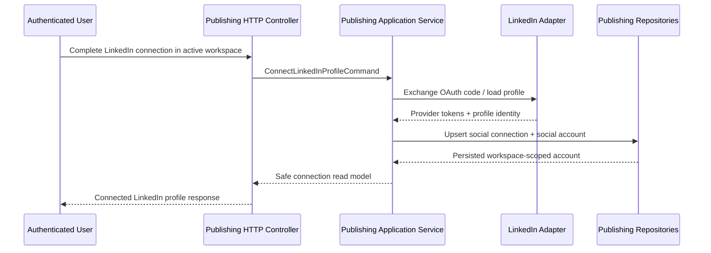
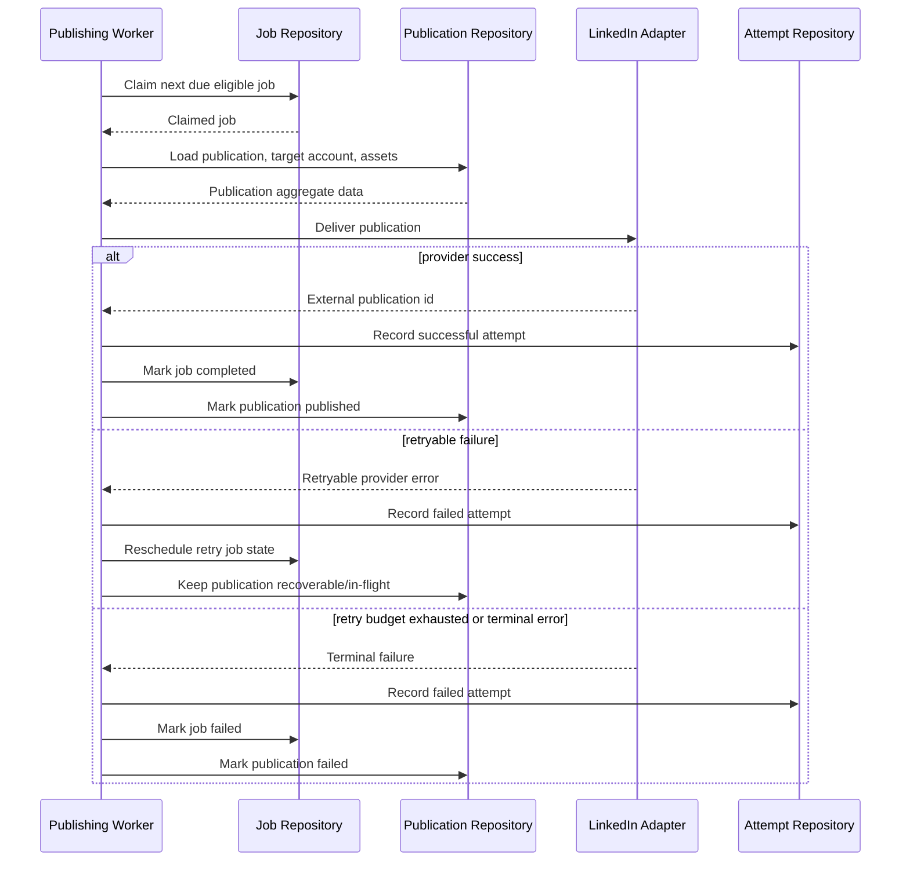

# Design: LinkedIn Publishing MVP

## Technical Approach

This change introduces a new `publishing` bounded context in `server/smp` that owns workspace-scoped outbound social publishing semantics while keeping provider-specific behavior in infrastructure adapters. The first provider slice implements LinkedIn personal-profile publishing with real OAuth and delivery integration plus deterministic fake adapters for local development and automated tests.

The design follows the approved proposal and the new `publishing` spec by splitting responsibilities into: provider-neutral publication lifecycle and queue logic, workspace-scoped connection ownership, provider capability validation, and LinkedIn-specific OAuth/media/publication execution. Persistence uses Liquibase + R2DBC. Delivery execution uses a database-backed scheduler/worker port so the domain stays stable if a stronger queue is introduced later.

## Architecture Decisions

### Decision: Introduce a new Publishing bounded context now

**Choice**: Add `com.profiletailors.smp.publishing` as a first-class Spring Modulith module with `application`, `domain`, `infrastructure`, and `ModuleMetadata.kt`.

**Alternatives considered**:
- Put LinkedIn publishing inside `platform` as generic infrastructure.
- Put social publishing logic inside `identity` because OAuth is involved.
- Build a LinkedIn-only package without a provider-neutral publishing core.

**Rationale**: Publishing is product behavior, not identity or platform plumbing. A first-class bounded context matches the existing architectural style and keeps queue, publication, and provider-delivery semantics cohesive.

### Decision: Keep the domain provider-neutral, keep LinkedIn details in infrastructure

**Choice**: Model `SocialConnection`, `SocialAccount`, `Publication`, `PublicationAsset`, `PublicationJob`, and `DeliveryAttempt` as publishing concepts, while OAuth exchange, profile lookup, media upload, and publish HTTP calls live in `publishing/infrastructure/linkedin`.

**Alternatives considered**:
- Model the whole slice as LinkedIn-specific entities first.
- Push provider HTTP payloads directly into application handlers.

**Rationale**: The user wants LinkedIn first but also easy future expansion to pages and more providers. Provider-neutral core types preserve portability without over-modeling every future network.

### Decision: Use persisted job claiming instead of in-memory timers

**Choice**: Store jobs in PostgreSQL and run a simple poll-and-claim worker using authoritative job states, due timestamps, attempt counters, and lease ownership metadata.

**Alternatives considered**:
- `@Scheduled` with in-memory state only.
- Immediate execution for everything and defer scheduling.
- Adopt Kafka/SQS/RabbitMQ now.

**Rationale**: Persisted jobs are the smallest design that still supports retries, failure recovery, restarts, and future queue migration. It is simple enough for MVP and durable enough for real usage.

### Decision: Separate connection completion from publication delivery

**Choice**: Implement dedicated connection commands/queries and delivery commands/worker flows. LinkedIn OAuth completion persists workspace-scoped connected accounts independently of any publication.

**Alternatives considered**:
- Connect accounts lazily on first publication attempt.
- Bundle connection and publication into one workflow.

**Rationale**: Connection lifecycle and publication lifecycle have different failure modes, permissions, and recovery paths. Keeping them separate yields cleaner APIs and better auditability.

### Decision: Support fake provider adapters alongside real LinkedIn adapters

**Choice**: Add configuration-driven provider beans so local/test profiles can use fake OAuth completion, fake profile discovery, fake media registration, and fake publish execution.

**Alternatives considered**:
- Mock provider calls only in unit tests.
- Require real LinkedIn credentials in all environments.

**Rationale**: The product needs real OAuth eventually, but development and CI must remain deterministic and credential-light.

## Data Flow

### OAuth connection flow

```text
HTTP controller
   -> mediator command
      -> publishing application service
         -> LinkedIn OAuth port
         -> LinkedIn profile lookup port
         -> social connection repository
         -> social account repository
```

### Publication flow

```text
HTTP controller
   -> mediator command
      -> publication application service
         -> publication/domain policy
         -> asset validation
         -> provider capability validation
         -> publication repository
         -> job scheduler port
```

### Delivery flow

```text
poller/worker
   -> claim due job
      -> load publication + target account + assets
         -> provider adapter (LinkedIn)
            -> media upload/registration
            -> publish post
         -> record delivery attempt
         -> mark published OR reschedule retry OR mark failed
```

### Sequence diagram: connected-account setup



### Sequence diagram: scheduled delivery with retry



## File Changes

| File | Action | Description |
|------|--------|-------------|
| `server/smp/src/main/kotlin/com/profiletailors/smp/publishing/ModuleMetadata.kt` | Create | Declares Spring Modulith boundaries for the new publishing context. |
| `server/smp/src/main/kotlin/com/profiletailors/smp/publishing/PublishingBoundedContext.kt` | Create | Marker object for the bounded context. |
| `server/smp/src/main/kotlin/com/profiletailors/smp/publishing/application/**` | Create | Commands, queries, handlers, scheduling services, retry policy services, and read models. |
| `server/smp/src/main/kotlin/com/profiletailors/smp/publishing/domain/**` | Create | Core entities, enums, state-transition policies, provider ports, and repository ports. |
| `server/smp/src/main/kotlin/com/profiletailors/smp/publishing/infrastructure/http/**` | Create | Controllers for connections, publications, edits, cancellation, manual retry, and scheduling operations. |
| `server/smp/src/main/kotlin/com/profiletailors/smp/publishing/infrastructure/persistence/**` | Create | R2DBC repositories for connections, accounts, publications, assets, jobs, and attempts. |
| `server/smp/src/main/kotlin/com/profiletailors/smp/publishing/infrastructure/linkedin/**` | Create | LinkedIn OAuth, profile lookup, capability validation, media upload, and publication adapters; fake variants included. |
| `server/smp/src/main/kotlin/com/profiletailors/smp/publishing/infrastructure/scheduling/**` | Create | Poller, job claimer, and worker orchestration adapters. |
| `server/smp/src/main/kotlin/com/profiletailors/smp/platform/infrastructure/PlatformBootstrapConfiguration.kt` | Modify | Register publishing worker clock/scheduler beans if kept in shared platform bootstrap. |
| `server/smp/src/main/resources/application.yaml` | Modify | Add `publishing.*` and `publishing.linkedin.*` properties for worker cadence, retry policy, and provider mode/credentials. |
| `server/smp/src/main/resources/db/changelog/db.changelog-master.yaml` | Modify | Include new publishing Liquibase changelog files. |
| `server/smp/src/main/resources/db/changelog/publishing/*.yaml` | Create | Create tables for social connections, social accounts, publication assets, publications, jobs, and attempts. |
| `server/smp/src/test/kotlin/com/profiletailors/smp/publishing/**` | Create | Unit, persistence, controller, worker, and integration tests for the new slice. |
| `server/smp/src/test/kotlin/com/profiletailors/smp/infrastructure/db/LiquibaseBaselineChangelogTest.kt` | Modify | Assert publishing changelog inclusion. |
| `server/smp/src/test/kotlin/com/profiletailors/smp/ModularStructureTest.kt` | Modify | Verify the new publishing module respects Modulith boundaries. |

## Interfaces / Contracts

```kotlin
package com.profiletailors.smp.publishing.domain

enum class SocialProvider { LINKEDIN }
enum class PublicationStatus { DRAFT, QUEUED, SCHEDULED, PROCESSING, PUBLISHED, FAILED, CANCELLED }
enum class ScheduleMode { NOW, SCHEDULED_AT, NEXT_SLOT }
enum class JobStatus { PENDING, CLAIMED, RETRY_WAITING, COMPLETED, FAILED, CANCELLED }
enum class AssetSourceType { UPLOADED, EXTERNAL_URL }

data class SocialConnection(
    val id: String,
    val workspaceId: String,
    val provider: SocialProvider,
    val accountId: String,
    val status: String,
)

data class PublicationJobClaim(
    val jobId: String,
    val publicationId: String,
    val attemptNumber: Int,
    val claimedAt: java.time.Instant,
)

interface SocialConnectionRepository {
    suspend fun upsert(connection: SocialConnection): SocialConnection
    suspend fun findByWorkspaceAndId(workspaceId: String, connectionId: String): SocialConnection?
}

interface PublicationRepository {
    suspend fun createDraft(draft: PublicationDraft): PublicationDraft
    suspend fun updateEditableDraft(draft: PublicationDraft): PublicationDraft
    suspend fun markPublished(publicationId: String, externalPublicationId: String, publishedAt: java.time.Instant)
    suspend fun markFailed(publicationId: String, failedAt: java.time.Instant, reason: String)
}

interface PublicationJobRepository {
    suspend fun enqueue(job: PublicationJob)
    suspend fun claimNextDue(now: java.time.Instant, workerId: String): PublicationJobClaim?
    suspend fun rescheduleRetry(jobId: String, nextAttemptAt: java.time.Instant, attemptNumber: Int)
    suspend fun complete(jobId: String, completedAt: java.time.Instant)
}

interface SocialPublisher {
    suspend fun publish(command: ProviderPublishCommand): ProviderPublishResult
}

interface SocialConnectionProvider {
    suspend fun completeConnection(command: CompleteProviderConnectionCommand): ProviderConnectionResult
}
```

### API surface

Planned HTTP endpoints under versioned API conventions:

```text
POST   /api/publishing/linkedin/connections/complete
GET    /api/publishing/accounts
POST   /api/publishing/publications
PATCH  /api/publishing/publications/{publicationId}
POST   /api/publishing/publications/{publicationId}/cancel
POST   /api/publishing/publications/{publicationId}/retry
POST   /api/publishing/publications/{publicationId}/reschedule
GET    /api/publishing/publications/{publicationId}
GET    /api/publishing/publications
```

All publishing endpoints remain authenticated, workspace-scoped, and authorization-controlled using the existing principal and active-workspace seams.

## Testing Strategy

| Layer | What to Test | Approach |
|-------|-------------|----------|
| Unit | Publication state transitions, schedule-mode resolution, retry policy, priority ordering, capability validation | Pure Kotlin/JUnit tests in `server/smp/src/test/kotlin/com/profiletailors/smp/publishing/domain` and `application`. |
| Persistence | R2DBC repositories for connections, publications, jobs, attempts, and editable/cancellable semantics | H2-backed repository tests following existing `DatabaseUnitTestBase`/repository patterns. |
| Integration | Publishing HTTP endpoints, workspace scoping, OAuth fake mode, worker claim/retry behavior | `@SpringBootTest` + `WebTestClient` integration tests modeled after `LocalAuthEndpointIntegrationTest`. |
| Modularity | New module boundaries and allowed dependencies | Extend Modulith verification tests. |
| Postgres integration | Queue claiming and persistence semantics on PostgreSQL | Add `@Tag("postgres")` integration tests if H2 behavior diverges on claim/update SQL. |

## Migration / Rollout

A database migration is required. Add additive Liquibase changelogs for the publishing tables and include them from `db.changelog-master.yaml`. No destructive migration is required for the MVP.

Rollout should default to fake-provider mode in local/test profiles and require explicit LinkedIn credentials/configuration to enable live OAuth and publishing in non-test environments. Worker polling should be configurable and may be disabled by property in environments where the feature is not yet released.

## Open Questions

- [ ] Which exact LinkedIn scopes and product approvals are available for personal-profile publishing in the target environment?
- [ ] Which LinkedIn content shapes are truly executable in MVP versus only modeled as forward-compatible capability contracts?
- [ ] Do we need a dedicated permissions namespace for publishing before implementation starts, or can MVP reuse a minimal workspace-authorized path temporarily?
