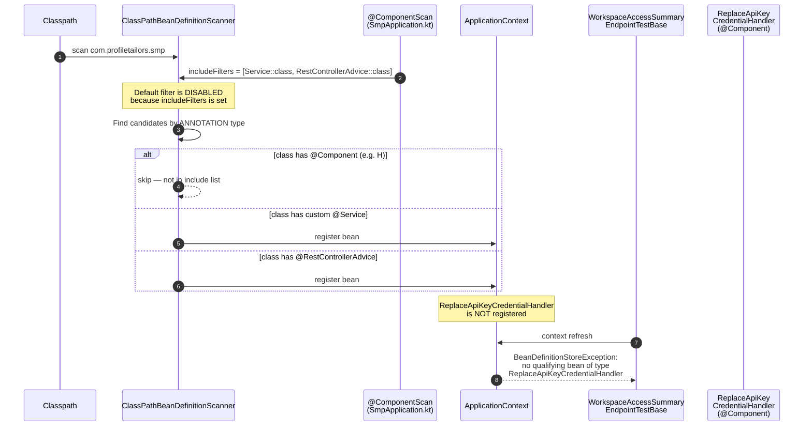
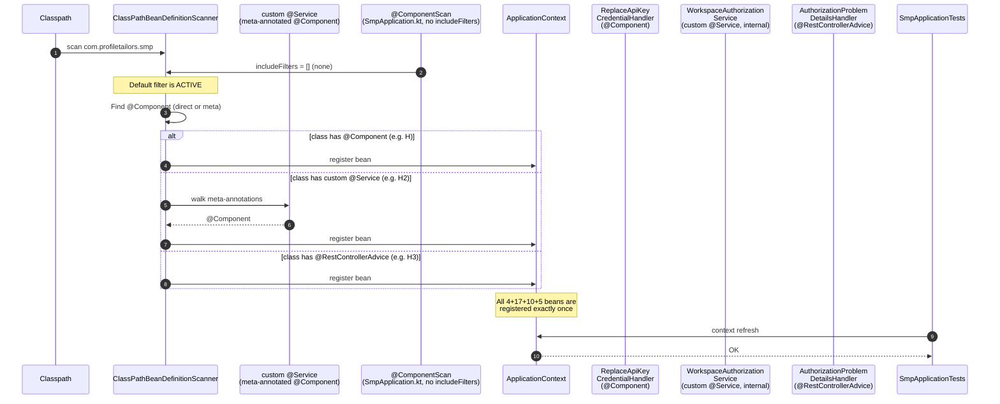
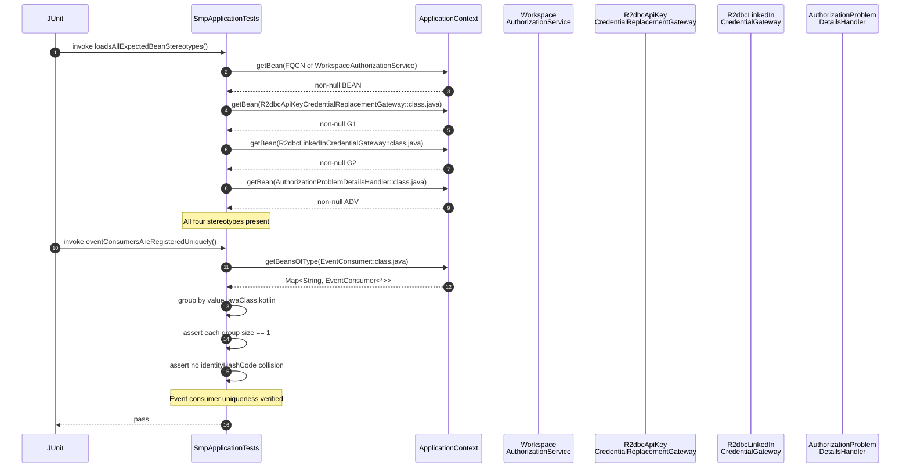

# Design: Fix Restrictive Component Scan

## Technical Approach

`server/smp` boots via `SmpApplication`, whose `@ComponentScan` declares an explicit `includeFilters`
restricted to the project marker `com.profiletailors.common.domain.Service` and
`@RestControllerAdvice`. Per Spring's `ClassPathBeanDefinitionScanner` contract, *any* explicit
`includeFilters` disables the default filter set (`@Component`, `@Repository`, `@Service`,
`@Controller`), so every stereotype the rest of the codebase relies on is silently dropped during
classpath scanning. The design fixes the bug at the root by (a) meta-annotating the custom
`Service` marker with `@Component` so the project's hexagonal convention is preserved *and*
discoverable by Spring's default filter, (b) removing the `includeFilters` block so the default
filter runs, (c) applying the same preventive fix to `RateLimitConfiguration`, (d) normalising the
single Spring-`@Service` outlier to the custom marker, and (e) replacing the redundant
`@Component` on `PublishingCredentialsProperties` with idiomatic
`@EnableConfigurationProperties` on a co-located `@Configuration`. Two guard rails make the bug
impossible to reintroduce: a regression test in `SmpApplicationTests` that asserts at least one
bean of each stereotype is present plus `EventConsumer` uniqueness, and an ArchUnit rule in
`ComponentScanArchTest` that fails `./gradlew :server:smp:check` if the smp application layer
declares Spring's `@Component` or `@Repository` instead of the project marker.

## Current State (Problem Recap)

`@ComponentScan(includeFilters = [...])` disables the default filter. With the current filter, the
only classes under `com.profiletailors.smp` that become beans are those annotated with the custom
`Service` (10 use-case handlers) or `@RestControllerAdvice` (5 problem-details handlers).
Everything else is silently dropped: 4 `@Component` classes (including
`ReplaceApiKeyCredentialHandler`, `SecureRandomApiKeyCredentialValueFactory`,
`GetWorkspaceAuditEventsHandler`, `R2dbcLinkedInCredentialGateway`), all 17 `@Repository` classes
across 7 modules (the entire R2DBC persistence layer), and 1 Spring-`@Service` class
(`CredentialEncryptionService`). The exact reported failure —
`BeanDefinitionStoreException` on `ReplaceApiKeyCredentialHandler` — is the downstream symptom:
`WorkspaceAccessSummaryEndpointTestBase` `@Autowired`s that handler, the bean does not exist, the
mediator lookup fails, and the context refuses to refresh.

## Target State (After the Fix)

`@ComponentScan` declares no `includeFilters`. Spring's default filter runs, and the custom
`Service` is discovered through its `@Component` meta-annotation. Every stereotype the project
uses is registered exactly once, no explicit filter is required, and the project convention (custom
marker for use-case handlers) is preserved as a semantic/IDE/static-analysis marker. The exclude
regex is kept with a KDoc that documents its intent as defense against test classes being moved
into `main`.

## Sequence Diagrams

### Diagram A — Bean discovery: BEFORE the fix



### Diagram B — Bean discovery: AFTER the fix



## Architecture Decisions

### 5.1 Custom `@Service` meta-annotated with `@Component`

| | |
|---|---|
| **Decision** | Add `@Component` to `shared/common/.../Service.kt`. |
| **Rationale** | Spring's default filter discovers stereotypes via meta-annotations, so the project convention is preserved *and* the bug becomes structurally impossible to reintroduce (the custom marker is now a true Spring stereotype). |
| **Alternatives** | Hand-rewrite every `@Component`/`@Repository` to `@Service` (rejected: error-prone, requires ongoing enforcement, breaks `@Repository` semantics for persistence ports); broaden the scan explicitly (rejected: re-introduces the trap that a future filter narrowing would silently skip classes again). |
| **Tradeoff** | Zero runtime cost; one extra annotation at compile time. |

### 5.2 Drop `includeFilters`; keep `excludeFilters`

| | |
|---|---|
| **Decision** | Remove `includeFilters` from `SmpApplication.kt`; keep `excludeFilters` regex with a KDoc explaining it is defense against test-only classes being moved into `main`. |
| **Rationale** | The filter is the bug. The exclude regex is harmless today and documents a deliberate intent. |
| **Alternatives** | Keep `includeFilters` and broaden it to every stereotype (rejected: a future filter narrowing would silently re-introduce the bug); drop both filters (rejected: removes the documented test-class safety net and the KDoc trail). |
| **Tradeoff** | Net -8 lines of code, +6 lines of KDoc. |

### 5.3 ArchUnit (not detekt, not grep) as the guard rail

| | |
|---|---|
| **Decision** | Add `com.tngtech.archunit:archunit-junit5:1.4.2` as `testImplementation`; create `server/smp/src/test/kotlin/com/profiletailors/smp/ComponentScanArchTest.kt`. |
| **Rationale** | ArchUnit is the de-facto standard for Java/Kotlin architecture testing: 3.7k GitHub stars, 417 Maven Central dependents, Apache 2.0, no known vulnerabilities. The repo has precedent in `tmp/example-code/cvix-main/server/engine/src/test/kotlin/com/cvix/ArchTest.kt` (uses the same `ClassFileImporter` + `ArchRuleDefinition` DSL). The rule runs as part of `./gradlew :server:smp:test` and surfaces in standard CI without custom wiring. |
| **Alternatives** | detekt custom rule (rejected: heavier DSL for a single boolean check, no precedent in this repo); grep-based CI task (rejected: not a JUnit test, doesn't run in `./gradlew :server:smp:test`, harder to surface in CI, no structured failure output). |
| **Tradeoff** | +1 Apache-2.0 dependency; +1 test file (~50 lines including KDoc); runs in every CI build. |

### 5.4 `internal class` test access pattern

| | |
|---|---|
| **Decision** | The new `loadsAllExpectedBeanStereotypes()` test resolves beans via `applicationContext.getBean(Class.forName("com.profiletailors.smp.authorization.application.WorkspaceAuthorizationService"))` (FQCN string) rather than direct import of the `internal class` symbol. `ReplaceApiKeyCredentialHandler` is `public`, so it can be imported directly. |
| **Rationale** | `WorkspaceAuthorizationService` is `internal class`. Direct import from the test source set works *today* because the test source set and the main source set are in the same Gradle module. But: (a) it is fragile — if the test ever moves to a separate `testFixtures` module the import breaks silently at compile time, (b) Spring's bean lookup uses reflection and works regardless of visibility, so going through the context is more robust. FQCN strings keep the test resilient. |
| **Alternatives** | Direct import of `internal class` (rejected: works today but is fragile); making handlers `public` (rejected: leaks the `internal` convention into visibility); suppressing the Kotlin warning (rejected: same as direct import). |
| **Tradeoff** | Test is slightly more verbose; gains robustness against future module splits. |

### 5.5 `PublishingCredentialsConfiguration.kt` as a dedicated file

| | |
|---|---|
| **Decision** | New co-located `@Configuration` at `server/smp/src/main/kotlin/com/profiletailors/smp/publishing/infrastructure/credentials/PublishingCredentialsConfiguration.kt`, annotated `@Configuration` + `@EnableConfigurationProperties(PublishingCredentialsProperties::class)`, with a KDoc explaining its architectural role. |
| **Rationale** | Matches the project's house style of dedicated `@Configuration` classes per bounded context (e.g. `IdentitySecurityConfiguration`, `TenancyWebConfiguration`); the file documents the choice and gives room to grow if more beans are needed. |
| **Alternatives** | Piggyback on `CredentialEncryptionService.kt` (rejected: mixes concerns; would force that class to become a `@Configuration` which has different Spring semantics — `@Configuration` enables CGLIB proxying and bean-dependency interception); register globally (rejected: breaks bounded-context locality). |
| **Tradeoff** | +1 file (~15 lines including KDoc); zero behavioural change beyond removing the redundant `@Component`. |

### 5.6 Event-consumer double-registration test

| | |
|---|---|
| **Decision** | Add `eventConsumersAreRegisteredUniquely()` to `SmpApplicationTests`. It iterates `applicationContext.getBeansOfType(EventConsumer::class.java)`, groups entries by `value.javaClass.kotlin`, asserts each group has exactly one bean name, and asserts no two distinct bean names map to the same consumer instance (by `System.identityHashCode`). |
| **Rationale** | Cheap, deterministic, no event publish needed; catches the failure mode the explore phase flagged (double-registration when `EventConfiguration` becomes active). |
| **Alternatives** | Full event-publish round-trip test (rejected: heavy, requires a fake event bus, slow, may not catch registration-time duplication); rely on existing bus tests (rejected: they exercise happy paths, not registration counts). |
| **Tradeoff** | ~30 lines of test code; runs in the same JUnit cycle as `contextLoads()`. |

## File-by-File Change List

| File | Current State | After State | Test That Proves It |
|---|---|---|---|
| `shared/common/src/main/kotlin/com/profiletailors/common/domain/Service.kt` | `@Retention(RUNTIME) @Target(CLASS) @MustBeDocumented annotation class Service` (no Spring meta) | Adds `@Component` meta-annotation; KDoc clarifies dual role | `SmpApplicationTests.loadsAllExpectedBeanStereotypes()` resolves `WorkspaceAuthorizationService` via FQCN; `ComponentScanArchTest` rule passes |
| `server/smp/src/main/kotlin/com/profiletailors/smp/SmpApplication.kt` | `@ComponentScan` with `includeFilters = [Service, RestControllerAdvice]` + `excludeFilters` regex | Drops `includeFilters`; keeps `excludeFilters` with KDoc | `contextLoads()` + `loadsAllExpectedBeanStereotypes()` pass; `ComponentScanArchTest` confirms no `includeFilters` regression |
| `shared/shield/ratelimit/src/main/kotlin/com/profiletailors/ratelimit/infrastructure/config/RateLimitConfiguration.kt` | `@Configuration` + nested `@ComponentScan(..., includeFilters = [Service::class])` | Drops nested `@ComponentScan`; keeps `@Configuration` + `@EnableConfigurationProperties` | `ComponentScanArchTest` rule confirms no nested `includeFilters` in `shared/*/infrastructure/config/**` |
| `server/smp/src/main/kotlin/com/profiletailors/smp/publishing/infrastructure/credentials/CredentialEncryptionService.kt` | Imports `org.springframework.stereotype.Service`; `@Service` | Imports custom `Service`; annotation switched to project marker | `loadsAllExpectedBeanStereotypes()` resolves `R2dbcLinkedInCredentialGateway` which depends on `CredentialEncryptionService` |
| `server/smp/src/main/kotlin/com/profiletailors/smp/publishing/infrastructure/credentials/PublishingCredentialsProperties.kt` | `@Component` + `@ConfigurationProperties(prefix = "publishing.credentials.encryption")` | Removes `@Component`; keeps `@ConfigurationProperties` prefix unchanged | `contextLoads()` passes (properties still bind); spec scenario "PublishingCredentialsProperties has no `@Component` and keeps its prefix" |
| `server/smp/src/main/kotlin/com/profiletailors/smp/publishing/infrastructure/credentials/PublishingCredentialsConfiguration.kt` | (does not exist) | **NEW**: `@Configuration` + `@EnableConfigurationProperties(PublishingCredentialsProperties::class)` + KDoc | `contextLoads()` passes (properties still injectable into `CredentialEncryptionService`) |
| `server/smp/src/test/kotlin/com/profiletailors/smp/SmpApplicationTests.kt` | Single `contextLoads()` in a `@SpringBootTest` | Keeps `contextLoads()`; adds `loadsAllExpectedBeanStereotypes()` and `eventConsumersAreRegisteredUniquely()`; keeps `@SpringBootTest` config verbatim | All three methods pass in `./gradlew :server:smp:test` |
| `server/smp/src/test/kotlin/com/profiletailors/smp/ComponentScanArchTest.kt` | (does not exist) | **NEW**: ArchUnit rule asserting that no class under `com.profiletailors.smp.*.application.*` carries `org.springframework.stereotype.Component` or `org.springframework.stereotype.Repository`; plus no class under `com.profiletailors.*.infrastructure.config.*` declares a nested `@ComponentScan` with `includeFilters` | `./gradlew :server:smp:test` runs the rule; mutating any of the above files and re-running fails the build |
| `gradle/libs.versions.toml` | No `archunit` version, no `archunit-junit5` library | Adds `archunit = "1.4.2"` under `[versions]`; adds `archunit-junit5` under `[libraries]` | `./gradlew :server:smp:dependencies --configuration testRuntimeClasspath` shows the new artifact |
| `server/smp/build.gradle.kts` | No `archunit` test dependency | Adds `testImplementation(libs.archunit.junit5)` | `./gradlew :server:smp:test` compiles and runs `ComponentScanArchTest` |

## Sequence Diagram: Regression Test Flow



If any `getBean` returns `null` (the original `BeanDefinitionStoreException` failure mode), JUnit
fails the test, `./gradlew :server:smp:test` fails, CI fails.

## Risk Register and Design Mitigations

| # | Risk | Likelihood | Design Mitigation |
|---|---|---|---|
| 1 | Removing the include filter alone is not enough; Kotlin `internal class` naming collisions may still fail registration | Low | Existing test `WorkspaceAccessSummaryEndpointTestBase` already injects `internal` beans via `@Autowired`; the new test resolves one explicitly via FQCN to confirm. See ADR 5.4. |
| 2 | Kotlin `internal` visibility causes Spring reflection issues | Low | Same as #1. ADR 5.4 documents the test's lookup-via-context approach. |
| 3 | Shared-module scan coverage; broadening `scanBasePackages` could sweep in unintended classes | Medium | **Out of scope** for this change; the design does **not** modify `scanBasePackages`. The custom `Service` meta-annotation is module-agnostic so it does not bias shared-module discovery. |
| 4 | The custom `Service` annotation may still be useful as a marker | n/a | ADR 5.1 keeps the annotation; the meta-annotation adds the Spring stereotype without removing the semantic role. |
| 5 | `RateLimitConfiguration` has the same anti-pattern | Low | ADR 5.1 / 5.3 (the preventive file edit + the ArchUnit rule that catches any future `infrastructure.config.*` nested `includeFilters`). |
| 6 | `PublishingCredentialsProperties` causes a duplicate-bean warning once `@Component` is removed | Low | ADR 5.5 (co-located `@Configuration` + `@EnableConfigurationProperties` replaces the redundant `@Component`); the change is structurally the documented Spring Boot pattern. |
| 7 | BddTestConfiguration and IntegrationTestBase have `@Import`, not `@ComponentScan` | n/a | Out of design scope; the exclude regex is preserved per ADR 5.2. |
| 8 | Modulith boundary test is disabled, providing no protection | Medium | **Out of scope**; documented in the proposal's Future Work. The ArchUnit guard rail (ADR 5.3) covers the specific scan-convention risk. |
| 9 | Spring Modulith event subscription becomes active and reveals double-publishers | Medium | ADR 5.6 (event-consumer uniqueness test runs after `EventConfiguration` is loaded and asserts reference equality). |

## Open Sub-Tasks Template (for Apply Phase)

```
### Sub-task N: <bean or config that caused the failure>
- **Bean/Config (FQCN)**: com.profiletailors.smp...
- **Error message (verbatim)**: ...
- **Fix (one-line)**: ...
- **Test that proves the fix (file:method + assertion)**: ...
```

## Open Questions for the Apply Phase

- [ ] **Commit granularity**: one commit per file vs. one commit per logical change group (a)
  meta-annotation + filter drop, (b) normalisation + properties refactor, (c) tests + ArchUnit?
  Recommendation: one logical-group commit each so each is independently revertable.
- [ ] **ArchUnit rule text — strict or lenient?**: should the rule fail on
  `@org.springframework.stereotype.Component` in `application/` only, or also flag Spring's
  `@Repository` if it appears in `application/` (where persistence ports should not live)?
  Recommendation: fail on `@Component` unconditionally, advise-only on `@Repository` per spec
  scenario.
- [ ] **Test order**: should `loadsAllExpectedBeanStereotypes()` run before or after
  `eventConsumersAreRegisteredUniquely()`? Recommendation: alphabetical JUnit order
  (`e` < `l`) so the uniqueness check runs first and surfaces registration bugs before
  presence checks.
- [ ] **Property precedence**: does the `@EnableConfigurationProperties` switch change the
  property-binding precedence (Spring relaxed binding picks `@ConfigurationProperties` over
  `@Value` when both exist)? Apply phase should run `./gradlew :server:smp:test` and confirm no
  test relies on the old `@Component` injection path of `PublishingCredentialsProperties`.
