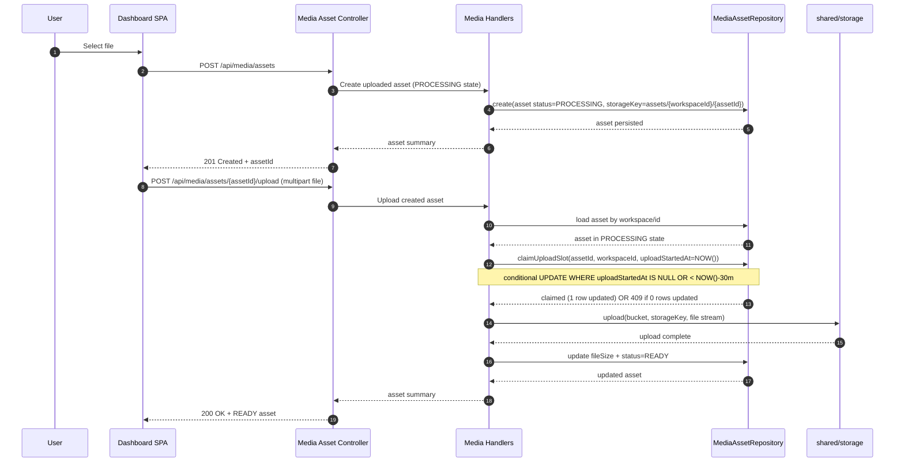
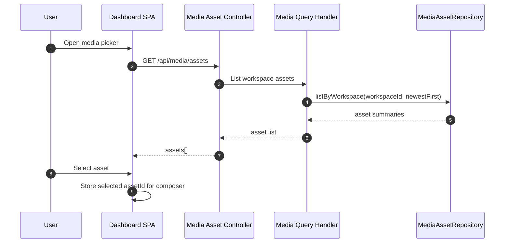
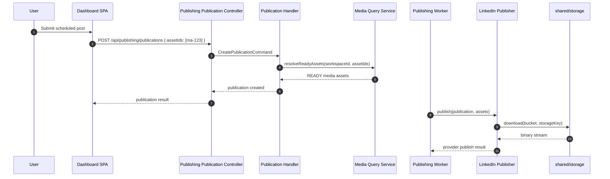

# Design: Centralized Media Library

## Overview

This change delivers a narrow MVP centralized media library for workspace users by introducing *
*media as a separate bounded context** instead of keeping the capability inside publishing. The new
media context becomes the canonical source of truth for workspace media metadata and lifecycle
state, while `shared/storage` remains the canonical binary-storage foundation. Publishing becomes a
consumer of media assets rather than the owner of the media catalog.

The frontend dashboard SPA shifts from local-only `File[]` state to a persisted media workflow that
creates an asset in the media context, uploads the binary, lists existing workspace assets, and
submits publication `assetIds` that reference media-owned assets.

The design stays aligned with the MVP proposal while reflecting the approved architecture decision:

- **Workspace-scoped only**
- **Upload-and-select only**
- **Separate media bounded context** with publishing as the first consumer
- **Provider-neutral media model** with LinkedIn as the required MVP publication consumer
- **No DAM features** such as folders, tags, search ranking, quotas, or transformation pipelines
- **No delete endpoint in the MVP API surface for this change**

## Goals

1. Provide a workspace-scoped media library API owned by a dedicated media bounded context.
2. Provide a browser upload flow that stores binaries in backend-managed object storage.
3. Let the SPA browse previously uploaded assets and attach them to new publications.
4. Keep publishing decoupled so future apps can reuse media without inheriting publishing-specific
   ownership.
5. Keep the implementation small enough for MVP while creating module boundaries that can evolve
   independently.

## Non-Goals

- Keeping media inside the publishing bounded context
- Rich metadata such as title, alt text, tags, ownership labels, or folders
- Search, smart organization, deduplication, moderation, virus scanning, quotas, or retention
  policies
- Cross-workspace sharing
- Provider-specific optimization or transformation pipelines
- Reworking publication publishing semantics beyond consuming persisted `assetIds`
- Building a generalized cross-product asset permission model beyond existing workspace scoping

## Technical Approach

The centralized media library will be implemented as a **new media bounded context** with its own
application and HTTP layer, while deliberately reusing existing storage and as much existing asset
persistence behavior as practical.

The resulting system shape is:

- **Media context owns** workspace media asset lifecycle, upload orchestration, media queries, and
  future reusable media capabilities.
- **Publishing context consumes** media asset identifiers and resolved media metadata when
  validating and publishing a post.
- **`shared/storage` owns** provider-neutral binary storage, upload/download/delete primitives, and
  bucket abstraction.
- **Frontend SPA integrates** with media APIs for upload and browsing, then uses returned asset ids
  when creating publications.

The resulting MVP product flow is:

1. SPA requests asset creation from the media API.
2. Media application creates a workspace media asset in `PROCESSING` state with a backend-generated
   stable `storageKey` under `assets/{workspaceId}/{assetId}`.
3. SPA uploads the binary through a backend-managed media upload endpoint.
4. Media application streams the file into `shared/storage` and marks the asset `READY`.
5. SPA lists workspace assets from the media API and selects one.
6. SPA creates a publication using persisted media `assetIds`.
7. Publishing resolves the referenced media assets through a media-facing query/port and continues
   downstream LinkedIn publishing using the same storage-backed binary foundation.

## Architecture Decisions

### Decision 1: Media is a separate bounded context, not a sub-capability of publishing

**Choice**: Introduce a dedicated media bounded context that owns media-library APIs, media
lifecycle rules, and media read models.

**Alternatives considered**:

- Keep the media library on top of existing `PublicationAsset` records inside publishing
- Create only a thin HTTP façade under publishing and defer extraction later

**Rationale**:

- Media is intended to become reusable by future apps, not just publication workflows.
- Keeping media inside publishing would make publishing the de facto owner of a broader workspace
  capability, increasing future extraction cost.
- A dedicated context creates the correct ownership boundary now while MVP scope is still small.
- The product requirement has been clarified by the approved architecture decision: media must
  evolve independently.

**Consequence**:

- New media-specific packages, APIs, and application contracts must be introduced now.
- Publishing must depend on a media-facing port or integration contract instead of directly owning
  asset lifecycle logic.
- Some implementation effort increases up front, but future reuse by non-publishing apps becomes
  materially simpler.

### Decision 2: Preserve the current storage-backed upload architecture with backend-managed upload for MVP

**Choice**: The browser uploads media to a backend media HTTP endpoint, and the media application
streams the content into `shared/storage` without accumulating the full binary payload in
application heap memory.

**Alternatives considered**:

- Direct browser-to-object-storage upload using presigned PUT/POST URLs
- Hybrid reserve endpoint plus upload session contract in storage module

**Rationale**:

- Current `shared/storage` presigning support is GET-oriented; there is no existing browser-ingest
  upload contract.
- Backend-managed upload is still the smallest additive path even after introducing a separate media
  context.
- The media context can validate workspace ownership, enforce allowed media types and size limits,
  and coordinate asset lifecycle transitions around upload.
- This preserves the existing upload recommendation without coupling upload policy to publishing.

**Consequence**:

- Backend instances carry upload bandwidth for MVP.
- Very large media and high-throughput ingestion are deferred concerns.
- The design preserves deterministic storage keys and keeps a future migration to presigned direct
  upload possible without changing the media asset model.

### Decision 3:

`shared/storage` remains canonical for binary storage; media owns metadata and lifecycle

**Choice**: The media context orchestrates uploads and metadata transitions, but actual binary
storage continues to go through `shared/storage` abstractions and configured buckets.

**Alternatives considered**:

- Embed storage-provider logic inside the media infrastructure
- Let publishing continue to own storage usage and expose media indirectly

**Rationale**:

- `shared/storage` already provides provider abstraction, named buckets, uploads, downloads, delete
  support, metrics, and events.
- Reusing the shared module preserves the monorepo's hexagonal boundary and avoids provider-specific
  duplication.
- The bounded-context split is about ownership of business capability, not duplication of low-level
  storage concerns.

**Consequence**:

- Media stays storage-provider-neutral.
- Bucket selection stays configuration-driven rather than feature-specific hardcoding.
- Media can evolve independently without redefining storage primitives.

### Decision 4: Backend is canonical for media metadata; frontend owns only transient upload UX state

**Choice**: The SPA owns only local UI state such as pending upload progress, local preview URLs,
and current picker selection. Persisted media truth lives in backend media APIs.

**Alternatives considered**:

- Keep local `File[]` state as the main source and upload lazily during publication creation
- Maintain a frontend-first asset cache with eventual synchronization

**Rationale**:

- Publication creation already accepts `assetIds`, so persisted backend records are the correct
  integration point.
- Upload-first semantics allow asset reuse across multiple publication attempts and future apps.
- This removes the current mismatch where the UI appears to support attachments but the publishing
  store still submits `assetIds: []`.

**Consequence**:

- Composer interactions become slightly more asynchronous.
- Frontend must handle `PROCESSING`, `FAILED`, and `READY` upload states explicitly.
- The new frontend integration points target media APIs instead of publishing-owned asset endpoints.

### Decision 5: Keep asset browsing simple: paginated newest-first listing with explicit status filtering

**Choice**: Provide list/read endpoints with simple filtering boundaries, newest-first ordering,
explicit status filtering, and bounded pagination, without search or folder semantics.

**Alternatives considered**:

- Search API with tags and metadata filters
- Folder or collection hierarchy

**Rationale**:

- MVP scope remains intentionally narrow even though the architecture is more future-ready.
- Existing metadata needed for upload and publishing is sufficient for a reusable picker.
- Simple list/read keeps backend query and frontend picker complexity low while still remaining
  operationally safe for growing libraries.

**Consequence**:

- Larger media libraries may become harder to browse over time.
- Search and organization features are deferred until asset volume justifies them.
- The API must support bounded pagination and explicit status filtering so the client can
  distinguish `READY` assets from incomplete ones without unbounded payloads.

## System Architecture

### Bounded Context Responsibilities

#### Media bounded context: `com.profiletailors.smp.media`

The new media context owns the media asset aggregate and all media-library behavior for MVP.

Responsibilities:

- workspace-scoped asset identity
- source type (`UPLOADED`)
- media type
- storage reference via `storageKey`
- original filename and file size capture
- lifecycle status
- media creation, upload completion, upload failure, and stale-upload reconciliation
- workspace media browsing queries
- media-facing integration contract consumed by publishing and future apps

The context should remain provider-neutral and intentionally narrow. Rich DAM semantics stay
deferred.

#### Publishing bounded context: `com.profiletailors.smp.publishing`

Publishing no longer owns the media library. Instead, it consumes media assets when validating
publication commands and when publishing downstream.

Responsibilities:

- accept media `assetIds` on publication create/edit flows
- resolve media assets through a media-facing query or port
- require referenced assets to be `READY` and workspace-accessible
- use media storage references during provider publishing
- remain provider-focused for downstream publication behavior
- return HTTP 503 with `MEDIA_SERVICE_UNAVAILABLE` when the media context is unavailable

Publishing should not create, upload, or browse media assets directly.

#### Shared Storage: `shared/storage`

`shared/storage` is reused as-is for binary persistence through `Storage` and
`StorageApplicationService`.

Responsibilities:

- stream upload into configured attachments/media bucket
- retain object storage provider abstraction
- emit storage metrics/events
- support downstream download by publishing integrations

Operational constraints:

- The upload implementation MUST stream request bytes to storage without buffering the full
  multipart payload in heap memory.
- Backend configuration must be compatible with real-world asset sizes for the MVP and must avoid
  default in-memory codec limits causing avoidable upload failures.

The MVP still does **not** require generalized upload presigning in `PresignableStorage` because
upload is backend-mediated.

#### Frontend: `apps/web/app`

The SPA is responsible for:

- selecting local files
- showing optimistic preview URLs before or during upload
- calling create/upload/list APIs in the media context with workspace-scoped auth requests
- managing upload progress/error state
- attaching persisted asset ids in publication creation
- allowing users to pick from previously uploaded workspace assets

The SPA is **not** responsible for:

- inventing asset ids
- deciding storage keys
- persisting canonical metadata
- bypassing backend storage policy

### Layer Responsibilities

#### Domain: `com.profiletailors.smp.media.domain`

Create or extract a media-owned asset aggregate/value model for MVP.

Domain responsibilities:

- workspace-scoped media asset identity (UUID v4 — never sequential)
- source type
- media type
- storage key
- lifecycle status
- original filename
- file size
- uploadStartedAt — set when the upload handler begins streaming; used by the reconciler to apply
  the grace period and by the conflict check to detect in-flight uploads
- future-compatible provider-neutral metadata

If reusing parts of the existing `PublicationAsset` structure accelerates delivery, reuse should
happen through extraction or translation into the media context, not by leaving ownership in
publishing.

#### Application: `com.profiletailors.smp.media.application`

Add media-oriented commands/queries and handlers to orchestrate:

- asset creation
- upload completion/failure transitions
- list/read queries for workspace media library
- lifecycle cleanup and reconciliation for incomplete uploads
- publishing-facing asset resolution queries

The application layer resolves:

- authenticated principal
- active workspace from `resourceContextProvider.requireWorkspaceContext()`
- allowed media validations for MVP
- repository persistence and storage orchestration
- integration contracts exposed to publishing

#### Infrastructure HTTP: `com.profiletailors.smp.media.infrastructure.http`

Add workspace-scoped controller endpoints for:

- create asset metadata
- upload binary to a created asset
- list assets
- get asset details
- no delete endpoint in the MVP API surface

Controllers should follow the same platform conventions already used elsewhere:

- `Mediator` dispatch
- Spring WebFlux
- workspace context from `X-Workspace-Id`
- API versioning conventions already used in the backend

#### Infrastructure integration between publishing and media

Publishing should integrate with media through a clear boundary, for example:

- a media query port implemented by the media context
- or a media application service contract exposed inside the same deployable module

The important design rule is that publishing depends on a **media-owned interface/capability**, not
on media internals leaking back into publishing ownership.

**Failure contract for media context unavailability:** if the media resolve-ready-assets port fails
due to infrastructure unavailability (e.g., DB connection loss, timeout), the publishing handler
MUST return a `503 Service Unavailable` response to the caller with a machine-readable error code
`MEDIA_SERVICE_UNAVAILABLE`. Publication creation MUST NOT succeed when media asset validation
cannot be performed. No circuit breaker or fallback mode is defined for MVP; the system fails fast
to protect data integrity.

**Publishing must treat `READY` as a precondition-at-dispatch.** Provider adapters must handle
storage-unavailable errors at execution time and propagate them as publication failures, not silent
success.

**resolve-ready-assets port contract:**

- Interface name: `MediaAssetResolver` (or equivalent port name)
- Input: `workspaceId: UUID, assetIds: List<UUID>`
- Output: `List<ResolvedMediaAsset>` where `ResolvedMediaAsset` contains
  `assetId, workspaceId, storageKey, mediaType`. Note: the `status` field is omitted from
  `ResolvedMediaAsset` because the port contract guarantees all returned assets are READY; including
  it would be misleading and could encourage defensive branching on an invariant field.
- Failure contract: throws/returns `AssetNotReadyException` if any assetId is missing,
  cross-workspace, or not `READY`. Throws/returns `MediaServiceUnavailableException` if the media
  context is unavailable.
- Timeout: the port MUST resolve within 5 seconds. Exceeding this timeout MUST result in
  `MediaServiceUnavailableException` being thrown. The publishing handler MUST return HTTP 503
  `MEDIA_SERVICE_UNAVAILABLE` on timeout.
- Publishing handlers MUST use only this port — no direct access to media persistence is permitted.

**Legacy row handling:** for the MVP transition period, the `MediaAssetResolver` implementation MUST
also resolve legacy `publication_assets` rows that predate the media context. A legacy row is
eligible for resolution if: (1) its `assetId` matches a requested id, (2) its `workspaceId` matches
the requesting workspace, and (3) its `status` is `READY` with a non-null `storageKey`. Legacy rows
are resolved through the same port response shape (`ResolvedMediaAsset`) as media-context-owned
records. This enables uninterrupted publication of any previously created assets during the
transition. A post-MVP cleanup task should backfill or replace legacy rows with media-context-owned
records once all workspaces have migrated.

## Recommended Upload Architecture

### Why backend-managed upload is still recommended for MVP

The recommended architecture is:

1. **Create asset metadata first** using the media API (asset starts in `PROCESSING` state).
2. **Upload file bytes to backend** using `multipart/form-data`.
3. **Media application streams to `shared/storage`** using the reserved backend-generated stable
   `storageKey` — the browser sends a `multipart/form-data` POST to the backend media upload
   endpoint. The backend media application layer receives the request and streams the request body
   bytes directly into the configured storage bucket via the `shared/storage` `Storage`
   abstraction — without accumulating the full binary payload in application heap memory. The
   backend initiates a storage write operation and pipes the incoming stream to the storage provider
   SDK.
4. **Media application captures final file size and transitions the asset** to `READY` on success or
   `FAILED` on failure.
5. **Frontend treats the returned asset id as canonical** for future publication attachment and
   library reuse.

This is still recommended because it:

- reuses the existing `Storage` abstraction immediately
- keeps upload policy enforcement centralized in the media context
- avoids premature storage-presign API design
- works with current backend and SPA conventions
- preserves future compatibility with a later direct-to-storage design

**Storage write retry policy for MVP:** single-attempt streaming. If a transient storage error
occurs during the stream, the server MUST NOT silently retry the storage write mid-stream (this
could result in duplicate or corrupt storage objects). Instead, the upload handler MUST close the
stream, transition the asset to `FAILED`, and respond with an appropriate error. The client MAY
initiate a fresh retry upload (`FAILED` → `PROCESSING`) as specified in the lifecycle. Future work
may introduce resumable upload sessions with partial-retry capability.

Atomicity and reconciliation guidance:

- The upload flow is inherently a multi-step operation: stream bytes to storage, then persist final
  asset state in the database.
- If storage succeeds but the final database transition does not: (1) the upload handler MUST
  immediately attempt a best-effort delete of the storage object using the reserved `storageKey`; *
  *the inline storage delete call during upload failure cleanup MUST be subject to a maximum timeout
  of 30 seconds (matching the reconciler's per-delete timeout). If the delete call does not return
  within 30 seconds, treat it as a failure, log it with `assetId` and `storageKey`, and proceed with
  the asset `FAILED` transition.** (2) regardless of whether the storage delete succeeds, the asset
  MUST transition to `FAILED` and `uploadStartedAt` MUST be reset to `NULL`; (3) if the storage
  delete itself fails, the failure MUST be logged with assetId and storageKey for the stale
  reconciler to attempt cleanup on its next run. The stale reconciler acts as the secondary safety
  net for orphaned storage objects.
- `PROCESSING` assets with `created_at` older than 2 hours and no upload activity within the
  30-minute grace period MUST be transitioned to `FAILED` by the stale reconciler.
- The reconciler MUST run at minimum every 15 minutes.
- Cleanup of orphaned or partial storage objects should be best-effort during failure handling and
  may also be revisited by reconciliation if the storage layer exposes enough metadata.

### Upload status model

For uploaded assets, the lifecycle distinguishes creation from completed ingestion. Status
semantics:

- `PROCESSING`: asset created but upload not yet completed, or upload in progress
- `READY`: binary successfully stored and asset available for selection/publishing
- `FAILED`: upload failed, was interrupted, timed out, or was cleaned up by the stale reconciler

`FAILED` assets are retryable. State transition: `FAILED` → `PROCESSING` on retry upload. The client
does not need to create a new asset. When an asset transitions to `FAILED` (upload timeout, storage
error, upload handler failure, or stale reconciler), `uploadStartedAt` MUST be reset to `NULL`. This
ensures that FAILED assets are immediately eligible for retry via the conditional
`uploadStartedAt IS NULL` branch of the upload claim gate, with no cooldown period.

State transition diagram:

- `PROCESSING` → `READY` (upload completes successfully)
- `PROCESSING` → `FAILED` (upload fails, is interrupted, times out, or stale reconciler cleans up)
- `FAILED` → `PROCESSING` (client retries upload)

The design requires uploaded assets to be created in `PROCESSING` state until storage ingest
succeeds.

Backward-compatibility note:

- Existing callers of publishing-owned asset creation semantics must be identified and migrated to
  the media context or explicitly proven unaffected.
- Existing persisted asset rows created before this change must remain readable during transition
  and should continue to be treated according to their stored status unless a migration reveals
  otherwise.
- Publication create/edit validation must explicitly require `READY` assets rather than assuming any
  fetched asset is publishable.

### Bucket and object key usage

The backend should continue reserving object keys using the current deterministic pattern:

`assets/{workspaceId}/{assetId}`

Asset identifiers MUST be UUID v4 values. Sequential or numeric identifiers are prohibited because
storage keys embed the assetId and must not be enumerable.

The binary should be stored in the same configured attachments/media bucket already used by
publishing integrations unless implementation reveals a strong need for a separate bucket that still
preserves publishing compatibility. For MVP, reusing the current bucket is preferred because it
ensures:

- current downstream publisher behavior keeps working
- no immediate migration is needed for LinkedIn asset resolution
- stored binaries remain addressable by existing `storageKey` lookups

**Before reusing the existing attachments bucket, the following must be verified during
implementation:** (1) existing object lifecycle rules do not auto-expire objects under the `assets/`
prefix; (2) existing CORS configuration permits browser-to-backend upload flows for the media
context; (3) existing IAM/access policies do not expose media assets to publishing-scoped consumers
unintentionally; (4) server-side encryption settings are compatible. If any policy conflicts are
found, a separate media bucket MUST be provisioned.

## API Design

The exact DTO names can follow existing backend naming conventions, but the API surface should now
be media-owned and shaped like this.

### Create asset

`POST /api/media/assets`

Purpose:

- create a workspace-scoped uploaded asset record in `PROCESSING` state
- validate media type and filename
- return canonical asset metadata including `assetId`, `workspaceId`, status, and the information
  the client needs to continue the upload flow
- assetId MUST be a UUID v4 value

> **Wire format:** The `mediaType` field uses MIME string format (e.g., `image/jpeg`) across all
> request and response bodies. Enum-style uppercase values are NOT used on the wire.

Request shape:

```json
{
  "sourceType": "UPLOADED",
  "mediaType": "image/jpeg",
  "originalFilename": "launch-post.jpg"
}
```

Response shape:

```json
{
  "assetId": "550e8400-e29b-41d4-a716-446655440000",
  "workspaceId": "ws-123",
  "sourceType": "UPLOADED",
  "mediaType": "image/jpeg",
  "status": "PROCESSING"
}
```

Notes:

- For MVP, `EXTERNAL_URL` creation remains unsupported at the HTTP layer because this change is
  limited to uploaded media.
- Supported media types for this MVP are explicitly limited to: `image/jpeg`, `image/png`,
  `image/gif`, `image/webp`, `video/mp4`, `application/pdf`, `application/msword`,
  `application/vnd.openxmlformats-officedocument.wordprocessingml.document`,
  `application/vnd.ms-powerpoint`, and
  `application/vnd.openxmlformats-officedocument.presentationml.presentation`.
- The maximum allowed file size for this MVP is `500 MB` per asset.
- The controller should reject unsupported source types and unsupported media types rather than
  relying on downstream publication validation alone.
- `originalFilename`: required when `mediaType` is an OOXML format; optional for image and video
  types.

### Upload binary to created asset

`POST /api/media/assets/{assetId}/upload`

Content type:

- `multipart/form-data`

Form parts:

- `file`: required binary file

Maximum request duration: 10 minutes. If the upload stream has not completed within 10 minutes, the
server MUST close the connection and transition the asset to `FAILED`.

Behavior:

- verify the asset belongs to the active workspace using not-found semantics for cross-workspace
  access
- verify the asset is an uploaded asset
- The upload handler MUST perform a conditional update:
  `UPDATE ... SET uploadStartedAt = NOW() WHERE assetId = ? AND workspaceId = ? AND (status IN ('PROCESSING', 'FAILED')) AND (uploadStartedAt IS NULL OR uploadStartedAt < NOW() - INTERVAL '30 minutes')`.
  If 0 rows are updated, the asset is either READY (reject with 409 `ASSET_UPLOAD_CONFLICT`) or
  actively being uploaded (reject with 409 `ASSET_UPLOAD_IN_PROGRESS`). If 1 row is updated, the
  upload may proceed. This provides compare-and-set atomicity without a separate locking mechanism.
- reject upload with HTTP 409 `ASSET_UPLOAD_CONFLICT` if asset is already `READY`
- if `Content-Length` is provided and exceeds 500 MB, reject the request before reading the body
  with HTTP 413 Payload Too Large
- during streaming, maintain a byte counter and terminate if cumulative bytes exceed 500 MB
- validate media type using magic-byte inspection as defined in the media-library specification
- stream content into `shared/storage` without buffering the full payload in memory
- capture file size
- mark asset `READY` on success or `FAILED` on interruption or terminal failure
- on failure: attempt best-effort delete of partial storage object; regardless of delete outcome,
  transition asset to `FAILED`; log cleanup failure with assetId, storageKey, and error if delete
  fails
- return a refreshed asset summary using a stable response contract

Recommended success response shape:

```json
{
  "assetId": "550e8400-e29b-41d4-a716-446655440000",
  "workspaceId": "ws-123",
  "sourceType": "UPLOADED",
  "mediaType": "image/jpeg",
  "status": "READY",
  "originalFilename": "launch-post.jpg",
  "fileSizeBytes": 532112,
  "createdAt": "2026-06-20T10:00:00Z"
}
```

### List assets

`GET /api/media/assets`

Behavior:

- workspace-scoped only
- newest-first ordering using persisted creation time
- default to `READY` assets; caller MAY override with explicit `status` query parameter
- support `status=PROCESSING` filter so the SPA can surface in-progress or dangling uploads from
  previous sessions
- enforce bounded pagination with a safe default page size and a maximum page size cap

Recommended query parameters:

- `status`: optional, repeatable or comma-separated; defaults to `READY`; supported values: `READY`,
  `PROCESSING`, `FAILED`
- `pageSize`: optional; bounded by backend maximum
- `cursor`: optional continuation token for the next page

Recommended paging constraints:

- default `pageSize`: `50`
- maximum `pageSize`: `100`

Cursor encoding: the cursor MUST be an opaque token encoding a composite keyset of (`created_at`
DESC, `assetId` DESC). The composite keyset prevents pagination gaps or duplicates when concurrent
inserts occur at the same timestamp. The cursor value MUST be base64url-encoded and treated as
opaque by clients.

Cursor staleness: cursors are keyset-based and encode a stable position in the sort order (
`created_at` DESC, `assetId` DESC). Status changes that occur between page fetches are not reflected
in the ongoing pagination: if an asset on a previous page transitions to a different status before
the next page is fetched, it may still appear (or not) based on the status filter applied to each
individual request, not the filter used when the cursor was issued. Clients that need a consistent
snapshot must refetch from the first page. Cursors do not expire; they remain valid indefinitely
unless the pagination schema changes. If a client submits a cursor that is no longer valid due to a
schema change, the server returns HTTP 400 with error code `INVALID_CURSOR`.

Response shape:

```json
{
  "assets": [
    {
      "assetId": "550e8400-e29b-41d4-a716-446655440000",
      "workspaceId": "ws-123",
      "mediaType": "image/jpeg",
      "sourceType": "UPLOADED",
      "status": "READY",
      "originalFilename": "launch-post.jpg",
      "fileSizeBytes": 532112,
      "createdAt": "2026-06-20T10:00:00Z"
    }
  ],
  "nextCursor": "opaque-cursor-or-null"
}
```

### Get asset details

`GET /api/media/assets/{assetId}`

Behavior:

- return a single workspace-scoped asset summary/detail record
- support composer rehydration and picker details
- support publishing-facing asset resolution through an internal media application contract, not by
  making publishing own the HTTP API

### Error response contract

All new media-library endpoints should reuse the platform's standard error envelope if one already
exists. If not, the MVP should define a stable error contract with at least:

```json
{
  "errorCode": "ASSET_NOT_READY",
  "message": "Asset 550e8400-e29b-41d4-a716-446655440000 is not ready for publishing use.",
  "details": {
    "assetId": "550e8400-e29b-41d4-a716-446655440000"
  }
}
```

The same contract should be used consistently for unsupported media type, file too large, missing
asset, cross-workspace not-found semantics, asset not ready, and upload conflict cases.

**Upload conflict (HTTP 409):** returned when the asset is already `READY`. Body:

```json
{
  "errorCode": "ASSET_UPLOAD_CONFLICT",
  "message": "Asset {assetId} has already completed upload and cannot be re-uploaded.",
  "details": {
    "assetId": "550e8400-e29b-41d4-a716-446655440000",
    "currentStatus": "READY"
  }
}
```

Returned exclusively when the asset is already `READY`. The client must reserve a new asset if a
different binary is needed.

**Upload in-progress (HTTP 409):** returned when the asset is in `PROCESSING` status with an active
upload in progress (`uploadStartedAt` within the 30-minute in-flight window). Body:

```json
{
  "errorCode": "ASSET_UPLOAD_IN_PROGRESS",
  "message": "Asset {assetId} already has an upload in progress. Wait until the current upload completes or fails, or retry after the in-flight window expires.",
  "details": {
    "assetId": "...",
    "currentStatus": "PROCESSING"
  }
}
```

No `Retry-After` header is returned because the exact in-flight expiry depends on the
`uploadStartedAt` value; clients should poll asset status to determine when retry is safe, or wait
for the 30-minute in-flight window to expire.

## Sequence Diagrams

### Flow 1: Create and upload a new asset



### Flow 2: Browse media library and attach existing asset



### Flow 3: Create publication with persisted media asset ids



### Sequence narrative implications

The critical architectural shift is that publishing no longer reads directly from a publishing-owned
asset repository. Instead:

- user-facing media flows terminate in the media context
- publication validation crosses a bounded-context boundary through a media-owned contract
- downstream publishing still uses `storageKey`-backed binaries, so the upload/storage
  recommendation stays stable even though ownership changes

## Backend Design Details

### Application commands and queries

Recommended additions in the media application API/handlers:

- create uploaded asset command/result
- upload asset command/result
- list workspace assets query/result
- get workspace asset query/result
- stale asset reconciliation / cleanup command or scheduled application workflow
- publishing-facing resolve-ready-assets query/result

Publishing application changes should be limited to consuming the new media-facing query/port
instead of maintaining media-library behavior itself.

### Repository evolution

The media context should own a media asset repository with read/write methods that support the
library use case, for example:

- list by workspace, ordered newest-first, with bounded pagination
- find single asset by workspace and id
- find by workspace and ids using SQL-level filtering so missing ids can be detected explicitly
- update file size and status after upload using workspace-scoped predicates
- update `uploadStartedAt` atomically as part of the conditional write when the upload begins
- mark stale incomplete assets failed during reconciliation

The repository remains the source of truth for:

- workspace isolation
- upload state
- file size capture
- storage key lookup for downstream publishing reuse

Repository and query constraints:

- update and lookup methods used by upload flows should include `workspaceId` in their persistence
  predicates for defense in depth
- publication validation must detect missing requested asset ids rather than silently accepting a
  partial match
- newest-first ordering should use persisted `createdAt` with null-safe semantics only if legacy
  rows require it; newly created records should always persist a non-null creation time

### Persistence and schema

The approved architecture requires **media-owned persistence**, but the MVP should still minimize
churn.

Preferred implementation direction:

- introduce media-owned repository and persistence code under the new media bounded context
- keep the physical asset schema as small and compatible as possible
- reuse the current asset table only if ownership is clearly moved to media at the code/module
  boundary and the schema naming does not create unacceptable long-term confusion

Decision constraints:

- the bounded-context split is mandatory at the module/code ownership level
- a brand-new table is optional for MVP if it adds unnecessary migration cost and does not
  materially improve the boundary yet
- if the existing `publication_assets` table is temporarily reused, the design must treat that as a
  transitional storage detail, not as evidence that publishing still owns media

Schema guidance:

- avoid unnecessary new columns unless implementation reveals a minimal gap
- maintain compatibility for existing persisted asset rows during transition
- if legacy data allows nullable `createdAt`, either order with explicit null handling or add the
  smallest safe migration needed so newly created and browsed assets sort deterministically

**Legacy `publication_assets` rows created before this change** are valid only for continued
downstream storage-key lookup. They are not owned by the new media context and should not be
surfaced through media-library browsing APIs.

**Relationship between PublicationAsset and MediaAsset:** The new media bounded context introduces a
`MediaAsset` entity owned by `com.profiletailors.smp.media`. The existing `PublicationAsset` in
`com.profiletailors.smp.publishing` is a publishing-domain concept that links publications to asset
references. For MVP: (1) newly created assets are owned and persisted by the media context; (2) the
existing `publication_assets` table MAY be reused as transitional physical storage for the media
context's records if the code boundary is clearly enforced; (3) the `PublicationAsset` domain model
in publishing should be refactored to reference media-owned asset ids rather than owning the full
asset lifecycle. Publishing should NOT create, update, or delete `MediaAsset` records directly.

### Validation rules

Backend validation should remain narrow and product-driven:

- workspace ownership enforced on all media operations
- only the explicit MVP media type allowlist accepted: `image/jpeg`, `image/png`, `image/gif`,
  `image/webp`, `video/mp4`, `application/pdf`, `application/msword`,
  `application/vnd.openxmlformats-officedocument.wordprocessingml.document`,
  `application/vnd.ms-powerpoint`, and
  `application/vnd.openxmlformats-officedocument.presentationml.presentation`
- file size capped at `500 MB` per asset for the MVP; enforced via `Content-Length` pre-check (HTTP
  413 Payload Too Large when `Content-Length` exceeds 500 MB) and streaming byte counter
- upload endpoint must reject upload to non-uploaded assets
- upload endpoint must reject writes to assets that are already `READY` (HTTP 409); assets that are
  `FAILED` are retryable (transition to `PROCESSING`)
- publication creation and publication edit must reject asset ids that are missing, cross-workspace,
  or not `READY`
- server-side validation MUST use magic-byte inspection for image and video formats; for OOXML
  formats (`.docx`, `.pptx`), validation MUST cross-check both the `Content-Type` header and file
  extension. The authoritative magic-byte signatures are defined in `specs/media-library/spec.md`
  Requirement 3. For implementation, apply the signatures specified there.
- asset identifiers MUST be UUID v4 values; sequential or numeric identifiers are prohibited because
  storage keys embed the assetId and must not be enumerable
- for OOXML media types, `originalFilename` is required and MUST carry a recognized extension (
  `.doc`, `.docx`, `.ppt`, `.pptx`); reject creation requests that omit it

### Stale asset reconciliation

The stale reconciler transitions `PROCESSING` assets with `created_at` older than 2 hours to
`FAILED`, provided the asset's last upload activity did not occur within the past 30 minutes (grace
period for large uploads).

The reconciler MUST run at minimum every 15 minutes.

When transitioning a stale `PROCESSING` asset to `FAILED`, the reconciler MUST also attempt
best-effort deletion of the corresponding storage object using the asset's `storageKey`. If the
storage delete fails, the failure MUST be logged with `assetId` and `storageKey`. The reconciler
MUST NOT block its run on individual storage cleanup failures. The reconciler MUST set
`uploadStartedAt = NULL` when transitioning a stale PROCESSING asset to FAILED.

The reconciler MUST also scan `FAILED` assets where `storageKey` is non-null and a previous inline
cleanup attempt was logged as failed. For each such asset, the reconciler MUST retry the best-effort
storage object deletion. If the retry succeeds, log the success. If the retry fails again, log and
defer to the next run. This ensures orphaned binaries from crash-or-cleanup-failed uploads do not
accumulate indefinitely.

Each storage delete call during reconciliation MUST be subject to a maximum timeout of 30 seconds.
If the storage client call does not return within 30 seconds, the attempt MUST be treated as a
failure, logged, and the reconciler MUST continue to the next record without blocking.

The reconciler MUST emit a `media.reconciler.run` structured log event per execution containing:
`recordsScanned`, `recordsTransitioned`, `durationMs`, and `errors`. An alert MUST be configured to
fire when `errors > 0` on 3 consecutive runs. The reconciler run history MUST be retained for at
least 7 days.

## Frontend Design Details

### Composer behavior changes

`CreatePostModal.vue` should stop treating local files as the final attachment model.

Recommended flow:

1. User selects a file.
2. SPA validates basic client-side constraints for UX only.
3. SPA calls the media create asset endpoint.
4. SPA uploads the file to the created media upload endpoint.
5. SPA stores returned asset summary in media-library state.
6. SPA submits publication with the selected `assetIds`.

Local object URLs may still be used for immediate preview, but they are purely transient UI helpers.

### Media library state

The SPA should introduce a focused media-library store or composable that handles:

- create/upload operations
- list/reload operations
- paging state
- pending upload progress
- picker selection state
- failed upload retry state
- polling or explicit refresh for incomplete asset states when needed

This avoids overloading the existing publishing store with raw `File` lifecycle management while
still letting publication creation consume selected `assetIds`.

### Auth and workspace scoping

Frontend API calls should use a dedicated `media-api.ts` module that implements typed media-library
helpers (reserve, upload, list, get) and reuses the existing authenticated request wrapper pattern
from `auth-api.ts` with workspace-scoped headers. Media domain concerns MUST NOT be co-located
inside `auth-api.ts`. The new media-library requests should follow the same `X-Workspace-Id` pattern
already used by publishing/channel and tenancy calls.

On media picker or composer open, the SPA SHOULD query for `PROCESSING` assets in addition to
`READY` assets, and surface any dangling uploads from prior sessions as recoverable (retry-eligible
if `PROCESSING` or `FAILED`) or as in-progress.

### SPA retry contract for upload failures

1. HTTP 5xx responses (503, 502, 504): retry up to 3 times with exponential backoff starting at 2
   seconds, max 30 seconds.
2. HTTP 409 `ASSET_UPLOAD_CONFLICT`: do not retry; show user an error indicating the upload is in
   conflict.
3. HTTP 413 (Payload Too Large): no retry; show user a specific file-too-large error. Note: the
   server MUST return HTTP 413 (not 400) when rejecting requests where `Content-Length` exceeds 500
   MB.
4. HTTP 400 (validation errors — wrong type, size exceeded): do not retry; show user a specific
   validation error.
5. HTTP 404 (asset not found): do not retry; treat as terminal.
6. Network timeout or connection error: retry up to 3 times with the same backoff as 5xx.

After max retries are exhausted, transition the UI to an error state that allows the user to
manually retry or cancel.

## Reuse of Existing Foundations

### Reuse of existing asset concepts

The design intentionally reuses existing asset concepts for:

- workspace-scoped identity
- `storageKey` reservation
- persisted upload metadata
- publication attachment linkage
- future provider upload/reference reuse if needed

However, these concepts are now owned by the media bounded context rather than by publishing.

### Reuse of `shared/storage`

The design intentionally reuses `shared/storage` for:

- provider-neutral binary persistence
- streaming upload/download
- named provider and bucket configuration
- metrics and storage domain events

No media-library-specific storage adapter should be introduced.

### Reuse of existing LinkedIn publishing flow

The design intentionally preserves existing downstream behavior:

- publishing still resolves binaries from storage using `storageKey`
- asset uploader and publisher logic remain provider-focused rather than media-library-aware
- the media library improves how assets get into storage and how the SPA references them, without
  forcing a rewrite of provider publishing adapters

## Security and Operational Considerations

- All media asset operations MUST require authentication.
- All media asset operations MUST require workspace context via `X-Workspace-Id`.
- Cross-workspace reads and uploads MUST use the same not-found semantics as missing assets to avoid
  existence leaks.
- Uploads MUST verify that the created asset belongs to the current workspace.
- Content type and size validation MUST happen server-side regardless of client checks.
- Validation MUST use magic-byte inspection; relying only on the request `Content-Type` header is
  prohibited.
- Storage keys MUST remain backend-generated only; assetIds MUST be UUID v4.
- Failed uploads MUST never leave the asset in `READY` state.
- Partial storage cleanup on failed uploads MUST be attempted and any failure MUST be logged.
- The upload endpoint MUST enforce rate limits using distributed DB-level counters (not in-memory
  per-instance counters): (1) concurrent upload count: enforced via an atomic `SELECT FOR UPDATE` on
  a per-workspace upload slot row, or via an atomic
  `UPDATE workspace_upload_slots SET active_uploads = active_uploads + 1 WHERE workspace_id = ? AND active_uploads < 5`.
  If 0 rows are updated, the workspace has reached the concurrent upload limit; return HTTP 429. The
  workspace slot counter MUST be decremented when any upload completes (READY or FAILED transition).
  This atomic row-level update provides serialization across all backend instances for the
  workspace-level cap. The per-asset `uploadStartedAt` conditional update provides serialization at
  the individual asset level. (2) hourly creation rate: a DB-level row in a `media_rate_limits`
  table (or equivalent) tracks `creation_count` with an hourly reset, updated atomically on each
  reservation. HTTP 429 + `Retry-After` is returned when either limit is exceeded.
- Cross-context integration from publishing to media MUST remain read-oriented for MVP to avoid
  accidental ownership leakage back into publishing.

**Known limitation (accepted risk for MVP — timing oracle):** the not-found response for a
cross-workspace asset may have measurably different latency than a response for a truly missing
asset if the DB lookup takes different time depending on whether the record exists. This is a timing
oracle that could allow workspace existence probing. Mitigating this via uniform synthetic response
delay is deferred to a post-MVP security hardening pass.

## Observability Contract

The following structured log events MUST be emitted for critical paths:

1. `media.asset.reserved` — fields: `assetId`, `workspaceId`, `mediaType`, `sourceType`
2. `media.asset.upload.started` — fields: `assetId`, `workspaceId`, `fileSizeBytes` (from
   `Content-Length` if available)
3. `media.asset.upload.completed` — fields: `assetId`, `workspaceId`, `fileSizeBytes`, `durationMs`
4. `media.asset.upload.failed` — fields: `assetId`, `workspaceId`, `reason`,
   `storageWriteAttempted` (boolean — true only if storage write was initiated before failure),
   `storageCleanupSucceeded` (boolean, present ONLY IF `storageWriteAttempted = true`). For failures
   that occur before any storage interaction (validation errors, magic-byte rejection,
   Content-Length pre-check), `storageWriteAttempted` MUST be `false` and `storageCleanupSucceeded`
   MUST be omitted.
5. `media.asset.cleanup.attempted` — fields: `assetId`, `storageKey`, `success`
6. `media.reconciler.run` — fields: `recordsScanned`, `recordsTransitioned`, `durationMs`, `errors`
7. `publishing.asset.validation.rejected` — fields: `publicationId`, `assetId`, `reason` (missing,
   cross-workspace, not-ready)
8. `media.ratelimit.exceeded` — fields: `workspaceId`, `limitType` (`concurrent_uploads` |
   `hourly_creations`), `currentValue`, `limitValue`. Emitted whenever a request is rejected with
   HTTP 429.

All events MUST include a correlation/request identifier.

**Alert: upload failure rate** — when `media.asset.upload.failed` events exceed 20% of
`media.asset.upload.started` events over any 5-minute rolling window, an alert MUST fire. This
threshold is a baseline and SHOULD be tuned per deployment.

## Testing Strategy

### Backend

- handler tests for media create/upload/list/get flows
- controller tests for workspace-scoped media endpoints
- repository integration tests for list/read/status transitions and missing-id detection
- storage integration coverage through existing `shared/storage` abstractions
- publication creation and edit tests proving only `READY` media assets are accepted
- tests for cross-workspace not-found semantics
- tests for conflict behavior on duplicate/concurrent upload attempts
- tests for interrupted upload cleanup and `FAILED` status transitions
- regression tests for any existing callers affected by lifecycle changes during extraction into
  media
- regression tests proving LinkedIn publishing still consumes uploaded assets through the existing
  storage-backed flow
- integration tests for the publishing-to-media boundary contract

### Frontend

- store/composable tests for media create/upload/list logic
- component tests for media picker and composer upload state
- tests for paging, incomplete asset state handling, and retry UX
- regression tests ensuring `schedulePost` submits real `assetIds` instead of `[]`
- tests proving the composer talks to media endpoints while publication submission still talks to
  publishing endpoints

## Affected Packages and Modules

### New or significantly expanded backend modules

- `server/smp/src/main/kotlin/com/profiletailors/smp/media/domain/`
- `server/smp/src/main/kotlin/com/profiletailors/smp/media/application/`
- `server/smp/src/main/kotlin/com/profiletailors/smp/media/infrastructure/http/`
- `server/smp/src/main/kotlin/com/profiletailors/smp/media/infrastructure/persistence/`
- optional media integration package for contracts consumed by publishing

### Modified backend modules

- `server/smp/src/main/kotlin/com/profiletailors/smp/publishing/application/`
- `server/smp/src/main/kotlin/com/profiletailors/smp/publishing/domain/`
- `server/smp/src/main/kotlin/com/profiletailors/smp/publishing/infrastructure/`
- `shared/storage/src/main/kotlin/com/profiletailors/storage/` (reuse, with only minimal changes if
  upload integration needs them)

### Modified frontend modules

- `apps/web/app/src/components/CreatePostModal.vue`
- `apps/web/app/src/stores/publishing.ts`
- `apps/web/app/src/lib/media-api.ts` (new — dedicated media-library API helpers)
- new or expanded media picker/store modules under `apps/web/app/src/components/`, `src/views/`,
  `src/stores/`, or `src/composables/`

## Tradeoffs and Deferred Work

### Accepted tradeoffs

1. **Separate bounded context now increases MVP implementation cost**
    - More backend module and integration work up front
    - Avoids a costlier future extraction if media is reused by additional apps

2. **Backend upload bandwidth**
    - Simpler MVP implementation now
    - Less scalable than direct-to-storage uploads later

3. **Simple list-only browsing**
    - Low implementation cost
    - Weak organization for large asset sets

4. **Possible transitional persistence compromise**
    - Reusing an existing table may reduce migration cost
    - Requires discipline so storage reuse does not erode media ownership at the code boundary

5. **Timing oracle (accepted risk for MVP)**
    - Cross-workspace existence probing via response-time difference is a known limitation
    - Uniform synthetic response delay deferred to a post-MVP security hardening pass

### Deferred items

- direct browser presigned upload contract
- delete/reference-management semantics
- thumbnails or signed preview URLs for remote rendering
- richer metadata and search
- advanced quotas, retention, deduplication, deep scanning, and moderation
- cross-application sharing semantics beyond workspace scoping
- whether a fully renamed media-owned physical schema should replace any transitional reused asset
  table after MVP
- timing oracle mitigation (uniform response delay for not-found vs. cross-workspace cases)

## Rollout Notes

The change is additive and can be rolled out incrementally:

1. introduce media bounded-context domain/application/HTTP contracts
2. implement backend create/upload/list/read endpoints and publishing-to-media resolution contract
3. add backend reconciliation/cleanup for incomplete uploads and compatibility updates for existing
   callers
4. add frontend media upload and picker integration
5. switch composer publication submission to real `assetIds`

**Phase 3 rollback strategy:** if the publishing-to-media integration (resolve port) causes
regressions, rollback MUST be possible without requiring a full deployment. Implement a feature flag
`media.context.integration.enabled` (default `true`). When `false`, the publishing handler falls
back to the legacy direct-asset-lookup path. This flag must be removable once Phase 3 is stable.
Document the flag in the deployment runbook.

Feature flag contract for `media.context.integration.enabled`:

- **Scope**: global toggle, applies to all incoming publication create/edit requests immediately
  upon change.
- **Behavior when true** (default): publishing validates assetIds through the `MediaAssetResolver`
  port.
- **Behavior when false**: publishing falls back to direct lookup of asset records from the legacy
  `publication_assets` table with workspace-scoped READY validation. **IMPORTANT**: any asset
  created through the media context after go-live only exists in media-context-owned records; the
  legacy path cannot resolve these assets and will treat them as not-found, failing any publication
  that references a post-go-live asset. This flag is ONLY safe to toggle before first user asset
  creation post-deployment.
- **In-flight requests**: requests already mid-execution when the flag changes observe the flag
  value at the start of the handler; no mid-execution switch.
- **Sunset condition**: the flag MUST be removed once Phase 3 has been stable for one release cycle
  with no regression reports.

**Operational Safety:**
⚠️ **Post-go-live constraint**: This flag is safe to toggle to `false` only before any workspace
member has created a media-context-owned asset post-deployment. Toggling it after go-live will
silently cause any publication referencing a new media-context asset to fail validation (the legacy
fallback path cannot resolve media-context-owned records; it only resolves pre-migration
`publication_assets` rows). Treat this flag as an immediate post-deployment emergency stop, not a
long-running operational toggle. Operators MUST be aware of this constraint before using the flag in
production.

**Legacy fallback path behavior:** when `media.context.integration.enabled = false`, the publishing
handler falls back to direct lookup of asset records from the `publication_assets` table (the
pre-media-context storage). Known limitations of the fallback path: (1) it only resolves assets that
existed before the media context migration; any asset created after go-live only exists in the media
context and will appear as not-found under the legacy path; (2) workspace scoping is applied as
before; (3) READY status validation is still enforced. Operators MUST be aware that toggling this
flag in production after go-live will cause new media-context assets to fail publication validation.
The flag is intended for immediate post-deployment rollback only, not for long-term operation.

Because the design reuses existing storage and preserves publishing's downstream binary consumption
model, rollback primarily means disabling the new media routes and reverting SPA usage while leaving
additive media records inert.

The media context MUST expose readiness probe integration compatible with the platform's existing
Actuator health endpoint. The readiness check MUST verify: (1) R2DBC DB connectivity for the media
context; (2) `shared/storage` bucket reachability (the configured attachments/media bucket). A
deployment where either dependency is unreachable MUST NOT pass readiness before accepting traffic.

In addition to the readiness probe, the media context MUST expose a liveness probe. The liveness
probe performs a shallow self-check (e.g., a low-cost DB ping). It MUST fail after 3 consecutive
internal failures to force pod recycling. Platform Actuator health endpoint (
`/actuator/health/liveness`) MUST expose this check.
