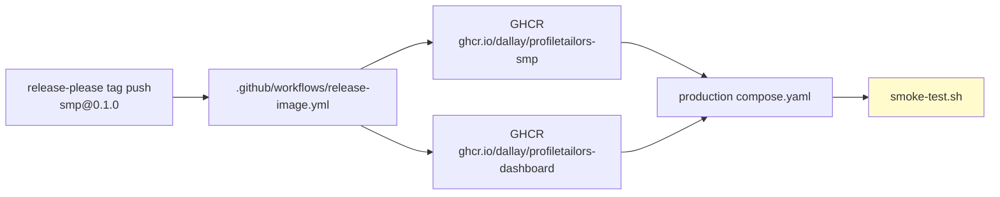

# Design: Release 0.1.0 Container Build & Deployment Pipeline

## Technical Approach

Add a tag-triggered GitHub Actions workflow that builds the SMP backend image via the existing Spring Boot `bootBuildImage` task and the dashboard image via the existing `dashboard.Dockerfile`, pushes both to GHCR, and runs the existing production smoke test as a non-blocking verification step. Update `release-please.yml` to invoke the workflow after an `smp` release, and switch `compose.yaml` defaults to the published registry images.

## Architecture Decisions

### Backend image build strategy

| Option | Tradeoff | Decision |
|--------|----------|----------|
| A. `bootBuildImage` buildpacks | Reproducible (builder/runner pinned by digest), no new Dockerfile, non-root tiny image, already used by `just release-backend-image`. Slower in CI, harder to debug layers, depends on Paketo availability. | **Recommended** |
| B. New `server/smp/Dockerfile` | Full parity with dashboard Dockerfile, faster layer cache, easier debugging. Adds a new file to maintain, must replicate non-root/digest rules, diverges from current buildpack setup. | Rejected for 0.1.0 |

**Rationale**: `build.gradle.kts` already pins the Paketo builder and run image by digest, and the Justfile already ships `release-backend-image`. Using buildpacks satisfies reproducibility and non-root requirements without introducing a new build path. The main risk is CI build time, which we mitigate with the Gradle build cache and a 30-minute job timeout.

### Smoke test placement

| Option | Tradeoff | Decision |
|--------|----------|----------|
| Inline smoke job after push | Validates the exact published images. Needs generated secrets and a temporary `.env`. | **Recommended** |
| Skip smoke test in CI | Faster, simpler. Does not verify the published artifact. | Rejected |

**Rationale**: Reusing `infra/apps/smp/production/smoke-test.sh` is the shortest path to verifying the published images. The job is marked `continue-on-error: true` for 0.1.0 so flakiness does not block the release, while still making failures visible.

## Component Diagram



**Inputs**: `GITHUB_TOKEN` (GHCR push), `APP_ID`/`APP_PRIVATE_KEY` (release-please app token), repository tag.
**Outputs**: registry images tagged `<tag>` and `latest`, workflow status, smoke test report.

## Workflow Design

**Trigger**: `on.push.tags` matching `smp@*`.

**Permissions**:

```yaml
permissions:
  contents: read
  packages: write
```

**Jobs**:

1. **build-backend** — checkout, setup-backend, run `./gradlew :server:smp:bootBuildImage -PreleaseVersion=<tag> --imageName=ghcr.io/dallay/profiletailors-smp:<tag>`, then `docker tag ...:latest` and push both tags.
2. **build-dashboard** — checkout, setup-frontend, `docker build -f infra/apps/smp/production/dashboard.Dockerfile -t ghcr.io/dallay/profiletailors-dashboard:<tag> -t ghcr.io/dallay/profiletailors-dashboard:latest --build-arg VITE_API_BASE_URL=${{ vars.VITE_API_BASE_URL }} .`, then push both tags.
3. **smoke-test** — needs both build jobs, checks out the tag, generates a temporary `production/.env` and secrets, runs `docker compose pull` and `smoke-test.sh`, `continue-on-error: true`.

**Key commands**:

```bash
# Backend
./gradlew :server:smp:bootBuildImage -PreleaseVersion="${TAG}" \
  --imageName="ghcr.io/dallay/profiletailors-smp:${TAG}" --no-daemon
docker tag "ghcr.io/dallay/profiletailors-smp:${TAG}" \
  "ghcr.io/dallay/profiletailors-smp:latest"
docker push "ghcr.io/dallay/profiletailors-smp:${TAG}"
docker push "ghcr.io/dallay/profiletailors-smp:latest"

# Dashboard
docker build -f infra/apps/smp/production/dashboard.Dockerfile \
  -t "ghcr.io/dallay/profiletailors-dashboard:${TAG}" \
  -t "ghcr.io/dallay/profiletailors-dashboard:latest" \
  --build-arg VITE_API_BASE_URL="${VITE_API_BASE_URL}" .
docker push "ghcr.io/dallay/profiletailors-dashboard:${TAG}"
docker push "ghcr.io/dallay/profiletailors-dashboard:latest"
```

## Image Naming and Tagging

| Image | Registry | Tags |
|-------|----------|------|
| Backend | `ghcr.io/dallay/profiletailors-smp` | `<git-tag>` (e.g., `smp@0.1.0`), `latest` |
| Dashboard | `ghcr.io/dallay/profiletailors-dashboard` | `<git-tag>`, `latest` |

**Compose defaults** change to:

```yaml
services:
  dashboard:
    image: ${DASHBOARD_IMAGE:-ghcr.io/dallay/profiletailors-dashboard:latest}
    pull_policy: always
  backend:
    image: ${SMP_IMAGE:-ghcr.io/dallay/profiletailors-smp:latest}
    pull_policy: always
```

The `build:` blocks remain as an optional override via `DASHBOARD_IMAGE`/`SMP_IMAGE`, but the default is a registry pull.

## Secret Management

| Secret/Var | Where used | Notes |
|------------|------------|-------|
| `GITHUB_TOKEN` | GHCR login and push | Auto-provided; workflow needs `packages: write` |
| `APP_ID` | release-please app token | Existing secret in `release-please.yml` |
| `APP_PRIVATE_KEY` | release-please app token | Existing secret in `release-please.yml` |
| `vars.VITE_API_BASE_URL` | Dashboard build arg | Public URL for API (e.g., `https://api.profiletailors.com`) |
| Smoke-test secrets | Generated in CI | Temporary `.env` and secret files used only by the smoke-test job |

No secrets are hardcoded in workflow files.

## Smoke Test Integration

- **Reuse**: run the existing `infra/apps/smp/production/smoke-test.sh`.
- **Placement**: separate `smoke-test` job after both images are pushed.
- **Blocking**: `continue-on-error: true` for 0.1.0; the job result is reported as a warning and the workflow does not fail the release.
- **Environment**: the job generates a temporary `production/.env` with dummy secret values and runs `docker compose --env-file ... -f compose.yaml up -d --wait` before invoking the script.

## Affected Files

| File | Action | Description |
|------|--------|-------------|
| `.github/workflows/release-image.yml` | Create | Tag-triggered build, push, and smoke-test workflow |
| `.github/workflows/release-please.yml` | Modify | Replace `notify-smp` echo with a call to `release-image.yml` using `smp--tag_name` |
| `infra/apps/smp/production/compose.yaml` | Modify | Default images to GHCR registry tags and `pull_policy: always` |
| `docs/release-verification.md` | Modify | Document the automated tag-triggered pipeline |
| `server/smp/build.gradle.kts` | No change | Existing `bootBuildImage` configuration is used as-is |

## Risks and Mitigations

| Risk | Mitigation |
|------|------------|
| GHCR push denied | `permissions: packages: write`; push to `ghcr.io/dallay/*` from repo in the `dallay` org |
| Buildpack build slow/timeout | 30-minute timeout; use Gradle build cache; monitor first run |
| Digest drift in buildpack base | Already pinned by digest in `build.gradle.kts`; dashboard Dockerfile also pinned |
| Smoke test flaky in CI | `continue-on-error: true` for 0.1.0; revisit in DALLAY-511 |
| Multi-arch not supported | Document as out-of-scope; add `platforms` later if needed |
| Bad image pushed | Disable workflow or re-tag manually; rely on `latest` pointer restore |

## Definition of Done for Design

- [ ] Backend build strategy (buildpacks) is justified against a Dockerfile.
- [ ] Workflow trigger, jobs, permissions, and commands are documented.
- [ ] Image names, tags, and registry are specified.
- [ ] Secret names and their uses are listed.
- [ ] Smoke test integration is described as non-blocking.
- [ ] Affected files are enumerated.
- [ ] Risks and mitigations are captured.
- [ ] The design is reviewed and approved before implementation.
