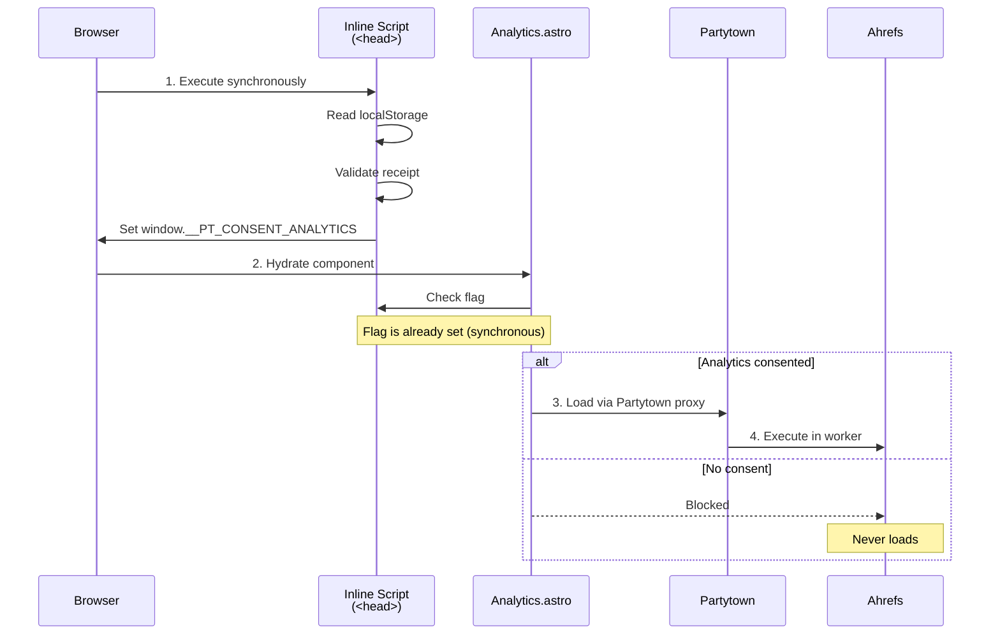
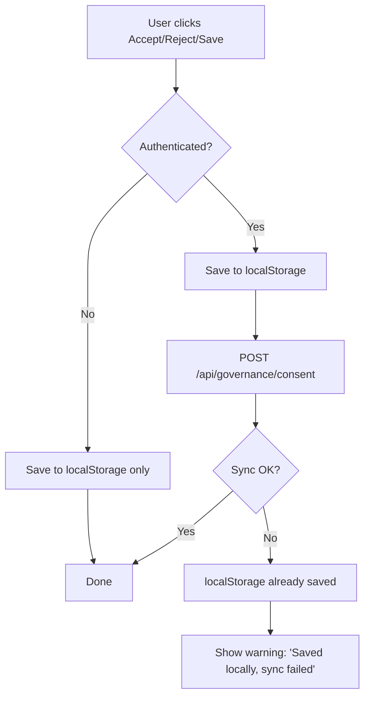

# Design: Frontend Consent Management (DALLAY-494)

## 1. Architecture Overview

### 1.1 Dual-Surface Architecture

```text
┌─────────────────────────────────────────────────────────────────┐
│                     CONSENT FLOW ARCHITECTURE                     │
├─────────────────────────────────────────────────────────────────┤
│                                                                  │
│  ┌─────────────────────────┐    ┌─────────────────────────────┐ │
│  │   MARKETING SITE (Astro)│    │         APP (Vue)            │ │
│  │                         │    │                             │ │
│  │  ┌───────────────────┐  │    │  ┌───────────────────────┐  │ │
│  │  │ ConsentBanner     │  │    │  │ ConsentBanner.vue     │  │ │
│  │  │ .astro            │  │    │  │ (shadcn Dialog)      │  │ │
│  │  └─────────┬─────────┘  │    │  └───────────┬───────────┘  │ │
│  │            │            │    │              │              │ │
│  │  ┌─────────┴─────────┐  │    │  ┌───────────┴───────────┐  │ │
│  │  │ ConsentScript     │  │    │  │ useConsentStore     │  │ │
│  │  │ (inline in <head>)│  │    │  │ (Pinia)             │  │ │
│  │  └─────────┬─────────┘  │    │  └───────────┬───────────┘  │ │
│  │            │            │    │              │              │ │
│  │  ┌─────────┴─────────┐  │    │  ┌───────────┴───────────┐  │ │
│  │  │ Analytics.astro   │  │    │  │ CookieSettings.vue   │  │ │
│  │  │ (conditional)     │  │    │  └───────────┬───────────┘  │ │
│  │  └───────────────────┘  │    │              │              │ │
│  └─────────────────────────┘    └──────────────┼──────────────┘ │
│                                                │                │
└────────────────────────────────────────────────┼────────────────┘
                                                 │
                    ┌────────────────────────────┴────────────────┐
                    │              SHARED LAYER                   │
                    │                                              │
                    │  ┌────────────────────────────────────────┐  │
                    │  │         localStorage: 'pt-consent'     │  │
                    │  │  ┌──────────────────────────────────┐ │  │
                    │  │  │ ConsentReceipt {                  │ │  │
                    │  │  │   consentVersion: number          │ │  │
                    │  │  │   policyVersion: string          │ │  │
                    │  │  │   timestamp: string              │ │  │
                    │  │  │   region: string                 │ │  │
                    │  │  │   categories: {                  │ │  │
                    │  │  │     necessary: true             │ │  │
                    │  │  │     analytics: boolean          │ │  │
                    │  │  │   }                            │ │  │
                    │  │  │   dnt: boolean                  │ │  │
                    │  │  │   source: 'banner' | 'settings'│ │  │
                    │  │  │ }                               │ │  │
                    │  │  └──────────────────────────────────┘ │  │
                    │  └────────────────────────────────────────┘  │
                    │                                              │
                    │  ┌────────────────────────────────────────┐  │
                    │  │         i18n: consent.* keys            │  │
                    │  │  /en/consent.ts  /es/consent.ts        │  │
                    │  └────────────────────────────────────────┘  │
                    │                                              │
                    └──────────────────────┬───────────────────────┘
                                           │
                    ┌──────────────────────┴───────────────────────┐
                    │           BACKEND (App Only)                 │
                    │                                                │
                    │  POST /api/governance/consent                 │
                    │  (Authenticated users only)                   │
                    │                                                │
                    └──────────────────────────────────────────────┘
```

### 1.2 Flow Decision Matrix

| User Type | Banner Shown | localStorage | Backend Sync |
|-----------|-------------|--------------|--------------|
| Marketing anonymous | Yes | Write | No |
| App anonymous | Yes | Write | No |
| App authenticated | Yes | Write | Yes |

### 1.3 Key Architectural Decisions

**Decision**: Separate inline consent check from React/Astro hydration
**Rationale**: Analytics scripts must be blocked BEFORE any JavaScript executes. Hydration-based checks would race with Partytown initialization.
**Alternatives**: React context at root — rejected because it runs after hydration, leaving a window where scripts could execute.

**Decision**: localStorage as single source of truth for consent state
**Rationale**: Simple, works offline, no server round-trip for anonymous users. Matches GDPR requirement for "easy withdrawal."
**Alternatives**: Cookie-based — rejected; cookies are sent with every request, raising privacy concerns. IndexedDB — overkill for flat schema.

## 2. Component Design

### 2.1 Marketing Site (Astro)

#### File Structure

```
apps/web/marketing/src/
├── components/consent/
│   ├── ConsentBanner.astro      # Main banner UI
│   ├── ConsentBanner.css        # Scoped styles (equal prominence)
│   └── ConsentScript.astro      # Inline <head> consent check
├── layouts/
│   └── Layout.astro             # MODIFIED: include ConsentScript
└── i18n/
    └── consent.ts               # EN + ES copy
```

#### ConsentBanner.astro

```astro
---
import { t } from '@i18n/utils'
import type { ConsentState } from '@components/consent/types'

interface Props {
  currentConsent?: ConsentState
}

const { currentConsent } = Astro.props

// Pre-populate toggle state from existing consent
const analyticsChecked = currentConsent?.categories?.analytics ?? false
---

<div id="consent-banner" role="dialog" aria-labelledby="consent-heading" hidden>
  <div class="consent-backdrop"></div>
  <div class="consent-container">
    <h2 id="consent-heading">{t('consent.banner.heading')}</h2>
    <p class="consent-description">
      {t('consent.banner.description').replace(
        '[privacy policy]',
        `<a href="/privacy" class="consent-link">${t('consent.privacy.link')}</a>`
      )}
    </p>

    <!-- Necessary (always-on, disabled) -->
    <div class="consent-category consent-category--disabled">
      <div class="consent-category-info">
        <span class="consent-category-label">
          {t('consent.category.necessary.label')}
        </span>
        <span class="consent-category-desc">
          {t('consent.category.necessary.description')}
        </span>
      </div>
      <input
        type="checkbox"
        checked
        disabled
        aria-disabled="true"
        class="consent-checkbox"
      />
    </div>

    <!-- Analytics (opt-in) -->
    <div class="consent-category" id="consent-analytics">
      <div class="consent-category-info">
        <span class="consent-category-label">
          {t('consent.category.analytics.label')}
        </span>
        <span class="consent-category-desc">
          {t('consent.category.analytics.description')}
        </span>
      </div>
      <button
        type="button"
        role="switch"
        aria-checked={analyticsChecked ? 'true' : 'false'}
        data-consent-analytics
        class:list={['consent-toggle', { 'consent-toggle--on': analyticsChecked }]}
      >
        <span class="consent-toggle-thumb"></span>
      </button>
    </div>

    <!-- Actions: Equal prominence (all same visual weight) -->
    <div class="consent-actions">
      <button type="button" data-consent-accept class="consent-btn consent-btn--primary">
        {t('consent.action.acceptAll')}
      </button>
      <button type="button" data-consent-reject class="consent-btn consent-btn--primary">
        {t('consent.action.rejectAll')}
      </button>
      <button type="button" data-consent-save class="consent-btn consent-btn--secondary">
        {t('consent.action.savePreferences')}
      </button>
    </div>
  </div>
</div>

<style>
  /* ConsentBanner.css — Equal prominence enforcement */
  .consent-btn {
    flex: 1;                    /* Identical flex basis */
    padding: 0.75rem 1.5rem;    /* Same padding */
    border-radius: 0.5rem;
    font-weight: 600;
    font-size: 1rem;
    cursor: pointer;
    transition: all 0.2s ease;
    border: 2px solid transparent;
  }

  .consent-btn--primary,
  .consent-btn--secondary {
    /* Both use same color saturation — no dark patterns */
    background: var(--color-surface);
    color: var(--color-text);
    border-color: var(--color-border);
  }

  .consent-btn--primary:hover,
  .consent-btn--secondary:hover {
    background: var(--color-surface-hover);
  }
</style>

<script>
  import { initConsentBanner } from '@components/consent/consent-bridge'

  // Initialize banner with existing consent state
  initConsentBanner({
    analytics: document.querySelector('[data-consent-analytics]')?.getAttribute('aria-checked') === 'true'
  })
</script>
```

#### ConsentScript.astro (Inline Head Script)

```astro
---
// ConsentScript.astro — Runs synchronously BEFORE any other JS
// Placed in <head>, no async/defer attributes
---

<script is:inline>
// ─────────────────────────────────────────────────────────────────────────────
// PROFILE TAILORS — CONSENT CHECK (Inline, Synchronous)
// Must run before Analytics.astro or any third-party scripts
// ─────────────────────────────────────────────────────────────────────────────

(function () {
  'use strict'

  // ── Constants ─────────────────────────────────────────────────────────────
  var CONSENT_KEY = 'pt-consent'
  var CONSENT_VERSION = 1
  var ANALYTICS_FLAG = '__PT_CONSENT_ANALYTICS'

  // ── DNT/GPC Detection ──────────────────────────────────────────────────────
  function isDNTEnabled() {
    return (
      navigator.doNotTrack === '1' ||
      navigator.doNotTrack === 'yes' ||
      window.doNotTrack === '1'
    )
  }

  function isGPCEnabled() {
    return navigator.globalPrivacyControl === true
  }

  function hasPrivacySignal() {
    return isDNTEnabled() || isGPCEnabled()
  }

  // ── Schema Validation ──────────────────────────────────────────────────────
  function isValidReceipt(receipt) {
    if (!receipt || typeof receipt !== 'object') return false
    if (typeof receipt.consentVersion !== 'number') return false
    if (receipt.consentVersion !== CONSENT_VERSION) return false
    if (typeof receipt.policyVersion !== 'string') return false
    if (!/^\d{4}-\d{2}-\d{2}$/.test(receipt.policyVersion)) return false
    if (typeof receipt.timestamp !== 'string') return false
    // ISO 8601 datetime: e.g. 2026-07-23T10:00:00Z — reject loosely formatted dates
    if (!/^\d{4}-\d{2}-\d{2}T\d{2}:\d{2}:\d{2}(\.\d+)?(Z|[+-]\d{2}:\d{2})$/.test(receipt.timestamp)) return false
    if (typeof receipt.region !== 'string') return false
    if (receipt.region.length !== 2) return false
    if (typeof receipt.categories !== 'object') return false
    if (receipt.categories.necessary !== true) return false
    if (typeof receipt.categories.analytics !== 'boolean') return false
    if (typeof receipt.dnt !== 'boolean') return false
    if (!['banner', 'settings'].includes(receipt.source)) return false
    return true
  }

  // ── Main Consent Check ─────────────────────────────────────────────────────
  function checkConsent() {
    var analyticsAllowed = false
    var dntSignal = hasPrivacySignal()

    try {
      var stored = localStorage.getItem(CONSENT_KEY)

      if (stored) {
        var receipt = JSON.parse(stored)

        if (isValidReceipt(receipt)) {
          // Valid receipt exists — check if analytics consented
          analyticsAllowed = receipt.categories.analytics === true
        }
        // Invalid receipt falls through to default: analyticsAllowed = false
      }
      // No receipt: analyticsAllowed = false (restrictive default)
    } catch (e) {
      // JSON parse error or localStorage unavailable — block by default
      console.warn('[Consent] Error reading consent receipt:', e)
    }

    // Set global flag for Analytics.astro to read
    window[ANALYTICS_FLAG] = analyticsAllowed

    // Also expose privacy signal state for UI
    window.__PT_DNT = dntSignal

    // Dispatch custom event for reactive UI
    window.dispatchEvent(
      new CustomEvent('consentReady', {
        detail: {
          analytics: analyticsAllowed,
          dnt: dntSignal,
        },
      })
    )
  }

  // ── Execute ────────────────────────────────────────────────────────────────
  checkConsent()
})()
</script>
```

### 2.2 App (Vue + shadcn-vue)

#### File Structure

```
apps/web/app/src/
├── modules/settings/
│   └── infrastructure/
│       └── consent.store.ts          # NEW: Pinia store for consent
├── components/consent/
│   ├── ConsentBanner.vue             # Dialog-based banner
│   ├── CookieSettings.vue            # Settings panel view
│   └── useConsent.ts                  # Composable hook
└── shared/i18n/
    └── locales/
        ├── en/consent.ts              # EN copy
        └── es/consent.ts              # ES copy
```

#### ConsentBanner.vue (Dialog Pattern)

```vue
<script setup lang="ts">
import { ref, computed, onMounted } from 'vue'
import { useI18n } from '@shared/i18n'
import { useConsentStore } from '@modules/settings/infrastructure/consent.store'
import {
  Dialog,
  DialogContent,
  DialogHeader,
  DialogTitle,
  DialogDescription,
  DialogFooter,
} from '@/components/ui/dialog'
import { Button } from '@/components/ui/button'
import { Switch } from '@/components/ui/switch'

const { t, locale } = useI18n()
const consentStore = useConsentStore()

// Local state mirrors receipt for optimistic UI
const analyticsEnabled = ref(false)

// Sync local state with store on mount
onMounted(() => {
  const receipt = consentStore.receipt
  if (receipt) {
    analyticsEnabled.value = receipt.categories.analytics
  }
})

// Computed: show banner when no valid consent or force-open from footer
const showBanner = computed(() => {
  return !consentStore.hasValidConsent || consentStore.forceOpen
})

// Actions
function handleAcceptAll() {
  analyticsEnabled.value = true
  consentStore.saveConsent({ analytics: true, source: 'banner' })
}

function handleRejectAll() {
  analyticsEnabled.value = false
  consentStore.saveConsent({ analytics: false, source: 'banner' })
}

function handleSave() {
  consentStore.saveConsent({ analytics: analyticsEnabled.value, source: 'settings' })
}
</script>

<template>
  <Dialog :open="showBanner" @update:open="() => {}">
    <DialogContent class="consent-dialog">
      <DialogHeader>
        <DialogTitle>{{ t('consent.banner.heading') }}</DialogTitle>
        <DialogDescription v-html="t('consent.banner.description')" />
      </DialogHeader>

      <!-- Necessary — always on, disabled -->
      <div class="consent-category consent-category--disabled">
        <div class="consent-category-info">
          <span class="consent-category-label">
            {{ t('consent.category.necessary.label') }}
          </span>
          <span class="consent-category-desc">
            {{ t('consent.category.necessary.description') }}
          </span>
        </div>
        <Switch :model-value="true" disabled />
      </div>

      <!-- Analytics — opt-in toggle -->
      <div class="consent-category">
        <div class="consent-category-info">
          <span class="consent-category-label">
            {{ t('consent.category.analytics.label') }}
          </span>
          <span class="consent-category-desc">
            {{ t('consent.category.analytics.description') }}
          </span>
        </div>
        <Switch v-model="analyticsEnabled" />
      </div>

      <DialogFooter class="consent-footer">
        <Button variant="outline" @click="handleRejectAll">
          {{ t('consent.action.rejectAll') }}
        </Button>
        <Button variant="outline" @click="handleAcceptAll">
          {{ t('consent.action.acceptAll') }}
        </Button>
        <Button variant="default" @click="handleSave">
          {{ t('consent.action.savePreferences') }}
        </Button>
      </DialogFooter>
    </DialogContent>
  </Dialog>
</template>

<style scoped>
.consent-dialog {
  max-width: 480px;
}

.consent-category {
  display: flex;
  justify-content: space-between;
  align-items: center;
  padding: 1rem;
  border-radius: 0.5rem;
  border: 1px solid var(--color-border);
  margin-bottom: 0.75rem;
}

.consent-category--disabled {
  opacity: 0.6;
  background: var(--color-muted);
}

.consent-category-info {
  display: flex;
  flex-direction: column;
  gap: 0.25rem;
}

.consent-category-label {
  font-weight: 600;
}

.consent-category-desc {
  font-size: 0.875rem;
  color: var(--color-text-muted);
}

/* Equal prominence: all buttons same size */
.consent-footer {
  display: flex;
  gap: 0.5rem;
}

.consent-footer :deep(button) {
  flex: 1;
  min-width: 0;
}
</style>
```

## 3. State Management

### 3.1 TypeScript Types (Shared)

```typescript
// shared/types/consent.ts

/**
 * Consent receipt stored in localStorage.
 * Must be validated on read; invalid receipts = no consent.
 */
export interface ConsentReceipt {
  /** Material version: increment when purposes/categories change */
  consentVersion: number
  /** Privacy policy date: YYYY-MM-DD */
  policyVersion: string
  /** ISO 8601 timestamp of consent grant */
  timestamp: string
  /** Region code: 'EU' for MVP (over-compliance) */
  region: string
  /** Category choices */
  categories: {
    /** Always true — required for basic functionality */
    necessary: true
    /** Opt-in analytics consent */
    analytics: boolean
  }
  /** DNT or GPC was active at consent time */
  dnt: boolean
  /** How consent was given */
  source: 'banner' | 'settings'
}

/** Current system version — must match spec */
export const CURRENT_CONSENT_VERSION = 1

/** Privacy policy date — update when policy changes */
export const CURRENT_POLICY_VERSION = '2026-07-23'

/** localStorage key */
export const CONSENT_STORAGE_KEY = 'pt-consent'

/** Window global set by inline script */
export const ANALYTICS_FLAG = '__PT_CONSENT_ANALYTICS'
```

### 3.2 Zod Validation Schema

```typescript
// shared/validation/consent.schema.ts
import { z } from 'zod'

export const consentReceiptSchema = z.object({
  consentVersion: z.number().int().min(1),
  policyVersion: z.string().regex(/^\d{4}-\d{2}-\d{2}$/, 'Must be YYYY-MM-DD'),
  timestamp: z.string().datetime(),
  region: z.string().length(2),
  categories: z.object({
    necessary: z.literal(true),
    analytics: z.boolean(),
  }),
  dnt: z.boolean(),
  source: z.enum(['banner', 'settings']),
})

export type ConsentReceipt = z.infer<typeof consentReceiptSchema>

/**
 * Validate and parse a stored value.
 * Returns null if invalid (treating as no consent).
 */
export function validateReceipt(raw: unknown): ConsentReceipt | null {
  try {
    return consentReceiptSchema.parse(raw)
  } catch {
    return null
  }
}
```

### 3.3 Pinia Store (App)

```typescript
// apps/web/app/src/modules/settings/infrastructure/consent.store.ts

import { defineStore } from 'pinia'
import { ref, computed } from 'vue'
import {
  type ConsentReceipt,
  CONSENT_STORAGE_KEY,
  CURRENT_CONSENT_VERSION,
  CURRENT_POLICY_VERSION,
  validateReceipt,
} from '@shared/types/consent'

export const useConsentStore = defineStore('consent', () => {
  // ── State ────────────────────────────────────────────────────────────────
  const receipt = ref<ConsentReceipt | null>(null)
  const forceOpen = ref(false)
  const syncError = ref<string | null>(null)

  // ── Getters ──────────────────────────────────────────────────────────────
  const hasValidConsent = computed(() => {
    if (!receipt.value) return false
    return receipt.value.consentVersion === CURRENT_CONSENT_VERSION
  })

  const analyticsEnabled = computed(() => {
    return receipt.value?.categories.analytics ?? false
  })

  // ── Actions ───────────────────────────────────────────────────────────────
  function loadFromStorage() {
    try {
      const raw = localStorage.getItem(CONSENT_STORAGE_KEY)
      if (!raw) {
        receipt.value = null
        return
      }
      receipt.value = validateReceipt(JSON.parse(raw))
    } catch {
      receipt.value = null
    }
  }

  function saveConsent(params: { analytics: boolean; source: 'banner' | 'settings' }) {
    const newReceipt: ConsentReceipt = {
      consentVersion: CURRENT_CONSENT_VERSION,
      policyVersion: CURRENT_POLICY_VERSION,
      timestamp: new Date().toISOString(),
      region: 'EU',
      categories: {
        necessary: true,
        analytics: params.analytics,
      },
      dnt: detectDNTSignal(),
      source: params.source,
    }

    localStorage.setItem(CONSENT_STORAGE_KEY, JSON.stringify(newReceipt))
    receipt.value = newReceipt

    // Backend sync for authenticated users
    if (userIsAuthenticated()) {
      syncToBackend(newReceipt).catch((err) => {
        syncError.value = 'Consent saved locally. Sync failed.'
        console.error('[Consent] Backend sync failed:', err)
      })
    }
  }

  async function syncToBackend(receipt: ConsentReceipt): Promise<void> {
    const auth = useAuthStore()

    await auth.apiFetch('/api/governance/consent', {
      method: 'POST',
      headers: { 'Content-Type': 'application/json' },
      body: JSON.stringify({
        subjectReference: { user: auth.userId },
        purpose: 'web.analytics',
        granted: receipt.categories.analytics,
        timestamp: receipt.timestamp,
      }),
      workspaceScoped: true,
    })
  }

  function openSettings() {
    forceOpen.value = true
  }

  function closeSettings() {
    forceOpen.value = false
  }

  // Initialize from storage on store creation
  loadFromStorage()

  return {
    receipt,
    forceOpen,
    syncError,
    hasValidConsent,
    analyticsEnabled,
    loadFromStorage,
    saveConsent,
    openSettings,
    closeSettings,
  }
})

function detectDNTSignal(): boolean {
  if (typeof navigator === 'undefined') return false
  return (
    navigator.doNotTrack === '1' ||
    navigator.doNotTrack === 'yes' ||
    navigator.globalPrivacyControl === true
  )
}

function userIsAuthenticated(): boolean {
  const auth = useAuthStore()
  return auth.isAuthenticated
}
```

### 3.4 Version Migration Strategy

```typescript
// Migration: handle consentVersion bumps

const MIGRATIONS: Record<number, (receipt: unknown) => ConsentReceipt | null> = {
  0: (receipt) => {
    // v0 → v1: Added dnt field, renamed source values
    const old = receipt as { consentVersion: 0; source?: 'banner' | 'settings' }
    // Invalid — must re-consent
    return null
  },
}

function migrateReceipt(raw: unknown): ConsentReceipt | null {
  const parsed = validateReceipt(raw)
  if (parsed) return parsed

  // Try migrations for older versions
  // ...
  return null
}
```

## 4. Script Blocking Strategy

### 4.1 Execution Order



### 4.2 Analytics.astro Modification

```astro
---
// analytics.astro — MODIFIED
import { AHREFS_ANALYTICS_KEY } from 'astro:env/client'

// Read the flag set by inline script in <head>
const analyticsAllowed = typeof window !== 'undefined'
  ? (window as any).__PT_CONSENT_ANALYTICS === true
  : false
---

{analyticsAllowed && AHREFS_ANALYTICS_KEY && (
  <script
    type="text/partytown"
    src="https://analytics.ahrefs.com/analytics.js"
    data-key={AHREFS_ANALYTICS_KEY}
    async
  />
)}
```

### 4.3 Race Condition Prevention

**Problem**: Partytown may initialize asynchronously, potentially loading scripts before our inline check runs.

**Solution**: Inline script runs in `<head>` with `is:inline` and no `async`/`defer`. This blocks HTML parsing until complete, guaranteeing the flag is set before any other script can execute.

**Verification**: Playwright test ensures no Ahrefs network request fires before consent is given:

```typescript
// e2e/consent.spec.ts
test('Ahrefs blocked until consent', async ({ page }) => {
  // Navigate (banner shows, Ahrefs should NOT be loaded)
  await page.goto('/')

  // Intercept Ahrefs requests
  const ahrefsRequests: Request[] = []
  await page.route(/analytics\.ahrefs\.com/, (route) => {
    ahrefsRequests.push(route.request())
    route.abort()
  })

  // Should have no requests yet
  expect(ahrefsRequests).toHaveLength(0)

  // Accept consent
  await page.click('[data-consent-accept]')

  // Now reload and check Ahrefs loads
  await page.reload()
  await page.waitForResponse(/analytics\.ahrefs\.com/)
})
```

## 5. DNT/GPC Detection

### 5.1 Detection Utility (Shared)

```typescript
// shared/utils/detect-privacy-signals.ts

export interface PrivacySignals {
  dnt: boolean
  gpc: boolean
  hasSignal: boolean
}

/**
 * Detect browser privacy signals.
 * Returns object with individual flags and combined hasSignal.
 */
export function detectPrivacySignals(): PrivacySignals {
  if (typeof navigator === 'undefined') {
    return { dnt: false, gpc: false, hasSignal: false }
  }

  const dnt =
    navigator.doNotTrack === '1' ||
    navigator.doNotTrack === 'yes' ||
    (window as any).doNotTrack === '1'

  const gpc = (navigator as any).globalPrivacyControl === true

  return {
    dnt,
    gpc,
    hasSignal: dnt || gpc,
  }
}

/**
 * Get the default analytics state based on privacy signals.
 * Returns false (restrictive) when signals detected.
 */
export function getDefaultAnalyticsState(): boolean {
  return !detectPrivacySignals().hasSignal
}
```

### 5.2 Banner Behavior with DNT/GPC

| Signal State | Analytics Default | Banner Shown | User Can Override |
|--------------|-------------------|--------------|-------------------|
| No DNT/GPC | ON (unchecked) | Yes | Yes |
| DNT or GPC | OFF (checked off) | Yes | Yes (user clicks Accept) |

**Rationale**: Banner always shown for transparency. Default is restrictive but user can override if they explicitly choose.

## 6. Backend Integration (App Only)

### 6.1 API Contract

```typescript
// POST /api/governance/consent

interface ConsentSyncRequest {
  subjectReference: {
    user: string  // userId from auth context
  }
  purpose: 'web.analytics'
  granted: boolean
  timestamp: string  // ISO 8601
  region?: string    // Optional, defaults to 'EU'
}

interface ConsentSyncResponse {
  success: boolean
  receiptId?: string
  error?: string
}
```

### 6.2 Sync Flow



### 6.3 Error Handling

```typescript
async function syncConsent(receipt: ConsentReceipt): Promise<void> {
  const auth = useAuthStore()

  try {
    await auth.apiFetch('/api/governance/consent', {
      method: 'POST',
      body: JSON.stringify({
        subjectReference: { user: auth.userId },
        purpose: 'web.analytics',
        granted: receipt.categories.analytics,
        timestamp: receipt.timestamp,
      }),
      workspaceScoped: true,
    })
  } catch (error) {
    // Non-blocking: localStorage is already saved
    // Show warning toast to user
    showToast({
      type: 'warning',
      message: 'Consent saved locally. Sync failed — will retry.',
    })
  }
}
```

### 6.4 Idempotency

The backend should accept duplicate requests with the same `timestamp` and `subjectReference` without error. This handles:
- Network retries
- User clicking save multiple times
- Stale local state syncing after rehydration

## 7. i18n Structure

### 7.1 Key Organization

```
shared/i18n/locales/
├── en/
│   └── consent.ts          # EN keys
└── es/
    └── consent.ts          # ES keys
```

### 7.2 Translation Files

```typescript
// shared/i18n/locales/en/consent.ts
export const consentEn = {
  'consent.banner.heading': 'We use cookies',
  'consent.banner.description':
    'We use cookies to improve your experience. You can read our [privacy policy](#) for more details.',
  'consent.category.necessary.label': 'Necessary cookies',
  'consent.category.necessary.description':
    'Required for authentication, security, and basic site functionality.',
  'consent.category.analytics.label': 'Analytics cookies',
  'consent.category.analytics.description':
    'Help us understand how you use the site to improve your experience.',
  'consent.action.acceptAll': 'Accept all',
  'consent.action.rejectAll': 'Reject all',
  'consent.action.savePreferences': 'Save preferences',
  'consent.footer.cookieSettings': 'Cookie settings',
  'consent.privacy.link': 'privacy policy',
} as const

// shared/i18n/locales/es/consent.ts
export const consentEs = {
  'consent.banner.heading': 'Usamos cookies',
  'consent.banner.description':
    'Usamos cookies para mejorar tu experiencia. Puedes leer nuestra [política de privacidad](#) para más detalles.',
  'consent.category.necessary.label': 'Cookies necesarias',
  'consent.category.necessary.description':
    'Requeridas para autenticación, seguridad y funcionalidad básica del sitio.',
  'consent.category.analytics.label': 'Cookies de análisis',
  'consent.category.analytics.description':
    'Nos ayudan a entender cómo usas el sitio para mejorar tu experiencia.',
  'consent.action.acceptAll': 'Aceptar todas',
  'consent.action.rejectAll': 'Rechazar todas',
  'consent.action.savePreferences': 'Guardar preferencias',
  'consent.footer.cookieSettings': 'Configuración de cookies',
  'consent.privacy.link': 'política de privacidad',
} as const
```

### 7.3 Equal Prominence Enforcement

**Requirement**: All three buttons must have identical visual weight.

| Attribute | Accept | Reject | Save |
|-----------|--------|--------|------|
| Size | Same | Same | Same |
| Color saturation | Same | Same | Same |
| Position | First | Second | Third |
| Font weight | 600 | 600 | 600 |
| Padding | 0.75rem 1.5rem | 0.75rem 1.5rem | 0.75rem 1.5rem |

**CSS enforcement**:

```css
.consent-btn {
  flex: 1;
  min-width: 0;  /* Prevent overflow */
  padding: 0.75rem 1.5rem;
  border-radius: 0.5rem;
  font-weight: 600;
  font-size: 1rem;
  background: var(--color-surface);
  color: var(--color-text);
  border: 2px solid var(--color-border);
}
```

## 8. Testing Strategy

### 8.1 Unit Tests

```typescript
// shared/validation/consent.schema.test.ts
import { describe, it, expect } from 'vitest'
import { consentReceiptSchema, validateReceipt } from './consent.schema'

describe('consentReceiptSchema', () => {
  it('validates a complete receipt', () => {
    const receipt = {
      consentVersion: 1,
      policyVersion: '2026-07-23',
      timestamp: '2026-07-23T10:00:00Z',
      region: 'EU',
      categories: {
        necessary: true,
        analytics: true,
      },
      dnt: false,
      source: 'banner',
    }

    expect(consentReceiptSchema.parse(receipt)).toEqual(receipt)
  })

  it('rejects wrong consentVersion', () => {
    const receipt = {
      consentVersion: 0, // Wrong
      policyVersion: '2026-07-23',
      timestamp: '2026-07-23T10:00:00Z',
      region: 'EU',
      categories: { necessary: true, analytics: true },
      dnt: false,
      source: 'banner',
    }

    expect(() => consentReceiptSchema.parse(receipt)).toThrow()
  })

  it('rejects invalid policyVersion format', () => {
    const receipt = {
      consentVersion: 1,
      policyVersion: 'July 23, 2026', // Wrong format
      timestamp: '2026-07-23T10:00:00Z',
      region: 'EU',
      categories: { necessary: true, analytics: true },
      dnt: false,
      source: 'banner',
    }

    expect(() => consentReceiptSchema.parse(receipt)).toThrow()
  })
})
```

### 8.2 E2E Test Scenarios (7 from Spec)

```typescript
// e2e/consent.spec.ts (Playwright)

import { test, expect } from '@playwright/test'

test.describe('Consent Management', () => {
  test.beforeEach(async ({ page }) => {
    await page.goto('/')
    await page.evaluate(() => localStorage.removeItem('pt-consent'))
  })

  // 1. Accept all flow
  test('accept-all sets analytics true and loads Ahrefs', async ({ page }) => {
    await page.click('[data-consent-accept]')
    const receipt = await page.evaluate(() =>
      JSON.parse(localStorage.getItem('pt-consent')!)
    )
    expect(receipt.categories.analytics).toBe(true)

    await page.reload()
    await page.waitForResponse(/analytics\.ahrefs\.com/)
    expect(await page.locator('consent-banner').isHidden()).toBe(true)
  })

  // 2. Reject all flow
  test('reject-all sets analytics false and blocks Ahrefs', async ({ page }) => {
    await page.click('[data-consent-reject]')
    const receipt = await page.evaluate(() =>
      JSON.parse(localStorage.getItem('pt-consent')!)
    )
    expect(receipt.categories.analytics).toBe(false)

    await page.reload()
    const ahrefsRequests: string[] = []
    await page.route(/analytics\.ahrefs\.com/, (route) => {
      ahrefsRequests.push(route.url())
      route.abort()
    })
    await page.goto('/')
    expect(ahrefsRequests).toHaveLength(0)
  })

  // 3. Granular accept via toggle
  test('toggle analytics off and save', async ({ page }) => {
    await page.click('[data-consent-analytics-toggle]') // Turn off
    await page.click('[data-consent-save]')
    const receipt = await page.evaluate(() =>
      JSON.parse(localStorage.getItem('pt-consent')!)
    )
    expect(receipt.categories.analytics).toBe(false)
    expect(receipt.source).toBe('settings')
  })

  // 4. DNT signal blocks by default
  test('dnt-enabled sets analytics off by default', async ({ page }) => {
    await page.addInitScript(() => {
      Object.defineProperty(navigator, 'doNotTrack', {
        value: '1',
        writable: true,
      })
    })
    await page.goto('/')
    // Toggle should be OFF
    const toggle = page.locator('[data-consent-analytics]')
    await expect(toggle).toHaveAttribute('aria-checked', 'false')

    // But Ahrefs blocked until explicit accept
    await page.click('[data-consent-accept]')
    const receipt = await page.evaluate(() =>
      JSON.parse(localStorage.getItem('pt-consent')!)
    )
    expect(receipt.dnt).toBe(true)
    expect(receipt.categories.analytics).toBe(true) // User override
  })

  // 5. Withdrawal flow
  test('withdraw consent via cookie settings', async ({ page }) => {
    // First, accept
    await page.click('[data-consent-accept]')

    // Open settings
    await page.click('[data-cookie-settings]')
    await page.click('[data-consent-analytics-toggle]') // Turn off
    await page.click('[data-consent-save]')

    // Verify updated
    const receipt = await page.evaluate(() =>
      JSON.parse(localStorage.getItem('pt-consent')!)
    )
    expect(receipt.categories.analytics).toBe(false)
    expect(receipt.source).toBe('settings')
  })

  // 6. Version upgrade requires re-consent
  test('outdated consentVersion shows banner', async ({ page }) => {
    await page.evaluate(() => {
      localStorage.setItem(
        'pt-consent',
        JSON.stringify({
          consentVersion: 0, // Outdated
          policyVersion: '2026-07-23',
          timestamp: '2026-07-01T10:00:00Z',
          region: 'EU',
          categories: { necessary: true, analytics: true },
          dnt: false,
          source: 'banner',
        })
      )
    })

    await page.goto('/')
    await expect(page.locator('#consent-banner')).toBeVisible()
  })

  // 7. GPC signal treated identically to DNT
  test('gpc-signal blocks analytics by default', async ({ page }) => {
    await page.addInitScript(() => {
      Object.defineProperty(navigator, 'globalPrivacyControl', {
        value: true,
        writable: true,
      })
    })
    await page.goto('/')
    const toggle = page.locator('[data-consent-analytics]')
    await expect(toggle).toHaveAttribute('aria-checked', 'false')
  })
})
```

### 8.3 Test Utilities

```typescript
// e2e/utils/consent.ts

/**
 * Mock DNT/GPC signals in browser context
 */
export async function mockPrivacySignals(
  page: Page,
  signals: { dnt?: boolean; gpc?: boolean }
) {
  await page.addInitScript(
    ({ dnt, gpc }) => {
      if (dnt !== undefined) {
        Object.defineProperty(navigator, 'doNotTrack', {
          value: '1',
          writable: true,
        })
      }
      if (gpc !== undefined) {
        Object.defineProperty(navigator, 'globalPrivacyControl', {
          value: gpc,
          writable: true,
        })
      }
    },
    signals
  )
}

/**
 * Set a consent receipt directly in localStorage
 */
export async function setConsentReceipt(
  page: Page,
  receipt: Partial<ConsentReceipt>
) {
  const fullReceipt: ConsentReceipt = {
    consentVersion: 1,
    policyVersion: '2026-07-23',
    timestamp: new Date().toISOString(),
    region: 'EU',
    categories: { necessary: true, analytics: false },
    dnt: false,
    source: 'banner',
    ...receipt,
  }
  await page.evaluate(
    (r) => localStorage.setItem('pt-consent', JSON.stringify(r)),
    fullReceipt
  )
}

/**
 * Clear all consent state
 */
export async function clearConsent(page: Page) {
  await page.evaluate(() => localStorage.removeItem('pt-consent'))
}
```

## 9. Performance Considerations

### 9.1 Inline Script Size

The inline script in `<head>` must be minimal:

| Metric | Target | Current Estimate |
|--------|--------|------------------|
| Script size | < 2KB | ~1.8KB |
| Parse time | < 5ms | ~3ms |
| CLS impact | None | Positioned after theme script |

### 9.2 CLS Mitigation

Consent banner positioned at bottom of viewport with `position: fixed` and `z-index` below modals. No layout shift because:
1. Hidden by default (`hidden` attribute)
2. Only shown after hydration confirms no valid consent

### 9.3 Partytown Overhead

Partytown is already integrated. The consent check adds no additional worker overhead — it merely sets a boolean flag. Ahrefs already uses Partytown, so no new infrastructure needed.

### 9.4 Lazy Loading

```astro
<!-- Load banner JS only when needed -->
{!hasValidConsent && (
  <script>
    import { initConsentBanner } from '@components/consent/banner.client'
    initConsentBanner()
  </script>
)}
```

## 10. File Changes Summary

| File | Action | Description |
|------|--------|-------------|
| `apps/web/marketing/src/components/consent/ConsentBanner.astro` | Create | Banner UI component |
| `apps/web/marketing/src/components/consent/ConsentBanner.css` | Create | Scoped styles |
| `apps/web/marketing/src/components/consent/ConsentScript.astro` | Create | Inline head script |
| `apps/web/marketing/src/components/consent/types.ts` | Create | TypeScript types |
| `apps/web/marketing/src/components/Analytics.astro` | Modify | Conditional Ahrefs load |
| `apps/web/marketing/src/layouts/Layout.astro` | Modify | Include ConsentScript |
| `apps/web/marketing/src/i18n/consent.ts` | Create | EN + ES translations |
| `apps/web/marketing/e2e/consent.spec.ts` | Create | Playwright E2E tests |
| `apps/web/app/src/components/consent/ConsentBanner.vue` | Create | Dialog-based banner |
| `apps/web/app/src/components/consent/CookieSettings.vue` | Create | Settings panel |
| `apps/web/app/src/components/consent/useConsent.ts` | Create | Composable hook |
| `apps/web/app/src/modules/settings/infrastructure/consent.store.ts` | Create | Pinia store |
| `apps/web/app/src/modules/settings/infrastructure/consent.store.test.ts` | Create | Store tests |
| `apps/web/app/src/shared/i18n/locales/en/consent.ts` | Create | EN translations |
| `apps/web/app/src/shared/i18n/locales/es/consent.ts` | Create | ES translations |
| `shared/types/consent.ts` | Create | Shared types |
| `shared/validation/consent.schema.ts` | Create | Zod schemas |
| `shared/utils/detect-privacy-signals.ts` | Create | DNT/GPC detection |

## 11. Open Design Questions

### 11.1 Backend Sync Retry Strategy

**Question**: Should failed backend syncs retry automatically, and if so, with what backoff?

**Options**:
1. **No retry** — Accept data loss for anonymous users; authenticated users see error
2. **Retry with exponential backoff** — Retry 3 times over 1 minute
3. **Queue for later** — Store failed syncs and retry on next page load

**Recommendation**: Option 1 for MVP (simpler), with option 3 as follow-up for audit compliance.

### 11.2 Region Detection Approach

**Question**: Should we implement geolocation-based region detection to determine applicable law (GDPR vs non-EU)?

**Options**:
1. **Hardcoded EU** — MVP over-compliance; show GDPR banner to everyone
2. **Free geo-IP API** — Cloudflare headers or free service (limited accuracy)
3. **Backend-based** — Server determines region from request context

**Recommendation**: Hardcoded EU (current) until legal team confirms non-EU users don't need GDPR. Avoids complexity and potential false negatives.

### 11.3 Marketing Category Extensibility

**Question**: How should we architect for future categories (Marketing, Functional, etc.) without requiring `consentVersion` bumps?

**Architecture**:

```typescript
interface ConsentReceipt {
  categories: {
    necessary: true
    analytics: boolean
    // Future: add without version bump if purpose unchanged
    // marketing?: boolean
  }
}
```

**Approach**: Categories are optional in schema. Frontend decides which to show. `consentVersion` only bumps when the PURPOSE changes, not when a new optional category is added.

---

## Next Step

Ready for `sdd-tasks` to break this design into implementation tasks.
