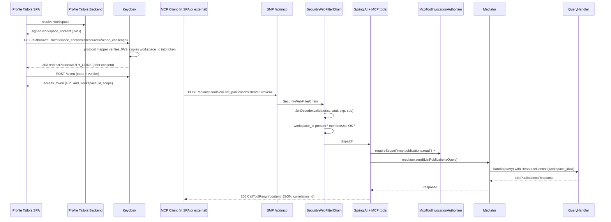

# Design: MCP Server Integration

## Technical Approach

Embed an MCP server inside the existing Spring Boot 4 / WebFlux backend using Spring AI
2.0's `@McpTool` adapter layer. The server speaks Streamable HTTP in STATELESS mode and is
fronted by the existing OAuth 2 Resource Server. `@McpTool` beans are thin adapters that call
the existing mediator — domain handlers, repositories, and authorization rules are reused
untouched.

```text
MCP client ──HTTPS──▶ POST /api/mcp  (Authorization: Bearer <jwt>)
                       │
                       ▼
   Spring Security OAuth2 Resource Server
   (signature, iss, aud, exp, workspace_id presence, membership check)
                       │
                       ▼
   Spring AI 2.0 STATELESS Streamable HTTP transport (WebFlux, no session affinity)
                       │
                       ▼
   Spring AI resolves @McpTool bean ──▶ McpToolInvocationAuthorizer.requireScope(tool, jwt)
                                                  │    ✓
                                                  ▼
                                       @McpTool ──▶ Mediator.send(Query/Command)
                                                             │
                                                             ▼
                                                  existing handler (ResourceContext from JWT)
```

**Profile Tailors is the Resource Server only.** Keycloak owns `authorize`, `token`,
`revoke`, and `register`. SMP does **not** publish `/.well-known/oauth-authorization-server`
nor run a client registration endpoint (Keycloak: `POST /realms/{realm}/clients-registrations/default`).

---

## Architecture Decisions

| # | Decision | Options considered | Choice & rationale |
|---|----------|--------------------|--------------------|
| 1 | MCP transport | STDIO / Streamable HTTP STATEFUL / Streamable HTTP STATELESS | **STATELESS Streamable HTTP** — cloud-native, no session affinity, every request is independent; aligns with Spring AI 2.0 webflux starter. Stateful is reserved for Phase 3 push notifications. |
| 2 | Auth integration | Custom OAuth2 handler / Spring Security OAuth2 Resource Server | **Resource Server** — reuse `JwtPrincipalAuthenticationConverter` and `JwtAuthenticatedPrincipalMaterializer`. No new token-validation logic. |
| 3 | Tool execution boundary | Direct handler calls / Mediator dispatch | **Mediator** — `mediator.send(query)` triggers the same pipeline (audit, validation, telemetry) as REST endpoints. Avoids bypassing cross-cutting concerns. |
| 4 | Workspace isolation | Trust `X-Workspace-Id` header / Extract from JWT claim | **JWT claim only** — `workspace_id` taken from the validated token and pushed into `ResourceContext` via `RequestContextStore`. Header is **ignored** for `/api/mcp`. |
| 5 | Scope enforcement | `@PreAuthorize` on tools / WebFilter that parses JSON-RPC body / **Tool invocation authorizer** | **`McpToolInvocationAuthorizer`** — called at tool dispatch after Spring AI resolves the bean; consults a static tool→scope table. The security chain **never** parses the JSON-RPC body. |
| 6 | Error mapping | New error type / Reuse `ProblemDetail` | **Reuse + new `McpErrorMapper`** — domain exceptions remain shared; mapper converts to `CallToolResult(isError=true, content=…)` carrying `ApplicationError(code, category, message, retryable, correlationId)`. |
| 7 | Client onboarding | DCR-only / CIMD-only / DCR + CIMD | **DCR confirmed; CIMD is a spike question** — Keycloak 26+ supports RFC 7591 DCR (confirmed by Keycloak docs). CIMD (draft-ietf-oauth-client-id-metadata-document) is unverified; baseline path is **pre-registered clients + DCR**; fallback if CIMD fails is **pre-registration only**. |
| 8 | Rate limiting | New bucket per tool / Reuse `InMemoryRateLimitAdapter` | **Reuse** — add new bucket names (`mcp-channels-read`, `mcp-publications-read`) wired into existing `RateLimitConfiguration`. |
| 9 | Authorization Server role | SMP embeds an OAuth server / Keycloak | **Keycloak** — SMP exposes only RFC 9728 Protected Resource Metadata. Keycloak owns `/.well-known/openid-configuration`, `/authorize`, `/token`, `/revoke`, `/register` (when DCR enabled). |
| 10 | Workspace injection | SPA picks workspace / Custom Keycloak authenticator / **Pre-flow signed context** | **Option A: signed `workspace_context` from SPA → Keycloak protocol mapper** — minimum Keycloak customization, single source of truth (Profile Tailors DB); upgradeable later to a custom authenticator that offers a workspace selector UI. |

---

## Component Architecture

### Package structure

```text
server/smp/src/main/kotlin/com/profiletailors/smp/mcp/
├── tools/                             # @McpTool beans (thin, no logic)
│   ├── PublicationTools.kt             # list_publications, get_calendar
│   ├── ChannelTools.kt                 # list_channels
│   ├── ProviderTools.kt                # list_providers
│   └── McpToolMetadata.kt              # static name → required scope map
├── application/
│   └── McpWorkspaceContextResolver.kt  # workspace_id claim → ResourceContext
├── infrastructure/
│   ├── McpConfiguration.kt             # @EnableMcpServer + bean wiring
│   ├── McpSecurityConfiguration.kt     # SecurityWebFilterChain for /api/mcp (JWT only)
│   ├── McpToolInvocationAuthorizer.kt  # scope check at tool invocation
│   ├── McpErrorMapper.kt               # exception → MCP tool result
│   ├── tools/
│   │   └── McpPingTool.kt              # profile-gated mcp_ping (internal)
│   ├── oauth/
│   │   └── ResourceMetadataController.kt  # RFC 9728 only — no auth-server metadata
│   └── McpProperties.kt                # @ConfigurationProperties("app.mcp")
└── ModuleMetadata.kt                   # @ApplicationModule marker (Modulith discovery)
```

`OAuthMetadataController` and `ClientRegistrationService` are intentionally **absent** from
SMP — those concerns live in Keycloak.

### Integration points

| Layer | Reuse | New |
|-------|-------|-----|
| Security | `JwtPrincipalAuthenticationConverter`, `JwtAuthenticatedPrincipalMaterializer`, `JwtAudienceValidator`, `RequestContextStore`, `FederatedTokenValidator` (jti revocation) | `McpSecurityConfiguration` (filter chain scoped to `/api/mcp/**` — JWT validity, `iss`, `aud`, `exp`, `workspace_id` presence, authoritative membership check). **No JSON-RPC parsing in the chain.** |
| Scope auth | n/a | `McpToolInvocationAuthorizer` — static tool→scope map, invoked from each `@McpTool` (or wrapping decorator). |
| Mediator | `Mediator` bean from `shared:bus` | none |
| Application | `ListPublicationsQuery`, `ListConnectedChannelsQuery`, `GetCalendarPublicationsQuery`, `ListProviderCatalogQuery` | none |
| Errors | `PublishingProblemDetailsHandler` (REST), existing domain exceptions | `McpErrorMapper`, shared `ApplicationError` taxonomy |
| Rate limit | `InMemoryRateLimitAdapter`, `RateLimitConfiguration` | new bucket names registered in `app.mcp.rate-limit.*` |
| Audit | `AuditHook`, `AuthorizationDecisionAuditFact` | `McpToolInvocationAuditFact` (tool name, scope checked, workspace_id, correlation_id) |

---

## Dependencies

### `gradle/libs.versions.toml` additions

```toml
[versions]
springAi = "2.0.0"

[libraries]
spring-ai-bom                       = { module = "org.springframework.ai:spring-ai-bom", version.ref = "springAi" }
spring-ai-starter-mcp-server-webflux = { module = "org.springframework.ai:spring-ai-starter-mcp-server-webflux" }
spring-ai-mcp-server-webflux        = { module = "org.springframework.ai:spring-ai-mcp-server-webflux" }
```

### `server/smp/build.gradle.kts` additions

```kotlin
dependencyManagement {
    imports {
        mavenBom(SpringBootPlugin.BOM_COORDINATES)
        mavenBom(libs.spring.modulith.bom.get().toString())
        mavenBom(libs.spring.ai.bom.get().toString())   // NEW
    }
}

dependencies {
    implementation(project(":shared:bus"))
    implementation(project(":shared:security"))
    implementation(project(":shared:spring-boot-common"))
    implementation(libs.spring.ai.starter.mcp.server.webflux)   // NEW
    // existing oauth2 resource server, webflux stay
}
```

`Spring Modulith` discovers the `mcp` bounded context via `ModuleMetadata.kt` (`@ApplicationModule` marker); the MCP tool beans are `ChannelTools`, `ProviderTools`, `PublicationTools` (`infrastructure/tools/McpPingTool` is profile-gated `mcp_ping`).

---

## Configuration

### `application.yaml`

```yaml
spring:
  ai:
    mcp:
      server:
        enabled: ${SMP_MCP_ENABLED:false}        # feature-flag rollback (single source of truth)
        protocol: STATELESS
        type: ASYNC
        streamable-http:
          mcp-endpoint: /api/mcp                  # canonical Spring AI 2.0 property
        # Spring AI 2.0 mounts the transport on WebFlux; no separate port

app:
  mcp:
    resource-uri:      ${SMP_MCP_RESOURCE_URI:https://api.profiletailors.com/api/mcp}
    required-audience: ${SMP_MCP_AUDIENCE:https://api.profiletailors.com/api/mcp}
    scopes:
      - mcp:channels:read
      - mcp:publications:read
      # mcp:publications:write is reserved for Phase 5 (NOT in MVP)
    scope-policy: PERMISSIVE                     # MVP: any workspace member
    rate-limit:
      buckets:
        mcp-channels-read:     { capacity: 60, refill: 60, per: PT1M }
        mcp-publications-read: { capacity: 30, refill: 30, per: PT1M }
```

`SMP_MCP_ENABLED=false` excludes Spring AI's transport bean entirely. There is no
`app.mcp.enabled` flag — the Spring AI property is the source of truth.

### Security chain (in `McpSecurityConfiguration`)

```kotlin
private val mcpPathMatcher = ServerWebExchangeMatchers.pathMatchers(mcpEndpoint, "$mcpEndpoint/**")

http
  .securityMatcher(OrServerWebExchangeMatcher(mcpPathMatcher, rfc9728MetadataMatcher))
  .authorizeExchange { it.anyExchange().authenticated() }
  .oauth2ResourceServer { it.jwt { jwt -> jwt.jwtAuthenticationConverter(converter) } }
  // No JSON-RPC parsing here. Scope enforcement happens at tool invocation.
```

CORS: extend `CorsConfigurationProperties.allowedOrigins` to include MCP client UIs
(`https://app.profiletailors.com`, local dev origins).

---

## Security Design

| Concern | Mechanism |
|---------|-----------|
| Token signature | Existing `NimbusJwtDecoder` with `issuer-uri` |
| `iss` / `aud` / `exp` | Standard Spring Security + `JwtAudienceValidator` (RFC 8707: `aud` MUST include `app.mcp.resource-uri`) |
| `workspace_id` claim | Extracted by `McpWorkspaceContextResolver`, written to `RequestContextStore`. Existence + authoritative membership validated in the security chain; header is **ignored** for `/api/mcp` |
| Scopes | **Not** in the security chain. `McpToolInvocationAuthorizer` checks `Jwt.getClaimAsString("scope")` against the static tool→scope table at tool invocation. On rejection: `403` + `WWW-Authenticate: Bearer error="insufficient_scope", scope="<required>"` + body `{ "required_scope": "<required>", "granted_scopes": [...] }` |
| Workspace isolation | Handlers already call `requireWorkspaceContext().workspaceId`; repository queries are tenant-scoped |
| Replay / revocation | `jti` checked via existing `FederatedTokenValidator`; log via `AuthorizationDecisionAuditFact` |

### Token claim mapping — four independent dimensions

All four claims on a token are validated separately and serve distinct purposes. A token
that is correct on one axis but wrong on another is **rejected on that axis**, not
silently accepted.

| Claim | Standard / RFC | Identifies | Validated by |
|-------|---------------|------------|--------------|
| `sub` | OIDC core | The **user** | Resource Server (audit, membership check) |
| `aud` | RFC 8707 (`resource` parameter) | The **MCP server** (`https://api.profiletailors.com/api/mcp`) | `JwtAudienceValidator` in security chain |
| `workspace_id` | Profile Tailors claim | The **tenant** within the MCP server | Security chain (presence) + authoritative membership lookup |
| `scope` | RFC 6749 §3.3 | Which **operations** the token may invoke | `McpToolInvocationAuthorizer` at tool invocation |

### Tool→scope static map (`McpToolMetadata`)

| Tool | Required scope |
|------|---------------|
| `list_channels` | `mcp:channels:read` |
| `list_publications` | `mcp:publications:read` |
| `get_calendar` | `mcp:publications:read` |
| `list_providers` | `mcp:publications:read` |

`tools/list` advertises **all four tools regardless of granted scopes**. Each
`@McpTool(description = ...)` names its required scope in natural language (e.g.
`"List channels connected in this workspace. Requires scope mcp:channels:read."`) so MCP
clients can prompt the user up front. Scope enforcement happens in `tools/call`,
**not** in `tools/list`. The catalog remains stable and clients do not infer the caller's
scopes from the listing.

### MCP tool implementation pattern

The authorizer is invoked at tool dispatch. Two implementations are acceptable; choose at
apply time:

**Option 1 — explicit call (recommended for MVP)** (recommended for clarity and unit
testability):
```kotlin
@McpTool(description = "List channels connected in this workspace. Requires scope mcp:channels:read.")
suspend fun listChannels(
    @McpToolParam(description = "Optional status filter") status: String?
): ListChannelsResponse {
    authorizer.requireScope("mcp:channels:read")
    return mediator.send(ListConnectedChannelsQuery(status))
}
```

**Option 2 — decorator / tool interceptor** (refactor target if tool count grows):
register a `BeanPostProcessor` that wraps `ToolCallback` instances and consults the same
static `McpToolMetadata` table. Adapter bodies stay free of authorization code.

Either way, the security chain does **not** inspect the JSON-RPC body — scope is a
tool-level concept resolved only after Spring AI has identified the target tool.

---

## Workspace Selection (Option A — MVP)

Profile Tailors resolves the workspace **before** the OAuth flow starts. The SPA already
knows which workspace the user is acting in; it sends a signed context to Keycloak, and a
Keycloak protocol mapper reads that context and emits the `workspace_id` JWT claim from
it.

```text
SPA ──resolve-workspace──▶ Profile Tailors backend
SPa ◀──signed workspace_context (JWS; sub, workspace_id, scope-policy, exp)──
SPA ──GET <keycloak>/authorize?...&workspace_context=<JWS>&resource=<mcp-uri>──▶ Keycloak
   └─ Keycloak protocol mapper verifies the JWS against Profile Tailors JWKS,
      copies workspace_id into the issued access token
Keycloak consent screen (scope grant + workspace confirm)
SPA ──POST <keycloak>/token (PKCE verifier)──▶ Keycloak
SPA ◀──access_token { sub, aud = mcp-uri, workspace_id, scope }──
```

**Resource Server behavior** — the validator checks, per request:
1. `workspace_id` claim is present.
2. The token's `sub` holds a current membership grant for that workspace in the
   authoritative store (single read per request, short-lived cache acceptable).

**Why Option A for MVP**:
- Profile Tailors already owns workspace membership; Keycloak does not need a parallel copy.
- A signed `workspace_context` is unforgeable — Keycloak cannot issue tokens for a
  workspace the user is not part of.
- The protocol mapper is a no-code change on the Keycloak side; no realm theme work needed
  for MVP.

**Future option** (Phase 3+): a custom Keycloak **authenticator** that renders a
workspace selector inside the consent screen. This requires a Keycloak SPI extension and
is tracked as a separate change behind its own proposal.

---

## Error Handling

### `McpErrorMapper`

```kotlin
@Component
class McpErrorMapper(private val objectMapper: ObjectMapper) {
    fun toToolResult(error: Throwable, correlationId: String): CallToolResult {
        val appError = when (error) {
            is InvalidDateRangeException       -> ApplicationError("INVALID_DATE_RANGE",       "VALIDATION", error.message, false, correlationId)
            is InvalidTimezoneException        -> ApplicationError("INVALID_TIMEZONE",        "VALIDATION", error.message, false, correlationId)
            is DateRangeTooLargeException      -> ApplicationError("DATE_RANGE_TOO_LARGE",    "VALIDATION", error.message, false, correlationId)
            is InvalidChannelStatusException   -> ApplicationError("INVALID_CHANNEL_STATUS",  "VALIDATION", error.message, false, correlationId)
            is BusinessRuleValidationException -> ApplicationError("PUBLICATION_VALIDATION_FAILED", "VALIDATION", error.message, false, correlationId)
            is AccessDeniedException           -> ApplicationError("FORBIDDEN",               "AUTHORIZATION", "Insufficient permissions", false, correlationId)
            is WorkspaceMismatchException      -> ApplicationError("WORKSPACE_ACCESS_DENIED", "AUTHORIZATION", "Token workspace does not match request", false, correlationId)
            is RateLimitExceededException      -> ApplicationError("RATE_LIMIT_EXCEEDED",     "THROTTLING", "Rate limit exceeded", true, correlationId)
            else                               -> ApplicationError("INTERNAL_ERROR",          "INTERNAL", "Unexpected error", true, correlationId)
        }
        return CallToolResult.builder()
            .isError(true)
            .content(TextContent(objectMapper.writeValueAsString(appError)))
            .build()
    }
}
```

MVP tools are read-only list/calendar queries, so `publication_not_found` and
`channel_disconnected` do not apply — there is no operation that takes a
publication ID or channel handle. Those error codes will be added when the
write tools (Phase 5) ship `get_publication`, `cancel_publication`, etc.

| Layer | Error | Mapping |
|-------|-------|---------|
| Protocol | malformed JSON-RPC | `-32700` Parse error |
| Protocol | invalid params | `-32602` Invalid params |
| Protocol | unknown method | `-32601` Method not found |
| Auth | missing/invalid token | `401` + `WWW-Authenticate: Bearer resource_metadata="<...>"` (RFC 6750 + RFC 9728) |
| Auth | missing scope | `403` + `WWW-Authenticate: Bearer error="insufficient_scope", scope="<required>"` + body `{ "required_scope": "<required>", "granted_scopes": [...] }` |
| Auth | cross-workspace token | `403` + `ApplicationError(code="WORKSPACE_ACCESS_DENIED", category="AUTHORIZATION")` |
| Tool | invalid date range | `CallToolResult.isError=true` + `ApplicationError("INVALID_DATE_RANGE","VALIDATION")` |
| Tool | invalid timezone | `CallToolResult.isError=true` + `ApplicationError("INVALID_TIMEZONE","VALIDATION")` |
| Tool | date range too large | `CallToolResult.isError=true` + `ApplicationError("DATE_RANGE_TOO_LARGE","VALIDATION")` |
| Tool | invalid channel status filter | `CallToolResult.isError=true` + `ApplicationError("INVALID_CHANNEL_STATUS","VALIDATION")` |
| Tool | business rule violation | `CallToolResult.isError=true` + `ApplicationError("PUBLICATION_VALIDATION_FAILED","VALIDATION")` |
| Tool | rate limit exceeded | `CallToolResult.isError=true` + `ApplicationError("RATE_LIMIT_EXCEEDED","THROTTLING")` |
| Tool | unexpected | `CallToolResult.isError=true` + `ApplicationError("INTERNAL_ERROR","INTERNAL")`; full stack logged, never returned |

`correlation_id` is taken from `X-Correlation-Id` request header (generated by
`RequestContextStore` when absent) and propagated into every tool result for log
correlation.

---

## Data Flow

### 1. OAuth discovery (RFC 9728 only)

```text
MCP client ──GET /.well-known/oauth-protected-resource/api/mcp──▶ ResourceMetadataController
SMP ◀── 200  {
              resource: "https://api.profiletailors.com/api/mcp",
              authorization_servers: ["<keycloak>/realms/profiletailors"],
              scopes_supported: ["mcp:channels:read","mcp:publications:read"],
              bearer_methods_supported: ["header"]
            }
(SMP does NOT serve /.well-known/oauth-authorization-server; Keycloak publishes that at
/.well-known/openid-configuration.)
```

The 401 response on `POST /api/mcp` carries:

```text
WWW-Authenticate: Bearer realm="mcp", resource_metadata="<rfc9728-url>"
```

### 2. Authorized tool invocation (Option A + authorizer pattern)



### 3. Missing scope on `tools/call`

```text
client ──POST /api/mcp  tools/call list_channels──▶ SMP
   └─ SecurityWebFilterChain ──▶ JWT valid (iss, aud, exp, workspace_id)
   └─ Spring AI resolves @McpTool list_channels
   └─ McpToolInvocationAuthorizer.requireScope("mcp:channels:read")
       token.scope = "mcp:publications:read"   ✗
   ──▶ 403 Forbidden
      WWW-Authenticate: Bearer error="insufficient_scope", scope="mcp:channels:read"
      Body: { "required_scope": "mcp:channels:read",
              "granted_scopes": ["mcp:publications:read"] }
```

---

## File Changes

| File | Action | Purpose |
|------|--------|---------|
| `gradle/libs.versions.toml` | Modify | Add `springAi` version + 3 library entries |
| `server/smp/build.gradle.kts` | Modify | Import `spring-ai-bom`, add `spring-ai-starter-mcp-server-webflux` |
| `server/smp/src/main/resources/application.yaml` | Modify | `spring.ai.mcp.server.*` (no `endpoint` without `mcp-` prefix, no `app.mcp.enabled`); `app.mcp.*` for Profile Tailors-specific data |
| `server/smp/src/main/kotlin/com/profiletailors/smp/mcp/**` | Create | All classes in the package map above |
| `server/smp/src/main/kotlin/com/profiletailors/smp/mcp/ModuleMetadata.kt` | Create | Modulith public API declaration |
| `server/smp/src/main/kotlin/com/profiletailors/smp/mcp/infrastructure/oauth/ResourceMetadataController.kt` | Create | RFC 9728 — `/.well-known/oauth-protected-resource` and `/.well-known/oauth-protected-resource/api/mcp` only |
| `server/smp/src/main/kotlin/com/profiletailors/smp/mcp/infrastructure/McpToolInvocationAuthorizer.kt` | Create | Static tool→scope table, called at tool invocation |
| `server/smp/src/test/kotlin/com/profiletailors/smp/bdd/glue/McpBddSteps.kt` | Create | Cucumber step glue |
| `server/smp/src/test/resources/features/mcp-tools.feature` | Create | BDD scenarios |
| `server/smp/src/test/kotlin/com/profiletailors/smp/mcp/**` | Create | Unit + integration tests |
| `shared/common/.../error/ApplicationError.kt` | Create | Shared taxonomy record (DOMAIN / AUTH / SYSTEM categories) |
| `docs/mcp-server.md` | Create | Client config + OAuth flow (workspace injection, RFC 9728, scope matrix) |
| `.env.example` | Modify | Document `SMP_MCP_*` env vars |

No `OAuthMetadataController.kt`, no `ClientRegistrationService.kt` — those live in Keycloak.

---

## Testing Strategy

| Layer | Tool / Scope | What | How |
|-------|--------------|------|-----|
| Unit | JUnit 5 + MockK | `McpErrorMapper`, `McpToolInvocationAuthorizer`, `McpWorkspaceContextResolver`, each `@McpTool` bean (mocked Mediator) | Direct instantiation, no Spring context |
| Slice | `@WebFluxTest` | `McpSecurityConfiguration` — invalid token, missing scope (asserted at tool level), valid request | `WebTestClient` with `MockJwtDecoder` accepting `valid-token` / `e2e-*` / `mcp-*` prefixes |
| Integration | `@SpringBootTest` + `WebTestClient` | End-to-end tool call: MCP POST → handler → repository → response | `BddDatabaseSupport.resetDatabase()` + seeded workspace; token from `JwtTestSupport` with claims `{iss, aud, exp, sub, workspace_id, scope}` |
| BDD | Cucumber (`@mcp @smoke @fast`) | Happy path + auth failure + not-found per tool + workspace isolation breach + RFC 9728 discovery | `features/mcp-tools.feature` + `McpBddSteps.kt` |
| Security | `@SpringBootTest` + `WebTestClient` | RFC 9728 metadata, audience mismatch, expired token, revoked jti, missing `workspace_id` | Reuses `auth_login.feature`-style glue |
| Contract | `McpContractTest` | Pin `tools/list`, `tools/call`, `initialize` JSON shapes against MCP 1.x spec | Snapshot test against pinned `mcp-types.json` |

---

## Migration / Rollout

1. **Phase 0 — Wiring (no traffic):** add deps, scaffold packages, deploy behind
   `SMP_MCP_ENABLED=false`. Spring AI beans load but no endpoint is exposed.
2. **Phase 1 — Internal smoke:** flip flag in staging, run `just backend-bdd-fast`,
   exercise with an internal MCP client.
3. **Phase 2 — Limited GA:** enable in production for the Issue #56 AI agent only.
   Monitor `mcp_tool_invocations_total`, `mcp_tool_error_total`, latency p99, JWT
   validation failures.
4. **Phase 3 — Public docs + DCR:** publish `docs/mcp-server.md`, enable the DCR endpoint
   in Keycloak.

**Rollback**: set `SMP_MCP_ENABLED=false` (`spring.ai.mcp.server.enabled=false`); Spring
AI excludes the transport bean. Existing REST endpoints unaffected.

**Persistence**: **no Profile Tailors database migration is required for the technical
spike.** Keycloak owns OAuth clients, authorization sessions, and token issuance. A future
Connected Applications registry (showing a user's authorized MCP clients and supporting
revocation from `/api/iam/oauth/grants/{grantId}`) will require a dedicated persistence
design and Liquibase migration tracked in a separate change.

---

## Open Technical Questions

| # | Question | Owner | Impact | Mitigation |
|---|----------|-------|--------|------------|
| 1 | CIMD compatibility — does Keycloak 26+ accept **Client ID Metadata Documents** (draft-ietf-oauth-client-id-metadata-document)? | Platform | Required for ergonomic MCP client onboarding in MCP Nov 2025 | Tracked as a spike outcome (Task 2). Baseline path = pre-registered clients + DCR. **Fallback if CIMD fails: pre-registered clients only.** |
| 2 | Does Keycloak support **RFC 8707 Resource Indicators** with multi-audience tokens? | Platform | Required for clean resource binding | Spike in Phase 0; fallback = single audience `https://api.profiletailors.com/api/mcp`, `workspace_id` carried as a separate claim |
| 3 | Workspace injection mechanism in detail — JWS shape, login-URL parameter vs auth-request parameter, protocol mapper configuration | Platform | Affects Keycloak SPI exposure | Option A is the MVP. Phase 3+ may replace with a custom Keycloak authenticator that renders a workspace selector UI. |
| 4 | Consent screen ownership for the workspace confirmation step | Product / Security | Affects Keycloak theme config | Start with Keycloak default theme; switch to a custom page in Phase 3 if the custom-authenticator option is chosen |
| 5 | MCP spec version pinning — Spring AI 2.0 ships which MCP protocol revision? | R&D | Affects `Mcp-Session-Id` / SSE headers | ✅ Resolved per `spikes/SPIKE_OUTCOME.md` §1.3 — pins MCP 2025-06-18; starter wires it internally, no project override needed |
| 6 | `@McpTool` vs Spring AI 1.0 `@Tool` — annotation migration on upgrade | Platform | Need to confirm Spring AI 2.0 GA API | ✅ Resolved per `spikes/SPIKE_OUTCOME.md` §1.3 — GA API is `@McpTool(name, description, title, generateOutputSchema)` + `@McpToolParam(description, required)` from `org.springframework.ai.mcp.server.annotation`; `suspend fun` with `type: ASYNC` |
| 7 | SSE keep-alive for long tool calls | Platform | Not needed in Phase 1 (all tools < 5s) | Revisit if Phase 2 introduces `create_publication` |

---

## Appendix — Sequence: DCR + First Tool Call (Option A)

```text
SPA                 Profile Tailors         Keycloak              SMP /api/mcp
 │                       │                    │                        │
 │ 1. resolve workspace  │                    │                        │
 │ ─────────────────────▶│                    │                        │
 │ ◀── 200 signed workspace_context ──│       │                        │
 │                       │                    │                        │
 │ 2. GET /authorize?    │                    │                        │
 │      ...&workspace_context=…                │                        │
 │      &resource=https://.../api/mcp          │                        │
 │ ───────────────────────────────────────────▶│                        │
 │      (Keycloak protocol mapper              │                        │
 │       verifies JWS, sets                    │                        │
 │       workspace_id claim)                   │                        │
 │ ◀── 302 consent (scopes, workspace confirm) │                        │
 │ ─── user approves ──────────────────────────▶                        │
 │ ◀── 302 redirect?code=AUTH_CODE ──│         │                        │
 │                       │                    │                        │
 │ 3. POST /token (PKCE) │                    │                        │
 │ ───────────────────────────────────────────▶│                        │
 │ ◀── 200 access_token {sub,aud,workspace_id,scope}                  │
 │                       │                    │                        │
 │ 4. POST /api/mcp tools/call list_publications                        │
 │ ───────────────────────────────────────────────────────────────────▶ │
 │                                      SecurityWebFilterChain         │
 │                                        JwtDecoder ✓ iss/aud/exp/sub │
 │                                        workspace_id present + member│
 │                                      Spring AI → @McpTool list_publications
 │                                        McpToolInvocationAuthorizer.requireScope("mcp:publications:read") ✓
 │                                      mediator.send(ListPublicationsQuery)
 │ ◀── 200 CallToolResult(content=JSON, correlation_id) ────────────────│
```
