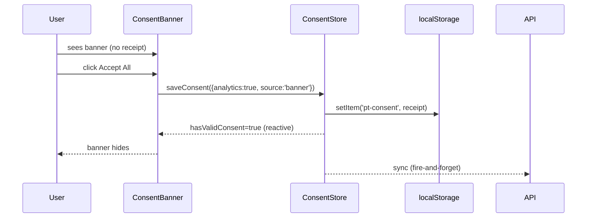

# Design: Replace blocking consent modal with non-modal banner and harden privacy-browser behavior

Capability `consent-banner-presentation`. Contract `privacy-compliance` (receipt, source, version) unchanged. Maps 1:1 to spec R1–R8.

## Technical Approach

Rewrite `ConsentBanner.vue` as a semantic `<aside>` fixed to the viewport bottom, rendered inline in the AppShell tree (no reka-ui Dialog, no `DialogPortal`, no `DialogOverlay`). Visibility is a computed `!hasValidConsent`. First level: Reject optional / Customize / Accept all (equal prominence). Customize expands **inline** (no dialog). `CookieSettings.vue` keeps its modal. Store is simplified (remove `forceOpen`/`openSettings`/`closeSettings` — no production caller) and the shared receipt/source/version layer untouched; tests and E2E updated; `consent-banner` testid retained.

## Architecture Decisions

| # | Decision | Alternatives | Rationale |
|---|----------|--------------|-----------|
| 1 | Non-modal fixed banner | Harden modal z-index/stacking (Approach 3) | Structural removal of the overlay-paint failure class, not mitigation; app usable while undecided (R1/R7) |
| 2 | Inline Customize (toggle + Save expand in-banner) | Compact sheet (still a dialog primitive) | Banner path contains **zero** dialog primitives → orphaned-overlay risk (R3) is impossible; one surface to test; reuses existing `Switch` + `save-btn` |
| 3 | Banner visibility driven only by `hasValidConsent`; remove `forceOpen`/`openSettings`/`closeSettings` from store | Keep `forceOpen` as contract | `openSettings` has zero production callers (footer uses `showCookieSettings` local ref in `AppShell.vue`); dead API invites undecided-state bypass; removing it eliminates a second mutation path for banner visibility (R5) |
| 4 | `CookieSettings.vue` stays modal | Make it non-modal too | Intentional, user-invoked settings — not an unsolicited gate; keeps stronger treatment for deliberate edits |
| 5 | Keep name `ConsentBanner.vue` + `consent-banner` testid | Rename to `ConsentNotice` | Component = the consent prompt; i18n keys live under `consent.banner.*`; testid is a cross-suite contract (E2E, tour, QA) |
| 6 | Shared actions via `useConsent(source: ConsentSource = 'banner')` | Duplicate handlers in both components | Single mutation path; `CookieSettings.vue` calls `useConsent('settings-panel')`; banner passes `'banner'`; store API unchanged |

## Rendering

Outer wrapper: `fixed inset-x-0 bottom-0 z-40 px-4 pt-4 pb-[calc(env(safe-area-inset-bottom)+1rem)] sm:inset-x-auto sm:right-6 sm:bottom-6 sm:w-[min(40rem,calc(100vw-3rem))] sm:px-0 sm:pb-[calc(env(safe-area-inset-bottom)+1.5rem)]` — `40rem` = 640px (560–680 band).

Card: `rounded-t-2xl border border-border-visible bg-bg-surface shadow-2xl sm:rounded-2xl overflow-hidden` — theme tokens already flip light/dark via CSS vars (no new theming). Mobile: edge-to-edge bottom sheet, `overflow-hidden` + wrapper `inset-x-0` ⇒ no horizontal overflow. `z-40`: below dialogs (`z-50`/`z-[51]`) and toasts, above app content; matches `UploadProgressToast` precedent. Entrance: `animate-in fade-in slide-in-from-bottom-2` (tw-animate-css already imported). No `Teleport`, no backdrop, no `bg-black/80`.

## Keyboard & Focus

- **Mount**: no autofocus; focus stays on document (skip link / body). No `focus()` call.
- **Escape**: banner registers no keydown handler ⇒ Escape is a no-op while undecided (R5).
- **Tab**: buttons are ordinary document controls in natural order.
- **Close control**: none rendered while undecided (R5); Customize "Back" collapses the panel only — banner stays visible, no receipt written.
- **Focus restoration**: no trap ⇒ no restoration needed; after decision the banner unmounts and focus remains wherever the user is. Visible focus via existing `Button`/`Switch` focus-visible rings.

## Persistence Flow

`saveConsent({ analytics, source })` (store, unchanged) → build receipt (`consentVersion: 1`, `policyVersion: '2026-07-23'`, ISO `timestamp`, `region: 'EU'`, `necessary: true`, `dnt` from `detectDNTSignal()`) → `localStorage.setItem('pt-consent', …)` → `receipt.value = newReceipt` (drives `hasValidConsent`) → if authenticated, fire-and-forget `syncToBackend`; failure sets `syncError` + toast, local receipt **not** reverted (R6). Sources: banner first-level + inline save ⇒ `'banner'`; CookieSettings ⇒ `'settings-panel'`. DNT/GPC: inline toggle initializes from `store.analyticsEnabled` ⇒ `false` default while undecided; Accept All explicitly overrides. `window.__PT_CONSENT_ANALYTICS` gating untouched.

## Sequence Diagrams

**1. First visit — Accept all**


**2. Reject optional**
```mermaid
sequenceDiagram
  U->>B: click Reject optional
  B->>S: saveConsent({analytics:false, source:'banner'})
  S->>L: persist receipt
  B-->>U: banner hides; analytics stays blocked
```

**3. Customize + Save (inline)**
```mermaid
sequenceDiagram
  U->>B: click Customize
  B-->>U: inline panel (Necessary Always-on, Analytics toggle OFF default)
  U->>B: toggle Analytics ON → click Save
  B->>S: saveConsent({analytics:true, source:'banner'})
  S->>L: persist receipt; B hides
```

**4. Stale receipt re-prompt**
```mermaid
sequenceDiagram
  L-->>S: loadFromStorage() → validateConsentReceipt() fails (v0/malformed)
  S-->>B: hasValidConsent=false
  B-->>U: banner shows; app stays fully visible
```

**5. Backend sync failure (non-blocking)**
```mermaid
sequenceDiagram
  U->>B: Accept All
  B->>S: saveConsent → local persist succeeds, receipt set
  S->>API: POST /governance/consent
  API-->>S: 5xx
  S-->>U: toast "saved locally, sync failed"; banner already hidden
```

## Browser Resilience

**Brave root cause (documented)**: old banner teleported `DialogOverlay` (`fixed inset-0 z-50 bg-black/80`) + `DialogContent` (`z-[51]`) through reka-ui `DialogPortal`. Under Brave Shields (cosmetic filtering + first-party isolation) the portal content failed to paint in correct order → dark full-screen overlay with invisible dialog; `z-[51]` only patched stacking. The failure class is *modal overlay inside a portal*.

**Structural fix**: banner has no overlay, no portal, no backdrop. Worst case under aggressive filtering = unstyled/hidden banner; no full-screen element exists to orphan the app (R7).

**Diagnosis checklist** (per state): ① `[data-testid="consent-banner"]` present in DOM; ② computed `display`/`visibility`/`opacity`; ③ zero portal nodes from banner (`[data-slot="dialog-overlay"]` absent); ④ z-index/stacking context (no ancestor transform creating containment); ⑤ Brave Shields → cosmetic filtering off comparison; ⑥ console errors; ⑦ blocked resources (network tab); ⑧ `pt-consent` validity via `validateConsentReceipt`.

| State | Receipt | Expect |
|-------|---------|--------|
| A | none / invalid | banner visible, no overlay, app clickable |
| B | stale version | banner re-shows, rest of app usable |
| C | valid current | banner absent |
| D | DNT/GPC | banner shows, analytics toggle OFF default |

## File Changes

| File | Action | Description |
|------|--------|-------------|
| `apps/web/app/src/components/consent/ConsentBanner.vue` | Modify | Replace Dialog with fixed non-modal `<aside>`; inline Customize; computed visibility `!hasValidConsent`; decision handlers call `saveConsent` only |
| `apps/web/app/src/components/consent/ConsentBanner.spec.ts` | Modify | Rewrite: assert `<aside>`, no overlay/`role=dialog`/`aria-modal`, no close btn, Escape ignored, app interactable behind banner, accept/reject/custom-save persistence, states A–D |
| `apps/web/app/src/components/consent/useConsent.ts` | Modify | Add `source` param (default `'banner'`); remove `openSettings` |
| `apps/web/app/src/components/consent/CookieSettings.vue` | Modify | Use `useConsent('settings-panel')` (behavior unchanged) |
| `apps/web/app/src/components/consent/useConsent.spec.ts`, `CookieSettings.spec.ts` | Modify | Align mocks with `useConsent(source)`; drop `forceOpen`/`openSettings` mocks |
| `apps/web/app/src/modules/settings/infrastructure/consent.store.ts` | Modify | Remove `forceOpen` state + `openSettings`/`closeSettings` actions; keep receipt/persistence/sync contract |
| `apps/web/app/src/modules/settings/infrastructure/consent.store.test.ts` | Modify | Drop `forceOpen`/`openSettings` cases; add sync-failure-does-not-revert case |
| `apps/web/app/src/shared/i18n/locales/{en,es}/consent.ts` | Modify | Add `customize`, `back` keys |
| `apps/web/app/e2e/specs/consent.spec.ts` | Modify | Assert no `dialog-overlay`; banner visible + app nav clickable while visible; stale-receipt scenario retained (TASK-028); add DNT scenario via `mockPrivacySignals` |
| `apps/web/app/e2e/fixtures/consent-helpers.ts` | Modify | Optional `expectNoOverlay(page)` helper |
| `AppShell.vue`, `ui/dialog/*`, `shared/web/*` | Verify | No change expected |

## Testing Strategy

| Layer | What | How |
|-------|------|-----|
| Component | Non-modal DOM: `<aside>` present, `[data-slot="dialog-overlay"]`/`consent-dialog`/`role=dialog`/`aria-modal` absent | mount + `wrapper.find` + `document.querySelector` |
| Component | App interactable while banner visible | sibling button behind banner receives click (no full-screen element intercepts) |
| Component | Escape ignored, no close control, Customize back keeps banner | `trigger('keydown.esc')`, assert still visible; no receipt written |
| Component | Persistence + sources + DNT default OFF | assert `saveConsent` payloads (`banner`); store mocks |
| Store | Preserved suite minus `forceOpen` cases; add sync-failure-does-not-revert | `consent.store.test.ts` (existing − `forceOpen`/`openSettings` + 1 new) |
| E2E | Non-modal prompt, no overlay, stale re-prompt, DNT | Playwright per spec R8 scenarios |

## Migration / Rollout

No migration — receipts stay `consentVersion: 1`; stale receipts re-prompt. Rollback: `git revert` (banner returns to dialog; `pt-consent` never deleted). Manual matrix: Chrome/Chromium, Safari/WebKit, Brave Shields ON/OFF × states A–D, EN/ES, light/dark, 320px/768px/1280px viewports.

## Open Questions

- [x] Copy for new `customize` / `back` i18n keys (proposal: "Customize" / "Customizar", "Back" / "Volver") — **approved by product**.
- [x] `forceOpen`/`openSettings`/`closeSettings` — **approved for removal** (no production caller; simplifies visibility to `!hasValidConsent`).
